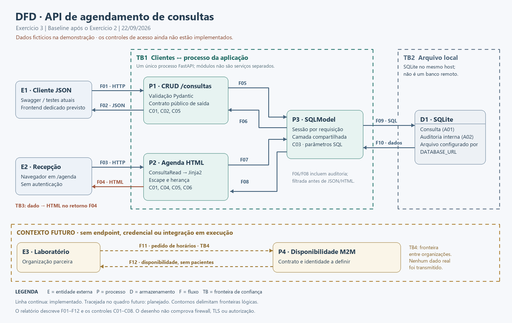
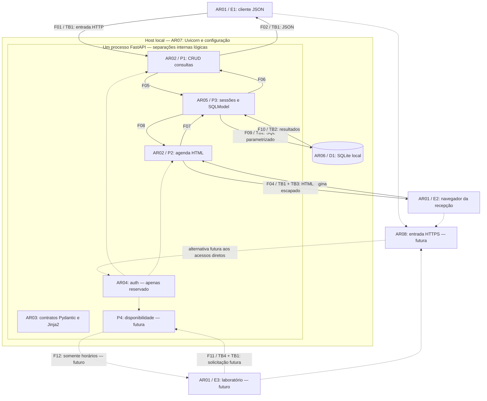
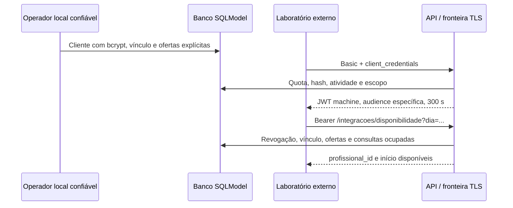
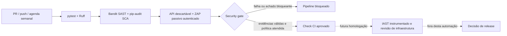
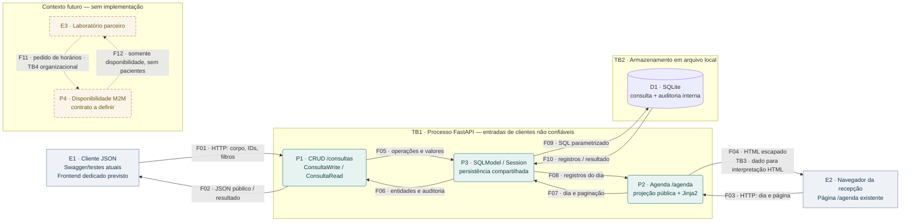

# Relatório técnico consolidado — Desenvolvimento Seguro de Aplicações Web

**Aluno:** Hebert Almeida

[Vídeo de apresentação](https://youtu.be/ZFfoUSW7Cw8)

Este relatório reúne as decisões dos 13 exercícios, as correções finais e a prova do security gate. Os capítulos por exercício preservam o estado histórico daquela etapa: lacunas apontadas nos primeiros exercícios devem ser lidas junto às correções posteriores e ao capstone.

Os resultados finais preservados registram 226 testes aprovados, 74 verificações OpenAPI, 12 respostas observadas pelo ZAP e dois alertas informativos. A consolidação documental não executou novamente os testes.

<a id="sumario"></a>
## Sumário

[Instalação e comandos de verificação](../README.md)

- [exercicio_01](#exercicio-01)

- [exercicio_02](#exercicio-02)

- [exercicio_03](#exercicio-03)

- [exercicio_04](#exercicio-04)

- [exercicio_05](#exercicio-05)

- [exercicio_06](#exercicio-06)

- [exercicio_07](#exercicio-07)

- [exercicio_08](#exercicio-08)

- [exercicio_09](#exercicio-09)

- [exercicio_10](#exercicio-10)

- [exercicio_11](#exercicio-11)

- [exercicio_12](#exercicio-12)

- [exercicio_13](#exercicio-13)

- [Prova_GitHub_R21_2026-10-03](#prova-github)

- [Correcoes_Conformidade_2026-10-02](#correcoes-finais)


- [Diagramas](#diagrama-arquitetura)
- [Limites e evidências](#limites)


---

<a id="exercicio-01"></a>
## Exercício 1 — Fundação da API de agendamento

### Objetivo e resultado
A fundação da API foi organizada em módulos e recebeu o CRUD de consultas via APIRouter. O ambiente virtual é próprio do projeto, com Python 3.12.14 e versões fixadas em requirements.txt. O primeiro conjunto de testes usa pytest e TestClient, com banco SQLite em memória independente por teste.

### Organização
- app/main.py: fábrica da aplicação, registro dos routers e ciclo de vida.
- app/routes/consultas.py: operações HTTP do recurso consultas.
- app/models/consulta.py: entidade SQLModel, contratos Pydantic de entrada e saída e enum de status.
- app/database/session.py: engine, criação inicial de tabelas e sessão por requisição.
- app/core/config.py: configuração via BaseSettings.
- app/auth: reservado para centralizar autenticação e autorização nos próximos exercícios.
- tests/conftest.py: fixtures de cliente e dados fictícios.
- tests/test_consultas.py: primeiro arquivo de testes automatizados.

### Contrato REST
| Método | Rota | Resultado esperado |
|---|---|---|
| POST | /consultas | 201, recurso criado e cabeçalho Location |
| GET | /consultas?offset=0&limit=20 | 200, lista ordenada por ID |
| GET | /consultas/{consulta_id} | 200 ou 404 |
| PUT | /consultas/{consulta_id} | 200 ou 404; substituição completa |
| DELETE | /consultas/{consulta_id} | 204 sem corpo ou 404 |

O corpo de entrada contém paciente_id, profissional_id, data_hora e status. Os três primeiros são obrigatórios. Status permite agendada, cancelada e realizada; seu padrão é agendada. PUT exige todos os campos obrigatórios, e omitir status restaura o padrão agendada. Não há atualização parcial nesta etapa.

Exemplo fictício:
```json
{
  "paciente_id": 1,
  "profissional_id": 2,
  "data_hora": "2030-10-15T09:00:00-03:00",
  "status": "agendada"
}
```

A resposta inclui o id gerado pelo banco e normaliza o horário para 2030-10-15T12:00:00Z.

### Decisões técnicas e de segurança
1. Isolamento: .venv evita mistura de dependências com outros projetos; requirements.txt permite recriar o ambiente. Não entregar a .venv no ZIP.
2. Modularização: main registra routers, models define contratos e persistência, database controla sessões. A camada de autenticação permanece separada e ainda sem implementação.
3. Validação: IDs do corpo são inteiros estritos positivos com teto de 2.147.483.647; campos extras e ID fornecido no corpo são recusados com 422. Status usa enum. A data exige fuso e não aceita timestamp numérico.
4. Horários: a entrada é normalizada para UTC. A versão instalada do SQLModel (0.0.46) trata datetime com UTCDateTime, preservando o fuso no retorno do SQLite. Não é necessário retirar tzinfo manualmente. Conversões além dos limites de datetime são recusadas com 422.
5. Respostas: response_model declara os campos expostos; a entidade de persistência e o contrato HTTP são separados para permitir evolução sem exposição automática de novos campos.
6. Persistência: SQLModel usa Session.get, select, add e delete. Valores são vinculados por parâmetros; não há SQL construído por concatenação de entrada. A tabela é criada no lifespan para a fundação local; migrações versionadas serão necessárias caso o esquema evolua sobre bancos existentes.
7. Paginação: listagem padrão de 20, máximo de 100, ordenada por ID. Offset tem limite superior compatível com os IDs adotados para impedir overflow no SQLite.
8. Sessões: cada requisição recebe sessão encerrada por contexto. A fábrica aceita engine injetada para testes isolados; não cria banco no momento do import.
9. Dados mínimos: a consulta armazena IDs, horário e status. Não foram adicionados nome, CPF ou prontuário.
10. Segredos: configuração sem credenciais embutidas; apenas .env.example sem segredos integra o material.

### Validação executada
23 casos pytest aprovados:
- criação com 201 e Location, leitura e equivalência de dados;
- normalização do fuso e roundtrip pelo banco;
- lista inicialmente vazia e paginação;
- atualização persistida e exclusão com 204 sem corpo;
- 404 nos métodos de leitura, atualização e exclusão;
- IDs inválidos, status inválido, datas inválidas ou sem fuso;
- campos extras e tentativa de definir ID no corpo;
- PUT incompleto sem alterar o registro;
- paginação inválida e casos extremos de conversão UTC.

Esses testes integram API, validação e banco em memória; não são testes unitários com mocking. Essa cobertura poderá ser ampliada nos exercícios posteriores.

O CRUD também foi exercitado por HTTP com Uvicorn em 127.0.0.1:8765, usando banco descartável em .cache. Foram observados 201, 200, 204, 404 e 422 nos caminhos correspondentes. pip check, Ruff check e Ruff format --check passaram.

Dois avisos de depreciação vêm das dependências Starlette/httpx e Starlette/AnyIO. Não houve falha nos testes. Os avisos foram preservados no log; não foram ocultados.

### Correções verificadas
Dois casos extremos receberam correções e testes de regressão:
- offset excessivo causava erro 500: limite superior e teste de regressão;
- conversão de data extrema para UTC causava OverflowError: captura e ValueError, resultando em 422, com testes para os extremos inferior e superior.

O resultado registrado nesta etapa foi de 23 testes aprovados; as execuções posteriores estão no índice de documentação.

### Rastreabilidade
| Requisito | Implementação | Evidência |
|---|---|---|
| Ambiente Python isolado | .venv e requirements.txt | evidencias/exercicio_01/ambiente.json |
| Módulos padrão | app/routes, app/models, app/database | arquivos-fonte e estrutura descrita acima |
| Recurso RESTful completo | router /consultas e registro em main | evidencias/exercicio_01/http_crud.json e openapi.json |
| Teste pytest de sucesso | test_criar_e_buscar_consulta | evidencias/exercicio_01/pytest.txt e pytest.xml |
| Validação explícita e saída controlada | ConsultaWrite e ConsultaRead | testes e contrato OpenAPI |

### Limitações desta etapa
Ainda não há login, verificação de ownership, regras por papel, validação de existência de paciente/profissional, chaves estrangeiras, prevenção de conflito de agenda ou restrição de data passada. As rotas são abertas neste esqueleto; usar somente dados fictícios no ambiente local. Os exercícios futuros deverão implementar os controles de segurança sobre esta base, sem tratar o CRUD inicial como aplicação pronta para dados reais.

DELETE realiza exclusão física, definida aqui para demonstrar CRUD. Política de retenção, cancelamento e trilha de auditoria deverão ser revistas com os requisitos posteriores.

O print do Swagger permanece pendente: a documentação foi aberta e suas rotas verificadas no navegador, mas a ferramenta retornou timeout/falha ao capturar a imagem. Não foi produzido um print artificial. Os registros HTTP, testes, esquema OpenAPI e ambiente foram salvos normalmente.

### Referências técnicas
- [FastAPI: aplicações com múltiplos arquivos](https://fastapi.tiangolo.com/tutorial/bigger-applications/)
- [FastAPI: lifespan](https://fastapi.tiangolo.com/advanced/events/)
- [SQLModel: testes com FastAPI](https://sqlmodel.tiangolo.com/tutorial/fastapi/tests/)
- [Pydantic: tipos padrão](https://docs.pydantic.dev/latest/api/standard_library_types/)


---

<a id="exercicio-02"></a>
## Exercício 2 — Controle de exposição de dados e templates seguros

### Resultado
A API de consultas mantém uma lista explícita de seis campos públicos. Dois campos internos de auditoria são persistidos, mas não são enviados ao cliente nem ao template. A página GET /agenda mostra as consultas do dia em UTC, com filtro de data e paginação, usando Jinja2 e herança de templates.

### Campos e responsabilidades
| Campo | Entrada POST/PUT | JSON de saída | HTML da agenda | Banco |
|---|---|---|---|---|
| id | Não | Sim | Sim | Gerado pelo banco |
| paciente_id | Sim | Sim | Sim | Sim |
| profissional_id | Sim | Sim | Sim | Sim |
| data_hora | Sim, com fuso | Sim, UTC | Horário UTC | Sim |
| status | Sim | Sim | Sim | Sim |
| observacao | Sim, até 500 caracteres | Sim | Texto com escape HTML | Sim |
| criado_em | Não | Não | Não | Gerado pelo servidor |
| referencia_interna | Não | Não | Não | UUID gerado pelo servidor |

A observação é operacional, por exemplo “Chegar 15 minutos antes”, e não foi criada para registrar prontuários ou informações clínicas. Todos os dados usados nas evidências são fictícios.

ConsultaWrite valida a entrada com extra="forbid". ConsultaRead declara exatamente os campos públicos e usa from_attributes=True para validar o objeto ORM. A entidade Consulta contém também os campos internos. O cliente não pode definir auditoria no POST/PUT; campos adicionais são rejeitados com 422.

POST, GET por ID, GET da coleção e PUT continuam com response_model explícito. DELETE retorna 204 sem corpo. O OpenAPI contém os contratos públicos, sem expor o modelo de persistência.

### Por que response_model importa
Se uma rota serializar o objeto completo do banco sem um contrato de saída restritivo, campos internos atuais ou acrescentados no futuro podem passar a aparecer no JSON. Neste projeto, isso exporia criado_em e referencia_interna. A referência interna permite correlacionar registros com outros sistemas ou logs, algo que não faz parte do contrato público da consulta.

A proteção vem da lista de campos do modelo de saída e do response_model aplicado às rotas. O extra="forbid" da entrada tem outra função: recusar campos não declarados enviados pelo cliente. Não é ele que substitui o controle de saída.

response_model também não substitui autenticação ou autorização: os IDs públicos ainda exigirão regras de acesso nos exercícios correspondentes.

### Página da recepção
- URL: /agenda; sem filtro, usa a data atual em UTC.
- Filtro: /agenda?dia=2030-10-15.
- Paginação: 50 registros por página, com navegação anterior/próxima.
- Consulta parametrizada: intervalo [00:00 UTC do dia, 00:00 UTC do dia seguinte), ordenado por horário e ID.
- O fuso UTC está indicado na interface. É a convenção desta etapa, não uma inferência sobre o fuso de todas as clínicas.
- base.html contém documento HTML, cabeçalho, CSS e rodapé.
- agenda.html usa extends "base.html" e sobrescreve title e content.
- CSS externo em app/static/agenda.css; não há JavaScript na página.
- Cache-Control: no-store evita o armazenamento deliberado da resposta pelo cache HTTP.

Antes de renderizar, a rota projeta os resultados em ConsultaRead. O template recebe apenas esses modelos públicos, sem acesso ao objeto ORM completo e à auditoria.

### Defesa contra XSS persistido
O ambiente Jinja2 é configurado centralmente em app/core/templates.py com select_autoescape, habilitado também por padrão, e StrictUndefined. A observação aparece somente no contexto de texto de uma célula: {{ consulta.observacao }}.

Não são usados filtro safe, Markup para dados de usuário, concatenação de HTML, eventos inline ou interpolação de texto de usuário em JavaScript. O texto armazenado não é usado como fonte de template.

O payload <script>alert("XSS")</script> é aceito como texto de observação e persistido. Na resposta HTML, os delimitadores aparecem codificados, como &lt;script&gt;. O navegador mostra o conteúdo literal e não cria um elemento script. O mesmo vale para .

O escape é feito na saída HTML, preservando o conteúdo original no banco e no JSON. JSON não precisa virar HTML escapado: um frontend que consuma esse JSON deverá inserir o texto com APIs seguras, como textContent, e não innerHTML. Autoescape protege o contexto usado aqui; não remove confidencialidade de dados e não é uma autorização de acesso.

### Testes e evidências
Suíte completa: 39 testes aprovados, sendo 23 da fundação adaptados ao novo campo público e 16 casos novos.

Os novos testes cobrem:
- existência da auditoria no banco e omissão em POST, GET individual, listagem e PUT;
- rejeição de auditoria enviada pelo cliente;
- omissão da auditoria tanto no HTML final quanto no contexto entregue ao template;
- persistência e renderização de quatro payloads, incluindo script, imagem com onerror, SVG e texto parecido com expressão Jinja;
- ausência de novos elementos executáveis e atributos de evento no HTML;
- agenda do dia padrão, limites de meia-noite em UTC e ordenação;
- herança de template, lista vazia, paginação e parâmetros inválidos;
- campos públicos exatos no OpenAPI e limite da observação.

Verificação adicional com Uvicorn em 127.0.0.1:8765:
- três consultas fictícias criadas com HTTP 201;
- auditoria existente na entidade e ausente na resposta pública;
- agenda com HTTP 200 e payloads escapados;
- inspeção do DOM real: três linhas, zero elementos script, zero elementos img e nenhum atributo de evento inline.

Arquivos em evidencias/exercicio_02:
- pytest.txt e pytest.xml: execução dos testes;
- payloads.json: entradas usadas na demonstração;
- http_exposicao_xss.json: respostas reais e comparação com o registro interno fictício;
- agenda_renderizada.html: HTML real retornado pelo servidor (o CSS depende do servidor local);
- navegador_dom.json: inspeção real do navegador;
- openapi.json: contrato vigente;
- qualidade.json: verificações de dependências e Ruff.

A captura PNG do navegador falhou por timeout, como na etapa anterior. O print permanece pendente; o HTML e o DOM não são apresentados como substitutos de um print. Não foi fabricada uma imagem de evidência.

Permanecem dois avisos de depreciação de dependências no pytest; estão preservados no log. Não houve falhas.

### Validação e limite de migração
A suíte desta etapa registrou 39 testes aprovados para os cenários exercitados. Isso não comprova ausência de todas as vulnerabilidades.

`create_all` cria tabelas, mas não altera tabelas existentes; a preparação de bancos antigos exige migração explícita.

### Banco e compatibilidade
O esquema agora tem três colunas adicionais: observacao, criado_em e referencia_interna. No início deste exercício não existia data/clinica.db. A demonstração usou .cache/exercicio02_demo.db, preservando o banco de demonstração anterior.

Caso você tenha criado um banco no Exercício 1, não o apague nem espere que create_all faça uma migração. Para testar esta etapa com um banco novo e manter o anterior:
```powershell
$env:DATABASE_URL = "sqlite:///./data/clinica_exercicio02.db"
.\.venv\Scripts\python.exe -m uvicorn app.main:app --reload
```
Use esse nome apenas se ainda não contiver um esquema antigo. A variável vale para o terminal atual. Evolução com reaproveitamento de dados exige uma migração explícita, ainda não implementada.

### Rastreabilidade da rubrica
| Item | Implementação | Evidência |
|---|---|---|
| Controlar campos expostos com response_model | ConsultaRead nas quatro operações com corpo | teste de campos exatos, auditoria interna e OpenAPI |
| Justificar risco sem response_model | seção de exposição acima | comparação banco versus resposta em http_exposicao_xss.json |
| Jinja2 com herança e autoescape | core/templates.py, base.html e agenda.html | testes de herança e payloads persistidos, HTML e DOM reais |

### Limites
A página é destinada à recepção, mas autenticação e restrição por papel ainda não foram implementadas. Não é uma página “interna protegida” apenas por estar em /agenda. Usar localmente e somente com dados fictícios até os exercícios de acesso.

Os riscos já documentados na fundação (ownership, existência de pacientes/profissionais e conflitos de agenda) continuam fora do escopo desta etapa. Não foi afirmada conformidade integral com LGPD.

### Fontes técnicas
- [FastAPI — response_model e filtragem de saída](https://fastapi.tiangolo.com/tutorial/response-model/)
- [Starlette — templates e autoescape](https://www.starlette.io/templates/)
- [Jinja2 — herança e escape](https://jinja.palletsprojects.com/en/stable/templates/)


---

<a id="exercicio-03"></a>
## Exercício 3 — Fundamentos de segurança e modelagem inicial

**Aplicação:** API de agendamento de consultas de uma rede de clínicas.  
**Baseline:** código após o Exercício 2, analisado em 22/09/2026.  
**Escopo:** avaliação CIA, mapeamento de referências e DFD inicial. Nenhuma funcionalidade de segurança nova foi implementada nesta etapa.

### 1. Conclusão da avaliação

A aplicação possui controles concretos de validação, exposição de propriedades, consultas parametrizadas e escape HTML. Esses controles reduzem classes específicas de falha, mas **não garantem acesso autorizado aos dados**: atualmente qualquer cliente que alcance o serviço pode consultar, criar, alterar e excluir consultas. A página da recepção também não exige autenticação.

O uso continua restrito ao ambiente local de demonstração e a dados fictícios. A recomendação para uso com dados reais é **não liberar a aplicação enquanto as lacunas de acesso, transporte, armazenamento e operação não forem tratadas**. Esta é uma decisão técnica desta análise, não uma declaração de conformidade legal ou uma pontuação CVSS.

### 2. Ativos, dados e escopo efetivamente existente

| ID | Ativo | Conteúdo e sensibilidade |
|---|---|---|
| A01 | Registro de consulta | id, paciente_id, profissional_id, data_hora, status e observacao. O vínculo paciente–profissional–horário pode revelar atendimento de saúde quando associado a pessoa identificável. |
| A02 | Auditoria interna mínima | criado_em e referencia_interna. São metadados internos protegidos contra exposição nos contratos de saída; não constituem trilha de auditoria de acessos ou alterações. |
| A03 | Persistência | Arquivo SQLite configurado por DATABASE_URL, contendo A01 e A02. Uma cópia do arquivo contorna os response models. |
| A04 | Serviço e agenda | Disponibilidade da API, página HTML, banco, CPU, memória e disco necessários ao agendamento. |
| A05 | Código, configuração e evidências | Templates, modelos, dependências fixadas e arquivos de teste. Evidências atuais são fictícias; evidências futuras com dados reais precisariam de tratamento próprio. |

Não há tabela de pacientes nem de profissionais, nome, CPF, prontuário, credenciais, tokens ou integração M2M implementados. O código apenas referencia IDs positivos; não verifica a existência desses pacientes e profissionais.

Um ID numérico **não equivale a anonimização**. A classificação de A01 como dado de alta sensibilidade é uma decisão de proteção para o contexto pretendido, considerando a possibilidade de ligação à pessoa. A observação é livre: o rótulo “operacional” e o limite de 500 caracteres não impedem que alguém insira informação clínica.

A LGPD inclui informações de saúde ligadas a pessoa natural na categoria de dados sensíveis e exige medidas técnicas e administrativas de proteção (art. 5º, II, e art. 46). Isso justifica o peso adicional da confidencialidade aqui, sem diminuir a importância dos demais pilares. [LGPD — texto oficial](https://www.planalto.gov.br/ccivil_03/_ato2015-2018/2018/lei/l13709.htm).

### 3. Avaliação pela tríade CIA

A classificação abaixo é qualitativa e contextual. “Impacto alto” descreve a consequência potencial no uso real; não significa que foi calculada uma severidade CVSS ou comprovado um incidente.

| Pilar | Objetivo e cenário concreto | Controles existentes | Lacunas e conclusão |
|---|---|---|---|
| Confidencialidade | Evitar que terceiros descubram quais pacientes têm consultas, horários e observações. Um cliente sem login pode enumerar GET /consultas e abrir /agenda. Impacto alto, com possibilidade de exposição de atendimento. | ConsultaRead expõe só seis propriedades; auditoria não vai para JSON nem contexto HTML; Jinja2 escapa texto; no-store na agenda. | Não há identidade, papéis ou ownership. TLS e criptografia do SQLite não estão configurados na aplicação. Controle de campos é parcial: os próprios seis campos públicos continuam sensíveis. Confidencialidade insuficiente para dados reais. |
| Integridade | Evitar consultas alteradas, removidas, associadas ao paciente errado ou com horário incorreto. Um cliente sem login consegue PUT/DELETE. Impacto alto para a operação da clínica. | Tipos e limites explícitos, enum de status, fuso obrigatório e UTC; extra='forbid'; SQLModel parametrizado; auditoria inicial gerada pelo servidor; commits em sessões. | Sem autorização, integridade referencial, regra de conflito de agenda, controle de concorrência de negócio ou trilha de alteração. O banco aceita IDs inexistentes. A validação sintática não comprova legitimidade nem consistência clínica. |
| Disponibilidade | Manter consulta e atualização da agenda acessíveis. Muitas requisições ou gravações podem consumir recursos e afetar a recepção. Impacto alto operacional. | Listagem JSON limitada a 100; HTML a 50 linhas por página; observação até 500 caracteres; limites numéricos; sessões encerradas por contexto; rejeição de datas extremas; /health verifica resposta do processo. | Não há rate limiting, limite explícito do corpo HTTP, proteção contra volume total de gravações, backup/restauração testados, redundância ou monitoramento configurados. Offset alto ainda pode ser caro. SQLite pode enfrentar contenção de escrita. Paginação não comprova resistência a DoS. |

**Interdependência:** XSS poderia permitir uso indevido da interface e afetar confidencialidade e integridade; uma exclusão indevida compromete integridade e disponibilidade do agendamento. Por isso, a tríade não deve ser tratada como três listas independentes.

### 4. Controles rastreáveis ao código

| Controle | Implementação observada | Evidência existente | Limite do controle |
|---|---|---|---|
| C01 — Lista de propriedades públicas | ConsultaRead e response_model em app/models/consulta.py e app/routes/consultas.py; projeção em app/routes/agenda.py | test_auditoria_persistida_mas_ausente_em_todas_respostas; test_openapi_publica_apenas_contratos_publicos | Limita propriedades, não decide quem pode ler cada consulta. |
| C02 — Validação de entrada | ConsultaWrite, IDs estritos, status enum, data com fuso, observacao limitada e extra='forbid' | test_criacao_invalida_nao_persiste; test_cliente_nao_pode_definir_auditoria; test_observacao_tem_limite | Não valida existência do paciente, ownership ou conflito de agenda. |
| C03 — Dados separados de SQL | Session.get, select, add, sqlmodel_update e delete, com SQLModel; sem concatenação de entrada em comandos SQL | Inspeção de app/routes/consultas.py e app/routes/agenda.py; testes CRUD | Persistência parametrizada não impede uma operação legítima executada por ator indevido. |
| C04 — Escape contextual HTML | select_autoescape centralizado; base.html e agenda.html com herança; observacao somente em texto de célula | test_xss_persistido_renderizado_como_texto; HTML e DOM salvos no Exercício 2 | Não é sanitização universal nem protege automaticamente um futuro frontend que use innerHTML. |
| C05 — Redução de consumo por resposta | limit/offset limitados; agenda com PAGE_SIZE=50; limites da observação e datas | test_paginacao_invalida; test_agenda_vazia_e_paginacao; casos extremos UTC | Não há teste de carga, quotas, rate limiting ou limite do crescimento do banco. |
| C06 — Menor retenção em cache HTML | Cache-Control: no-store em GET /agenda | Verificação do cabeçalho em test_auditoria_persistida_mas_ausente_em_todas_respostas | Não é criptografia, não impede captura de tela e não está aplicado às respostas JSON. |
| C07 — Configuração e isolamento | .venv, requirements.txt, BaseSettings, .env.example sem segredos e .gitignore | evidencias/exercicio_02/qualidade.json e inspeção dos arquivos | .venv isola dependências, não oferece sandbox do processo. Fixar versões não é scan de vulnerabilidades; .gitignore não protege arquivo já rastreado nem filtra ZIP. |
| C08 — Verificação do desenvolvimento | pytest e testes de regressão nos exercícios 1 e 2 | 39 casos aprovados no registro do Exercício 2 e respectivos resultados de teste | Testes parciais não são auditoria completa, scan ZAP, SAST especializado ou prova de ausência de falhas. |

### 5. Mapeamento dos frameworks

As referências têm funções diferentes: OWASP categoriza riscos de aplicações e APIs; NIST SSDF orienta práticas do ciclo de desenvolvimento; MITRE CWE descreve classes de fraqueza. O mapeamento é uma interpretação técnica dos controles do projeto, não uma certificação. Para MITRE, foi escolhido **CWE**, adequado ao nível de código; não foram atribuídas técnicas ATT&CK sem cenário que as sustente.

Versões adotadas: OWASP Top 10 **2025**, OWASP API Security Top 10 **2023** e NIST SSDF **1.1 / SP 800-218**. Os identificadores são sempre acompanhados de versão para não confundir, por exemplo, A05:2025 Injection com a numeração de edições anteriores.

| Referência | Controle ou lacuna concreta | Avaliação |
|---|---|---|
| OWASP API3:2023 — Broken Object Property Level Authorization | C01 e C02 restringem propriedades expostas e alterações nos campos internos. | Mitigação parcial de exposição e atribuição indevida de propriedades. Ainda faltam políticas por usuário/recurso. [Fonte](https://owasp.org/API-Security/editions/2023/en/0xa3-broken-object-property-level-authorization/) |
| OWASP A05:2025 — Injection | C03 separa parâmetros de SQL; C04 escapa a observação em HTML. | Controles implementados para os caminhos atuais de SQL e HTML, sem alegar imunidade a toda injeção. [Fonte](https://top10.owasp.org/2025/A05_2025-Injection/) |
| OWASP API4:2023 — Unrestricted Resource Consumption | C05 limita dados por resposta, porém não limita volume de requisições. | Redução parcial de consumo; disponibilidade ainda requer controles adicionais. [Fonte](https://owasp.org/API-Security/editions/2023/en/0xa4-unrestricted-resource-consumption/) |
| OWASP A01:2025 — Broken Access Control | GET/POST/PUT/DELETE e /agenda não verificam usuário ou permissão. | Lacuna prioritária, não um controle implementado. [Fonte](https://top10.owasp.org/2025/A01_2025-Broken_Access_Control/) |
| NIST SSDF PW.5.1 — práticas de codificação segura | C01–C04: validação, contrato explícito, SQL parametrizado e escape. | Evidência de adoção parcial no código atual. |
| NIST SSDF PW.7.2 — revisão/análise do código e registro dos problemas | C08: correções de offset e UTC no Exercício 1, com testes de regressão e problemas registrados. | A associação ao SSDF descreve evidências do projeto; não equivale a certificação ou revisão humana independente. |
| NIST SSDF PW.8.2 — testes e documentação dos resultados | C08: testes de endpoints e payloads, com logs e regressões. | Cobertura observável, ainda sem autenticação, testes de carga ou pipeline de segurança. |
| NIST SSDF PW.1.1 — modelagem de riscos | Este inventário, avaliação CIA e DFD. | Base inicial para o threat model posterior, não um STRIDE completo. |
| MITRE CWE-200 — exposição de informação sensível | C01 restringe metadados internos e C06 reduz cache HTML. | Acesso sem autorização aos dados públicos continua possível. [Fonte](https://cwe.mitre.org/data/definitions/200.html) |
| MITRE CWE-79 — XSS | C04; payload persistido permanece texto ao renderizar. | Defesa verificada no contexto HTML usado. [Fonte](https://cwe.mitre.org/data/definitions/79.html) |
| MITRE CWE-89 — SQL Injection | C03; chamadas SQLModel parametrizadas. | Controle no acesso atual ao banco. [Fonte](https://cwe.mitre.org/data/definitions/89.html) |
| MITRE CWE-862 — ausência de autorização | Nenhuma política aplicada às rotas atuais. | Lacuna identificada e relacionada a A01:2025. [Fonte](https://cwe.mitre.org/data/definitions/862.html) |
| MITRE CWE-400 — consumo não controlado de recursos | C05 ajuda por resposta; não há limite global de requisições/gravações. | Lacuna residual de disponibilidade. [Fonte](https://cwe.mitre.org/data/definitions/400.html) |

As associações SSDF acima usam a publicação de referência [NIST SP 800-218, versão 1.1](https://nvlpubs.nist.gov/nistpubs/SpecialPublications/NIST.SP.800-218.pdf). São correspondências entre práticas e evidências locais, não declaração de que todos os requisitos dessas práticas foram cumpridos.

### 6. DFD básico — baseline e notação

Veja **dfd_exercicio_03.png**, a versão editável **dfd_exercicio_03.mmd** e a tabela de fluxos abaixo.

- **E:** entidade externa; **P:** processo lógico; **D:** armazenamento; **F:** fluxo; **TB:** fronteira de confiança.
- Linhas contínuas representam o estado implementado. Linhas tracejadas no quadro inferior representam somente a integração futura.
- P1 e P2 executam no mesmo processo FastAPI. P3 representa a camada compartilhada de persistência, não um serviço de rede separado.
- O SQLite é um arquivo local: TB2 não implica um banco remoto ou conexão SQL via rede.
- Os papéis recepcionista, profissional de saúde e administrador pertencem ao contexto de negócio, mas ainda não são identidades reconhecidas pelo sistema.
- Pacientes são titulares dos dados referenciados, não um quarto cliente implementado.
- O frontend dedicado e o laboratório ainda não foram construídos. E1 representa hoje clientes JSON como Swagger/TestClient; o futuro frontend usará esse contrato.



#### Elementos

| ID | Elemento | Estado |
|---|---|---|
| E1 | Cliente JSON, operado por usuário ou atacante; frontend dedicado previsto | Contrato JSON existente |
| E2 | Navegador da recepção exibindo /agenda | Página existente, sem restrição por papel |
| P1 | CRUD /consultas: validação e contratos JSON | Implementado |
| P2 | Agenda: filtro por dia, projeção pública e renderização Jinja2 | Implementado |
| P3 | SQLModel / Session: persistência compartilhada | Implementado |
| D1 | SQLite: consultas com propriedades públicas e auditoria interna | Implementado |
| E3 | Laboratório parceiro, organização externa | Previsto, sem integração |
| P4 | Consulta de disponibilidade para cliente M2M | Previsto, sem endpoint, credencial ou política definidos |

#### Fronteiras de confiança

| ID | Transição | Tratamento atual e exigência futura |
|---|---|---|
| TB1 | Cliente externo → processo da aplicação; fluxos F01–F04 | Corpo, parâmetros e cabeçalhos não são confiáveis. Validação existe; identidade e autorização não. O teste local usa HTTP em loopback, não HTTPS. TLS deverá ser definido para tráfego real. |
| TB2 | Processo da aplicação ↔ armazenamento em arquivo; F09–F10 | SQL parametrizado existe. Permissões específicas de sistema operacional, criptografia em repouso, backup e recuperação não foram implementados nem auditados neste Assessment. O mesmo host não elimina essa fronteira lógica. |
| TB3 | Dado persistido → conteúdo interpretado no navegador; trecho final de F04 | É uma fronteira de interpretação, sobreposta ao retorno através de TB1. Observações recuperadas do banco continuam não confiáveis e são escapadas no contexto HTML. Não representa um segundo servidor. |
| TB4 | Organização parceira ↔ clínica; F11–F12 previstos | A confiança na recepção não se transfere ao laboratório. O futuro cliente M2M precisará de identidade e escopo próprios e deve receber disponibilidade sem dados de pacientes. Ainda não implementado. |

As caixas e fronteiras documentam pressupostos; sua existência no desenho não significa que há firewall, TLS, ACL ou autenticação efetivamente configurados.

#### Fluxos e dados sensíveis

| ID | Origem → destino | Dados e finalidade | Sensibilidade / controle |
|---|---|---|---|
| F01 | E1 → P1 | POST/PUT com paciente_id, profissional_id, data_hora, status e observacao; GET/DELETE com IDs e paginação conforme o método | Pode conter dados de paciente ou texto clínico. C02; não há autorização. |
| F02 | P1 → E1 | JSON público de consulta/lista; códigos de resultado e erros; DELETE 204 sem corpo | IDs, horário e observação permanecem sensíveis no contexto real. C01; não sai A02 nas respostas de sucesso. Erros de validação podem refletir entradas enviadas pelo próprio cliente. |
| F03 | E2 → P2 | GET /agenda com dia e pagina | Parâmetros de busca, sem corpo de prontuário. Validação de data/página; sem autenticação. |
| F04 | P2 → E2 | HTML com consulta, IDs de paciente/profissional, horário, status e observação | Dados sensíveis renderizados; C01, C04 e C06. Cruza TB1 e TB3. Escape não decide quem pode ver a página. |
| F05 | P1 → P3 | Operações CRUD e valores validados | Entrada em memória para persistência; não há uma chamada HTTP interna. |
| F06 | P3 → P1 | Entidade(s) com propriedades públicas e auditoria, ou ausência de registro | Confidencial dentro do servidor; C01 filtra antes de F02. |
| F07 | P2 → P3 | Intervalo de datas e paginação para leitura | Consulta somente leitura, parametrizada. |
| F08 | P3 → P2 | Registros do dia com observação original e auditoria | P2 projeta ConsultaRead antes do template; texto continua não confiável. |
| F09 | P3 → D1 | Comandos parametrizados de leitura/gravação/exclusão | Em gravações, inclui A01 e metadados internos gerados pelo servidor. |
| F10 | D1 → P3 | Resultados, registros persistidos e resultado das operações | Inclui A01/A02; acesso direto ao arquivo contornaria C01 e C02. |
| F11 | E3 → P4 | **Previsto:** solicitação de horários disponíveis | Contrato e autenticação M2M ainda serão definidos. Nenhum envio real. |
| F12 | P4 → E3 | **Previsto:** apenas disponibilidade mínima necessária | Não incluir paciente_id, observações ou auditoria; requisito futuro, não comportamento testado. |

**Caminho de paciente:** F01 → F05 → F09 persiste dados; F10 → F06 → F02 devolve JSON; F10 → F08 → F04 apresenta a agenda. C01 reduz propriedades e C04 trata HTML, mas sem autorização esses caminhos continuam acessíveis a um cliente que alcance a API.

**Caminho de XSS persistido:** uma observação controlada pelo cliente atravessa F01/F05/F09, permanece como dado em D1 e retorna em F10/F08/F04. O escape em P2/TB3 é necessário mesmo quando a origem imediata parece ser “o banco”.

#### Superfícies de apoio fora do desenho principal

/health informa que o processo responde, sem testar disponibilidade do banco. /docs e /openapi.json expõem o contrato. /static entrega o CSS. O Swagger padrão utiliza recursos externos de documentação; não se tratou esse carregamento como fluxo de pacientes no DFD central, mas ele merece revisão na implantação.

O Uvicorn pode registrar metadados de requisições, inclusive caminho e query string. Isso não constitui auditoria de negócio. A política de retenção e acesso a logs e às evidências ainda não está definida; não colocar dados clínicos em URLs. Essas superfícies devem entrar no inventário ampliado do threat model seguinte.

### 7. Prioridades para a modelagem posterior

| Prioridade contextual | Lacuna / cenário | Relação com DFD e CIA | Próxima decisão necessária |
|---|---|---|---|
| Alta | Leitura, edição e exclusão sem identidade ou autorização | TB1, F01–F04; C/I/D | Definir autenticação, papéis e autorização por recurso; criar testes de acesso indevido. |
| Alta | Dados em trânsito e no arquivo sem proteção criptográfica configurada | TB1/TB2; C | Definir TLS, acesso ao arquivo, proteção em repouso e gestão de segredos. |
| Alta | Operação com IDs inexistentes, conflitos e exclusão sem histórico | F05/F09; I/D | Definir integridade referencial, regras de agenda e política de auditoria/retenção. |
| Alta | Consumo de requisições, disco ou bloqueios de escrita | P1–P3/D1; D | Definir limites, rate limiting, monitoramento e recuperação testada. |
| Antes da integração M2M | Parceiro recebendo dados de pacientes além do necessário | TB4, F11/F12; C | Contrato mínimo de disponibilidade, escopos e credenciais próprias. |

A ordem é uma recomendação local baseada no contexto. O critério formal de severidade do security gate será definido no Exercício 12; esta tabela não o antecipa nem o substitui.

### 8. Evidências, revisão e rastreabilidade

A avaliação foi baseada nos arquivos app/models/consulta.py, app/routes/consultas.py, app/routes/agenda.py, app/core/templates.py, app/database/session.py, app/main.py, app/core/config.py e nos testes atuais. O manifesto em evidencias/exercicio_03 registra hashes dos arquivos analisados, para ligar o desenho a esta baseline.

Os 39 testes e os registros HTTP/DOM do Exercício 2 são evidências preexistentes reaproveitadas, não uma nova execução da suíte neste exercício documental. Uma sondagem isolada em memória foi usada para registrar os contratos, as rotas sem autenticação e os controles de saída, sem dados reais e sem modificar o banco local.

O DFD é um diagrama técnico gerado a partir da análise, não um print da aplicação; as pendências de captura dos exercícios anteriores continuam separadas.

| Exigência | Onde é atendida |
|---|---|
| Avaliação CIA | Seção 3, cenários concretos e riscos residuais |
| Frameworks ligados a controles reais | Seções 4 e 5, códigos C01–C08 e fontes oficiais |
| DFD básico | Diagrama PNG e fonte Mermaid, com elementos E/P/D |
| Trust boundaries | TB1–TB4, com pressupostos e limites explícitos |
| Fluxos sensíveis de pacientes | Tabela F01–F12 e caminhos descritos |
| Base para próximas análises | Identificadores estáveis e prioridades da seção 7 |


---

<a id="exercicio-04"></a>
## Exercício 4 — Threat model da API de agendamento

**Referência:** TM-CLINICA · versão 1.0 · 22/09/2026.  
**Baseline:** código após Exercício 2; inventário CIA e DFD do Exercício 3.  
**Artefatos oficiais para os próximos exercícios:** este documento e Exercicio_04_Threat_Model.json, mantidos juntos em docs.  
**Escopo:** modelagem e documentação; nenhum controle futuro foi implementado nesta etapa.

### 1. Resultado e método

O modelo registra **14 ameaças**, **10 misuse cases**, **12 ações de mitigação/manutenção** e **14 critérios de verificação**. STRIDE foi aplicado separadamente a quatro componentes existentes: P1 (CRUD), P2 (agenda), P3 (persistência) e D1 (SQLite). E3/P4 é avaliado à parte como integração futura.

A principal lacuna é o acesso sem identidade, autorização por recurso ou controle por função. São problemas relacionados, mas exigem verificações distintas; seus scores não devem ser somados como incidentes independentes.

A sequência adotada foi: arquitetura/ativos → intenção e sequência de abuso → ameaça STRIDE → controles/lacunas → mitigação → critério observável. O documento será atualizado junto ao sistema, seguindo a orientação de [threat modeling da OWASP](https://cheatsheetseries.owasp.org/cheatsheets/Threat_Modeling_Cheat_Sheet.html). Os misuse cases descrevem como uma função legítima pode ser abusada, conforme a referência de [abuse cases da OWASP](https://cheatsheetseries.owasp.org/cheatsheets/Abuse_Case_Cheat_Sheet.html).

STRIDE: **S**, falsificação de identidade; **T**, adulteração; **R**, negação de autoria; **I**, divulgação indevida; **D**, negação de serviço; **E**, elevação de privilégio. Uma ameaça pode ter vários efeitos; as letras não indicam severidade. [Microsoft — categorias STRIDE](https://learn.microsoft.com/en-us/azure/security/develop/threat-modeling-tool-threats).

### 2. Pressupostos e limites

- DFD preservado: E1 cliente JSON; E2 navegador da recepção; P1 CRUD; P2 agenda; P3 SQLModel; D1 SQLite; E3 laboratório e P4 disponibilidade previstos.
- TB1: cliente/aplicação. TB2: processo/arquivo. TB3: dado/interpretação HTML no retorno F04. TB4: parceiro/clínica. F01–F10 existem; F11/F12 são futuros.
- Pacientes/profissionais são apenas IDs. Não há autenticação, papéis, ownership, JWT, sessão ou M2M implementados.
- A demonstração usa dados fictícios e HTTP loopback. Cenários de rede/host são condicionais, não provas de exposição pública.
- Não houve carga hostil, interceptação, corrupção de banco, cópia de dados reais ou exploração de parceiro.
- Controles C01–C08 são os registrados no Exercício 3. Evidências de 39 testes do Exercício 2 e da sondagem do Exercício 3 são anteriores, não nova execução desta etapa.
- BOLA entre sujeitos autenticados e escalada entre papéis serão verificadas quando existirem identidades. Hoje está comprovada a ausência de controle de acesso, não o bypass de um JWT inexistente.
- Este inventário não esgota a segurança do projeto. Dependências, pipeline, cadeia de fornecimento, operação do host e logs deverão receber expansão específica. A05 está inventariado sem alegação de cobertura completa.

**Decisões pendentes:** matriz de papéis; ownership/escopo usuário–clínica–consulta; duração/conflito de horários; retenção da auditoria; limites de consumo; topologia TLS; RPO/RTO; contrato M2M. Propostas de testes não substituem essas decisões.

### 3. Ativos e superfícies

| Ativo | Conteúdo |
|---|---|
| A01 | Consultas: IDs de paciente/profissional, horário, status e observacao; potencialmente sensíveis quando ligados à pessoa. |
| A02 | Metadados internos criado_em/referencia_interna; não são trilha de eventos. |
| A03 | Arquivo SQLite e eventuais cópias; backups ainda não implementados. |
| A04 | Disponibilidade da API, agenda e capacidade operacional. |
| A05 | Código, configuração, dependências e evidências do projeto. |

IDs vinculados a atendimento não são automaticamente anônimos. Observacao pode receber texto clínico apesar da finalidade operacional; os exemplos usam apenas dados fictícios.

| Superfície | Entrada/acesso | Componentes / fronteiras |
|---|---|---|
| AS01 | HTTP /consultas e /consultas/{id}: JSON, parâmetros, IDs, leitura/criação/edição/exclusão. | P1 / TB1 |
| AS02 | HTTP /agenda: dia/pagina, consulta ao banco e interpretação do HTML. | P2 / TB1, TB3 |
| AS03 | Operações SQLModel/Session e limites transacionais; não é endpoint de rede separado. | P3, D1 / TB2 |
| AS04 | Arquivo SQLite, diretório, configuração e cópias acessíveis pelo host; requer privilégio adicional. | D1 / TB2 |
| AS05 | /docs e /openapi.json expõem contrato; /health e /static são superfícies auxiliares. | P1, P2 / TB1 |
| AS06 | Transporte cliente/servidor e futura terminação TLS; atualmente apenas HTTP loopback observado. | P1, P2 / TB1 |
| AS07 | Futuro cliente parceiro E3 e endpoint P4 de disponibilidade; nenhuma chamada implementada. | P4 / TB4 |

AS05 permite descobrir o contrato, o que não é automaticamente uma vulnerabilidade. AS04 requer acesso ao host; não há fluxo direto cliente → SQLite na API.

#### Controles atuais reaproveitados

- **C01:** Whitelist de propriedades JSON/contexto HTML.
- **C02:** Validação explícita e extra='forbid'.
- **C03:** SQLModel parametrizado.
- **C04:** Autoescape Jinja2.
- **C05:** Limites de campos/paginação/datas.
- **C06:** no-store em /agenda.
- **C07:** Configuração, dependências fixadas, .env.example.
- **C08:** Testes e revisões dos exercícios anteriores.

C01 controla propriedades, não acesso a objetos; C02 não valida legitimidade de negócio; C05 não é rate limiting; C07 não equivale a sandbox nem scan de dependências. A implementação e evidência detalhadas constam no Exercício 3.

### 4. Critério de prioridade

Pontuação qualitativa e autoral para a operação pretendida com dados de pacientes, considerando a arquitetura atual e o atacante que alcance a superfície. Não mede dano na demonstração fictícia; **não é CVSS, DREAD nem o gate do Exercício 12**.

- **P=1:** controle atual bloqueia o vetor ou seria necessária regressão; **P=2:** condição adicional, privilégio local, posição de rede ou volume não medido; **P=3:** oportunidade direta ao alcançar uma rota sem a barreira pertinente.
- **I=1:** efeito limitado/reversível; **I=2:** efeito limitado em dados, agenda ou rastreabilidade; **I=3:** exposição de pacientes, operação indevida importante ou interrupção relevante.
- **P × I:** 1–2 baixa; 3–4 moderada; 6 alta; 9 crítica. P/I são inteiros entre 1 e 3.
- Controles planejados não reduzem o score. Os pré-requisitos, cenário e evidência de cada registro justificam a estimativa.
- Score condicional não transforma integração inexistente em vulnerabilidade ativa. Reavaliar quando a arquitetura mudar.

### 5. Misuse cases

#### MC-01 — Agir como funcionário e acessar consultas alheias

**Ator:** Cliente sem autenticação hoje; sujeito de baixo privilégio no futuro.  
**Pré-condição:** Alcança API; variante futura exige conta válida.  
**Sequência de abuso:** 1. Chama CRUD sem credencial; 2. escolhe ID; 3. lê/altera recurso alheio; 4. futuramente tenta ação acima do papel.  
**Resultado / situação atual:** Acesso sem identidade, ownership ou permissão.  
**Ameaças:** TH-01, TH-02, TH-13.

#### MC-02 — Adulterar consulta e atributos internos

**Ator:** Cliente malicioso.  
**Pré-condição:** Envia POST/PUT JSON.  
**Sequência de abuso:** 1. Usa IDs positivos inexistentes e horário conflitante; 2. em tentativa separada, acrescenta criado_em/referencia_interna; 3. verifica persistência/rejeição.  
**Resultado / situação atual:** Negócio inconsistente; tentativa contra auditoria já é rejeitada.  
**Ameaças:** TH-03, TH-04.

#### MC-03 — Extrair dados pelo contrato de saída

**Ator:** Cliente que consulta API/agenda.  
**Pré-condição:** Alcança GET /consultas ou /agenda.  
**Sequência de abuso:** 1. Lista consultas; 2. inspeciona JSON/HTML/OpenAPI; 3. procura auditoria e dados de pacientes; 4. amplia busca por IDs/páginas.  
**Resultado / situação atual:** Auditoria omitida hoje; dados públicos continuam sem autorização.  
**Ameaças:** TH-01, TH-02, TH-06.

#### MC-04 — Executar observação persistida

**Ator:** Cliente que grava texto.  
**Pré-condição:** Pode gravar observacao; outra pessoa abre a agenda do dia.  
**Sequência de abuso:** 1. Persiste `` em dado fictício; 2. recepção abre /agenda; 3. espera transformação em HTML ativo.  
**Resultado / situação atual:** Se escape regredir, controle da página e possível uso futuro dos privilégios da vítima. Hoje texto é escapado e não há sessão autenticada a roubar.  
**Ameaças:** TH-07.

#### MC-05 — Transformar entrada em SQL

**Ator:** Cliente malicioso.  
**Pré-condição:** Pode enviar corpo/parâmetros.  
**Sequência de abuso:** 1. Envia ID malformado ou sintaxe SQL em observacao; 2. tenta mudar comando executado; 3. busca leitura/alteração extra.  
**Resultado / situação atual:** Vetor contido por validação/parametrização atuais; regressão a prevenir.  
**Ameaças:** TH-08.

#### MC-06 — Excluir ou alterar e negar autoria

**Ator:** Cliente ou operador malicioso.  
**Pré-condição:** A ação alcança o endpoint; hoje não exige identidade.  
**Sequência de abuso:** 1. Executa PUT/DELETE em consulta fictícia; 2. nega autoria; 3. exige prova de quem agiu.  
**Resultado / situação atual:** UUID/criado_em e access log não demonstram autoria confiável.  
**Ameaças:** TH-05.

#### MC-07 — Consumir capacidade da agenda

**Ator:** Cliente automatizado.  
**Pré-condição:** Alcança serviço, sem acesso ao host.  
**Sequência de abuso:** 1. Repete leituras/paginação/gravações; 2. aumenta custo e banco; 3. disputa capacidade com usuários legítimos.  
**Resultado / situação atual:** Consumo de CPU/disco/conexões ou contenção. Não foi executado ataque de carga.  
**Ameaças:** TH-09.

#### MC-08 — Copiar ou danificar banco fora da API

**Ator:** Ator com acesso local indevido/processo comprometido.  
**Pré-condição:** Privilégio adicional de leitura/escrita em arquivo/diretório/backup, não comprovado remotamente.  
**Sequência de abuso:** 1. Copia SQLite para contornar filtros; ou 2. altera/apaga banco; 3. explora ausência de restauração testada.  
**Resultado / situação atual:** Exposição total, alteração ou perda de dados; ACL real é desconhecida.  
**Ameaças:** TH-10, TH-11.

#### MC-09 — Interceptar futura implantação HTTP

**Ator:** Adversário no caminho de rede.  
**Pré-condição:** Serviço exposto em rede sem TLS válido.  
**Sequência de abuso:** 1. Observa tráfego; 2. tenta obter/modificar consulta; 3. tenta imitar servidor.  
**Resultado / situação atual:** Vazamento/alteração/servidor falso no cenário condicional; não alegamos interceptação do loopback.  
**Ameaças:** TH-12.

#### MC-10 — Usar parceiro como acesso humano

**Ator:** Cliente M2M comprometido.  
**Pré-condição:** Integração futura ativa e credencial do parceiro comprometida.  
**Sequência de abuso:** 1. Usa credencial M2M; 2. pede mais que disponibilidade; 3. tenta CRUD/agenda humana; 4. testa escopos/audiência indevidos.  
**Resultado / situação atual:** Exposição/ações além do escopo; integração ainda não existe.  
**Ameaças:** TH-14.

### 6. STRIDE por componente

As seis categorias foram consideradas. Células sem identidade/papel próprio explicam a condição, sem inventar autenticação para um arquivo.

| Componente | S | T | R | I | D | E |
|---|---|---|---|---|---|---|
| P1 | TH-01, TH-12 | TH-02, TH-03, TH-04, TH-08, TH-12 | TH-05 | TH-02, TH-06, TH-08, TH-12 | TH-09 | TH-13 |
| P2 | TH-01, TH-12 | TH-07, TH-12 (conteúdo interpretado/transporte) | TH-05 | TH-02, TH-06, TH-07, TH-12 | TH-09 | TH-13; TH-07 se contexto da vítima adquirir privilégios |
| P3 | Não possui identidade própria: herda sujeito de P1/P2. Lacuna de origem: TH-01. | TH-04, TH-08, TH-11 | TH-05 | TH-08; dados íntegros podem ser devolvidos a solicitante indevido por P1/P2. | TH-09, TH-11 | Sem fronteira autônoma de papéis: privilégios do processo/host são pré-condição de TH-10/TH-11. |
| D1 | Não autentica usuário humano; alteração/substituição de arquivo é T, em TH-11. | TH-04, TH-11 | TH-05, TH-11 | TH-10 | TH-09, TH-11 | Arquivo não eleva privilégio sozinho; acesso local adicional condiciona TH-10/TH-11. |

P3 executa no mesmo processo de P1/P2; não requer uma autenticação duplicada por módulo. O sujeito e as políticas devem ser estabelecidos centralmente.

**P4 futuro:** TH-14 considera S/I/E em TB4. T/R/D do parceiro deverão ser detalhados ao definir contrato, auditoria e limites, antes de liberar a integração.

### 7. Ameaças consolidadas

| ID | Ameaça | STRIDE | P × I | Prioridade | Estado |
|---|---|---|---|---|---|
| TH-01 | Ausência de identidade confiável | S | 3 × 3 = 9 | Crítica | Aberta |
| TH-02 | Acesso a recurso alheio / falta de ownership | I/T | 3 × 3 = 9 | Crítica | Aberta |
| TH-03 | Atribuição de auditoria pelo cliente | T | 1 × 2 = 2 | Baixa | Controlada no vetor atual |
| TH-04 | Associação inválida e conflito de agenda | T | 3 × 2 = 6 | Alta | Aberta |
| TH-05 | Negação de autoria sem trilha | R | 3 × 2 = 6 | Alta | Aberta |
| TH-06 | Exposição de propriedades internas | I | 1 × 2 = 2 | Baixa | Controlada no vetor atual |
| TH-07 | XSS persistido por regressão | T/I/E | 1 × 3 = 3 | Moderada | Controlada no vetor atual |
| TH-08 | Injeção SQL por consulta insegura futura | T/I | 1 × 3 = 3 | Moderada | Controlada no vetor atual |
| TH-09 | Esgotamento e contenção SQLite | D | 2 × 3 = 6 | Alta | Parcialmente mitigada |
| TH-10 | Leitura de arquivo SQLite/backup | I | 2 × 3 = 6 | Alta | Condicional — infraestrutura |
| TH-11 | Adulteração/perda do armazenamento | T/R/D | 2 × 3 = 6 | Alta | Condicional — infraestrutura |
| TH-12 | Interceptação/servidor falso sem TLS | S/T/I | 2 × 3 = 6 | Alta | Condicional — implantação em rede |
| TH-13 | Funções acima do papel permitido | E | 3 × 3 = 9 | Crítica | Aberta |
| TH-14 | Confusão de acesso M2M/humano | S/E/I | 2 × 3 = 6 | Alta | Planejada — integração futura |

“Controlada no vetor atual” significa defesa no caminho observado e regressão a manter; não significa ausência de risco em todos os contextos. “Condicional” exige condição adicional não comprovada no ambiente.

#### TH-01 — Ausência de identidade confiável

**STRIDE:** S · **componentes:** P1, P2 · **ativos:** A01, A04.  
**Superfícies:** AS01, AS02 · **fluxos:** F01, F02, F03, F04 · **fronteiras:** TB1.  
**Misuse cases:** MC-01, MC-03.

**Cenário:** Cliente alcançável opera como usuário legítimo. Não existe login/JWT: requisito de identidade ausente, não quebra de autenticação existente.  
**Evidência / fundamento:** Sondagem do Exercício 3 mostrou operações sem credencial.  
**Controles existentes:** Nenhum controle específico suficiente demonstrado para este vetor.  
**Mitigações:** MT-01 · **verificação:** VT-01.  
**Prioridade:** Crítica (P=3, I=3, score=9). **Estado:** Aberta.  
**Risco residual / limite:** Autenticar sozinho não resolve TH-02/TH-13.

#### TH-02 — Acesso a recurso alheio / falta de ownership

**STRIDE:** I, T · **componentes:** P1, P2 · **ativos:** A01.  
**Superfícies:** AS01, AS02 · **fluxos:** F01, F02, F03, F04, F05, F06 · **fronteiras:** TB1.  
**Misuse cases:** MC-01, MC-03.

**Cenário:** Busca por ID, edição e listas não verificam relação sujeito–recurso. Depois de login, lacuna pode persistir como BOLA/IDOR.  
**Evidência / fundamento:** Inspeção: nenhum filtro/dependência de autorização. Contas A/B ainda não existem para provar variante autenticada.  
**Controles existentes:** C01 (Whitelist de propriedades JSON/contexto HTML); C02 (Validação explícita e extra='forbid')  
**Mitigações:** MT-02, MT-01 · **verificação:** VT-02.  
**Prioridade:** Crítica (P=3, I=3, score=9). **Estado:** Aberta.  
**Risco residual / limite:** Contrato de saída não impede acesso aos campos públicos alheios.

#### TH-03 — Atribuição de auditoria pelo cliente

**STRIDE:** T · **componentes:** P1 · **ativos:** A02.  
**Superfícies:** AS01 · **fluxos:** F01, F05, F09 · **fronteiras:** TB1.  
**Misuse cases:** MC-02.

**Cenário:** Cliente tenta definir auditoria/campo extra via POST/PUT; entrada recusa propriedades não declaradas.  
**Evidência / fundamento:** Testes do Exercício 2 confirmam 422; metadados gerados pelo servidor.  
**Controles existentes:** C01 (Whitelist de propriedades JSON/contexto HTML); C02 (Validação explícita e extra='forbid')  
**Mitigações:** MT-04 · **verificação:** VT-03.  
**Prioridade:** Baixa (P=1, I=2, score=2). **Estado:** Controlada no vetor atual.  
**Risco residual / limite:** Reabrir se novo schema/rota aceitar auditoria; negócio inválido é TH-04.

#### TH-04 — Associação inválida e conflito de agenda

**STRIDE:** T · **componentes:** P1, P3, D1 · **ativos:** A01, A04.  
**Superfícies:** AS01, AS03 · **fluxos:** F01, F05, F09 · **fronteiras:** TB1, TB2.  
**Misuse cases:** MC-02.

**Cenário:** IDs positivos inexistentes e gravações concorrentes de horários conflitantes podem passar pela validação sintática.  
**Evidência / fundamento:** Não há FK/regra de conflito; concorrência não foi exercitada como prova de ataque.  
**Controles existentes:** C02 (Validação explícita e extra='forbid'); C03 (SQLModel parametrizado)  
**Mitigações:** MT-05 · **verificação:** VT-04.  
**Prioridade:** Alta (P=3, I=2, score=6). **Estado:** Aberta.  
**Risco residual / limite:** Regra exata depende do negócio; checagem sem atomicidade pode falhar em corrida.

#### TH-05 — Negação de autoria sem trilha

**STRIDE:** R · **componentes:** P1, P2, P3, D1 · **ativos:** A01, A02.  
**Superfícies:** AS01, AS02, AS03 · **fluxos:** F01, F03, F05, F07, F09 · **fronteiras:** TB1, TB2.  
**Misuse cases:** MC-06.

**Cenário:** Ator nega leitura/alteração/exclusão sem identidade e histórico por ação.  
**Evidência / fundamento:** criado_em/UUID são criação; DELETE remove registro. Sem auditoria de negócio.  
**Controles existentes:** Nenhum controle específico suficiente demonstrado para este vetor.  
**Mitigações:** MT-06, MT-01 · **verificação:** VT-05.  
**Prioridade:** Alta (P=3, I=2, score=6). **Estado:** Aberta.  
**Risco residual / limite:** Access log/UUID não provam autoria; proteger também dados dos eventos.

#### TH-06 — Exposição de propriedades internas

**STRIDE:** I · **componentes:** P1, P2 · **ativos:** A01, A02.  
**Superfícies:** AS01, AS02, AS05 · **fluxos:** F02, F04, F06, F08 · **fronteiras:** TB1, TB3.  
**Misuse cases:** MC-03.

**Cenário:** Serializar ORM completo futuramente poderia expor auditoria; hoje ConsultaRead/projeção a omitem.  
**Evidência / fundamento:** Testes de campos/contexto/OpenAPI e HTTP/DOM existentes.  
**Controles existentes:** C01 (Whitelist de propriedades JSON/contexto HTML); C06 (no-store em /agenda)  
**Mitigações:** MT-04 · **verificação:** VT-06.  
**Prioridade:** Baixa (P=1, I=2, score=2). **Estado:** Controlada no vetor atual.  
**Risco residual / limite:** Dados públicos sensíveis permanecem sem acesso controlado: TH-01/TH-02.

#### TH-07 — XSS persistido por regressão

**STRIDE:** T, I, E · **componentes:** P2 · **ativos:** A01, A04.  
**Superfícies:** AS01, AS02 · **fluxos:** F01, F05, F09, F10, F08, F04 · **fronteiras:** TB1, TB3.  
**Misuse cases:** MC-04.

**Cenário:** Observação vira código se escape regredir ou frontend usar innerHTML. Elevação refere-se aos privilégios futuros da vítima, não a sessão já existente.  
**Evidência / fundamento:** Quatro payloads escapados; DOM sem script/img/eventos. Não há XSS explorável demonstrado hoje.  
**Controles existentes:** C04 (Autoescape Jinja2); C01 (Whitelist de propriedades JSON/contexto HTML)  
**Mitigações:** MT-07 · **verificação:** VT-07.  
**Prioridade:** Moderada (P=1, I=3, score=3). **Estado:** Controlada no vetor atual.  
**Risco residual / limite:** Novos contextos JS/URL exigem nova avaliação; CSP não substitui escape.

#### TH-08 — Injeção SQL por consulta insegura futura

**STRIDE:** T, I · **componentes:** P1, P3 · **ativos:** A01, A03.  
**Superfícies:** AS01, AS03 · **fluxos:** F01, F05, F07, F09, F10 · **fronteiras:** TB1, TB2.  
**Misuse cases:** MC-05.

**Cenário:** Concatenação futura poderia transformar entrada em SQL; hoje acesso é parametrizado.  
**Evidência / fundamento:** Inspeção Session.get/select/ORM e testes de validação; sem finding SQLi ou captura específica de SQL emitido.  
**Controles existentes:** C02 (Validação explícita e extra='forbid'); C03 (SQLModel parametrizado)  
**Mitigações:** MT-08 · **verificação:** VT-08.  
**Prioridade:** Moderada (P=1, I=3, score=3). **Estado:** Controlada no vetor atual.  
**Risco residual / limite:** Preservar parâmetro; operação indevida sem autorização não é automaticamente SQLi.

#### TH-09 — Esgotamento e contenção SQLite

**STRIDE:** D · **componentes:** P1, P2, P3, D1 · **ativos:** A04, A03.  
**Superfícies:** AS01, AS02, AS03 · **fluxos:** F01, F03, F05, F07, F09 · **fronteiras:** TB1, TB2.  
**Misuse cases:** MC-07.

**Cenário:** Limites de página não impedem volume, escrita contínua, corpo excessivo ou paginação cara.  
**Evidência / fundamento:** Rate limiting/quota/corpo total não configurados no app; sem benchmark de DoS.  
**Controles existentes:** C05 (Limites de campos/paginação/datas)  
**Mitigações:** MT-09 · **verificação:** VT-09.  
**Prioridade:** Alta (P=2, I=3, score=6). **Estado:** Parcialmente mitigada.  
**Risco residual / limite:** Capacidade/infraestrutura exigem medição; limite por resposta não prova resiliência.

#### TH-10 — Leitura de arquivo SQLite/backup

**STRIDE:** I · **componentes:** D1 · **ativos:** A01, A02, A03.  
**Superfícies:** AS04 · **fluxos:** F09, F10 · **fronteiras:** TB2.  
**Misuse cases:** MC-08.

**Cenário:** Ator com acesso ao arquivo lê tudo sem passar pelos modelos da API.  
**Evidência / fundamento:** SQLite é local; ACL, criptografia de disco e backups não auditados. Não alegamos arquivo público.  
**Controles existentes:** Nenhum controle específico suficiente demonstrado para este vetor.  
**Mitigações:** MT-10 · **verificação:** VT-10.  
**Prioridade:** Alta (P=2, I=3, score=6). **Estado:** Condicional — infraestrutura.  
**Risco residual / limite:** Comprometimento do serviço pode contornar controle por rota; proteger chaves.

#### TH-11 — Adulteração/perda do armazenamento

**STRIDE:** T, R, D · **componentes:** P3, D1 · **ativos:** A01, A02, A03, A04.  
**Superfícies:** AS04 · **fluxos:** F09, F10 · **fronteiras:** TB2.  
**Misuse cases:** MC-08.

**Cenário:** Ator com escrita altera/apaga banco/evidências e afeta serviço; falhas operacionais também podem causar perda.  
**Evidência / fundamento:** Projeto sem backup/restauração; não houve corrupção executada.  
**Controles existentes:** Nenhum controle específico suficiente demonstrado para este vetor.  
**Mitigações:** MT-10, MT-06 · **verificação:** VT-11.  
**Prioridade:** Alta (P=2, I=3, score=6). **Estado:** Condicional — infraestrutura.  
**Risco residual / limite:** Definir recuperação e proteger cópias contra o mesmo comprometimento.

#### TH-12 — Interceptação/servidor falso sem TLS

**STRIDE:** S, T, I · **componentes:** P1, P2 · **ativos:** A01.  
**Superfícies:** AS06 · **fluxos:** F01, F02, F03, F04 · **fronteiras:** TB1.  
**Misuse cases:** MC-09.

**Cenário:** Se HTTP local for usado em rede, ator no caminho pode observar/modificar dados ou imitar servidor.  
**Evidência / fundamento:** Atual é HTTP loopback; não há evidência de exposição externa ou TLS de produção.  
**Controles existentes:** Nenhum controle específico suficiente demonstrado para este vetor.  
**Mitigações:** MT-11 · **verificação:** VT-12.  
**Prioridade:** Alta (P=2, I=3, score=6). **Estado:** Condicional — implantação em rede.  
**Risco residual / limite:** Score é do cenário condicional; autenticação não cifra o transporte.

#### TH-13 — Funções acima do papel permitido

**STRIDE:** E · **componentes:** P1, P2 · **ativos:** A01, A04.  
**Superfícies:** AS01, AS02 · **fluxos:** F01, F03, F05 · **fronteiras:** TB1.  
**Misuse cases:** MC-01.

**Cenário:** Clientes executam ações reservadas a perfis legítimos; login futuro sem regra por função mantém acesso indevido.  
**Evidência / fundamento:** Papéis/matriz não existem; não alegamos escalada de token/papel já implementado.  
**Controles existentes:** C02 (Validação explícita e extra='forbid')  
**Mitigações:** MT-03, MT-01 · **verificação:** VT-13.  
**Prioridade:** Crítica (P=3, I=3, score=9). **Estado:** Aberta.  
**Risco residual / limite:** Raiz compartilhada com TH-01, mas testes de função são distintos de identidade/ownership.

#### TH-14 — Confusão de acesso M2M/humano

**STRIDE:** S, E, I · **componentes:** P4 · **ativos:** A01, A04.  
**Superfícies:** AS07 · **fluxos:** F11, F12 · **fronteiras:** TB4.  
**Misuse cases:** MC-10.

**Cenário:** Credencial parceira aceita em rotas humanas ou disponibilidade retorna dados de pacientes.  
**Evidência / fundamento:** E3/P4 são previstos, sem endpoint/token atual.  
**Controles existentes:** Nenhum controle específico suficiente demonstrado para este vetor.  
**Mitigações:** MT-12 · **verificação:** VT-14.  
**Prioridade:** Alta (P=2, I=3, score=6). **Estado:** Planejada — integração futura.  
**Risco residual / limite:** Avaliação antecipatória, não finding atual; revisar antes de integrar.

### 8. Tratamento e responsabilidades propostas

Os responsáveis são funções sugeridas, não tarefas atribuídas a pessoas/equipes externas. “Planejada” não significa implementada.

| Mitigação | Ação | Responsável proposto | Estado |
|---|---|---|---|
| MT-01 — Identidade verificável | Autenticação centralizada; validar credenciais e, quando adotado JWT, assinatura, algoritmo permitido, emissor/audiência e expiração. Não confiar no ID ou papel declarado pelo cliente. | Backend / autenticação | Planejada |
| MT-02 — Autorização por recurso | Centralizar ownership e escopo organizacional em leitura, escrita, exclusão, listagens e agenda. Identidade vem da autenticação, não do corpo da consulta. | Backend / autorização | Planejada |
| MT-03 — Permissões por função | Aprovar matriz de recepcionista/profissional/administrador; negar por padrão e verificar cada ação no servidor. A matriz exata ainda não está definida. | Backend + negócio | Planejada; depende da matriz de negócio |
| MT-04 — Contratos explícitos | Preservar ConsultaWrite extra='forbid', ConsultaRead, auditoria gerada no servidor e projeção pública antes do template. | Backend / modelos | Implementada como C01/C02; manter regressões |
| MT-05 — Consistência do agendamento | Validar existência/vínculo de paciente e profissional; regra de conflito aplicada atomicamente. Proposta mínima a confirmar: uma consulta ativa por profissional no mesmo instante; intervalos por duração exigem modelagem adicional. | Backend + negócio | Planejada; regra de conflito proposta |
| MT-06 — Trilha de auditoria protegida | Registrar sujeito autenticado, ação, recurso, instante UTC, resultado e correlação; proteger integridade/acesso e definir retenção. Excluir tokens, credenciais e observacao dos logs de rotina. | Backend + plataforma | Planejada |
| MT-07 — Renderização contextual segura | Preservar autoescape e projeção pública; não aplicar safe/Markup a dados de usuário. Futuro consumidor JSON deve renderizar como texto; avaliar CSP como camada adicional. | Backend / templates | C04 implementado; CSP/cliente futuro não implementados |
| MT-08 — Parametrização SQL | Preservar SQLModel parametrizado; proibir concatenação de entrada; revisar buscas dinâmicas e regressões com conteúdo tratado como dado. | Backend / persistência | C03 implementado; teste específico a ampliar |
| MT-09 — Proteção de capacidade | Definir limites de corpo, requisições por cliente/operação, quotas de escrita, timeouts e monitoramento. Medir paginação cara e contenção SQLite em carga controlada. | Backend + plataforma | Parcial: C05 limita respostas/campos, não volume total |
| MT-10 — Armazenamento e recuperação | Conta de serviço e ACL restritas, proteção de dados/backups em repouso e gestão de chaves; testar restauração. Não servir banco ou diretório de dados como arquivos estáticos. | Plataforma | Planejada; host não auditado |
| MT-11 — Transporte protegido | TLS e validação de certificado para uso em rede; definir terminação proxy e cabeçalhos confiáveis. Loopback HTTP não comprova TLS de implantação. | Plataforma + backend | Planejada para exposição em rede |
| MT-12 — Separação M2M/humano | Definir identidade/credenciais, audiência e escopos do parceiro e contrato mínimo de disponibilidade. Negar acesso à agenda humana e CRUD; não enviar pacientes, observações ou auditoria. | Backend / integração | Planejada; E3/P4 não implementados |

**Ordem de tratamento:** identidade (MT-01); autorização (MT-02/03); consistência/auditoria (MT-05/06); capacidade e implantação (MT-09/10/11). Preservar modelos, SQL e HTML (MT-04/07/08) durante toda evolução. MT-12 é pré-condição de liberação da integração.

Não se recomenda uso com dados reais enquanto as lacunas de acesso e implantação estiverem abertas. Essa recomendação não é um gate automatizado nem uma decisão de severidade CVSS.

### 9. Verificações para os próximos exercícios

| ID | Critério de aceitação | Situação e evidência |
|---|---|---|
| VT-01 | Sem credencial válida, API retorna 401; agenda deve negar acesso sem conteúdo de pacientes, por 401 ou redirecionamento ao login conforme fluxo aprovado. Credencial inválida/expirada também é rejeitada. | Planejada. evidencias/exercicio_03/sondagem_cia.json demonstra a lacuna. |
| VT-02 | Com dois sujeitos/recursos, B não lê/altera/exclui consulta de A nem a encontra na listagem/agenda. Política proposta: 404 para recurso alheio, sem alteração no banco. Incluir casos positivos autorizados. | Planejada; base para Exercício 6. buscar_consulta hoje consulta somente por ID. |
| VT-03 | POST/PUT com criado_em, referencia_interna ou campo extra retorna 422 sem modificar registro; revalidar lista permitida ao evoluir schema. | Já existe parcialmente; manter. tests/test_exposicao_templates.py::test_cliente_nao_pode_definir_auditoria. |
| VT-04 | IDs inexistentes rejeitados sem persistência. Após aprovar regra de slot, duas gravações concorrentes produzem apenas uma consulta ativa; outra falha controladamente (proposta 409). | Planejada; depende da regra de negócio. Consulta armazena IDs sem FK e sem regra de conflito. |
| VT-05 | Ação autorizada e tentativa negada geram evento com resultado e identidade validada quando disponível; sem autenticação, registrar ator anônimo/identidade não validada, sem inventar autoria. Aplicativo não apaga silenciosamente evento no destino protegido. Testar ausência de tokens e observacao. | Planejada. criado_em/UUID não registram autoria/histórico. |
| VT-06 | POST, GET individual, lista, PUT, contexto HTML e OpenAPI só têm campos aprovados; marcador interno fictício não aparece. Toda alteração pública exige aprovação explícita. | Já existe; manter. tests/test_exposicao_templates.py::test_auditoria_persistida_mas_ausente_em_todas_respostas; test_openapi_publica_apenas_contratos_publicos. |
| VT-07 | Persistir script/img/svg/texto Jinja em observacao; saída contém texto escapado, sem elemento executável nem evento. Confirmar DOM e, futuramente, frontend. | Já existe no HTML; ampliar ao frontend. tests/test_exposicao_templates.py::test_xss_persistido_renderizado_como_texto; evidencias/exercicio_02/navegador_dom.json. |
| VT-08 | Texto parecido com SQL permanece literal; nenhum registro extra é lido/alterado/removido. ID malformado retorna 422. Capturar comandos emitidos e confirmar parâmetros separados do SQL. | Parcial; teste específico planejado. Inspeção ORM e testes CRUD/validação existentes. |
| VT-09 | Em ambiente isolado, limites configurados geram 429/413 conforme caso; serviço recupera capacidade. Medir latência/erros contra orçamento definido e quota de escrita. | Planejada; carga não executada. test_paginacao_invalida cobre só limite de resposta. |
| VT-10 | Conta não autorizada não lê banco/configuração/backup na implantação; arquivo não é servido via HTTP. Verificar criptografia e acesso às chaves sem copiar dados reais. | Planejada; infraestrutura. app/main.py só monta app/static; ACL do host desconhecida. |
| VT-11 | Em cópia descartável, falha/corrupção simulada dispara detecção e recuperação. Restaurar backup e conferir integridade/contagem e RPO/RTO definidos. Nunca destruir banco real. | Planejada. Projeto não possui backup/restauração. |
| VT-12 | Implantação de teste em rede usa HTTPS válido; cliente rejeita certificado inválido e não transmite dados sensíveis por HTTP. Verificar terminação TLS e salto interno do proxy. | Planejada. README demonstra apenas HTTP local. |
| VT-13 | Cada papel/ação da matriz aprovada tem caso permitido e negado; cabeçalho/campo de papel não amplia acesso. Ação proibida: 403 sem efeito. Recurso alheio segue VT-02. | Planejada; depende da matriz. app/auth é só preparação de pacote. |
| VT-14 | M2M com credencial/escopo válidos recebe só disponibilidade; ausência de credencial: 401. Escopo/audiência indevidos ou tentativa de CRUD/agenda humana: negar sem dados. | Planejada; integração inexistente. DFD E3/P4/F11/F12 são previstos. |

VT são requisitos verificáveis, não nomes de funções pytest já existentes. VT-10/11/12 exigem evidência da infraestrutura e não podem ser “comprovados” apenas por mocks.

**Cadeia para autorização:** MC-01 → TH-02 → A01/AS01/TB1/F01–F02 → MT-02 → VT-02. O Exercício 6 poderá começar pelos dois sujeitos/recursos; a relação concreta de ownership deve ser definida antes.

**Cadeia para XSS:** MC-04 → TH-07 → A01/AS02/TB3/F04 → MT-07/C04 → VT-07 → testes e DOM do Exercício 2. Preservar a cadeia ao introduzir novos campos e autenticação.

Não foram produzidos scans ZAP/SAST, resultados de carga ou execução de pipeline nesta etapa.

### 10. Referência oficial, manutenção e evidências

1. Preservar IDs do Exercício 3 e TH/MC/MT/VT. Nunca reutilizar um ID para outro problema.
2. Atualizar código vinculado, teste/evidência, data, responsável pela revisão e risco residual ao implementar controle. Plano sozinho não fecha ameaça.
3. Encerrar ameaça somente após demonstrar seus critérios. Aceitação de risco deve registrar justificativa e aprovação real; este documento não inventa uma aprovação do usuário.
4. Mudança de schema, identidade, papel, integração, rede ou armazenamento exige revisão de DFD e ameaça. Versionar e sincronizar Markdown/JSON.
5. No Exercício 12, aplicar o gate definido e justificado naquele exercício. No capstone (13), ligar cada teste/finding/correção a TH e VT e registrar risco residual/decisão de deploy.
6. Manter cenários controlados como regressões. Expandir A05/cadeia de fornecimento e P4 quando essas partes forem detalhadas.

| Exigência | Atendimento |
|---|---|
| Misuse cases | MC-01–MC-10: ator, pré-condição, sequência e resultado |
| STRIDE em pelo menos três componentes | P1, P2, P3 e D1; seis categorias consideradas |
| Ativos e superfícies | A01–A05 e AS01–AS07, ligados a cada ameaça |
| Mitigações | MT-01–MT-12, com estado e responsabilidade proposta |
| Referência para capstone | IDs estáveis, JSON, critérios VT e política de manutenção |

A validação em evidencias/exercicio_04 verifica integridade das referências e hashes da baseline, não a segurança do sistema. A suíte anterior de 39 casos não foi apresentada como nova execução. Não houve alteração de código da aplicação. ZIP somente ao final.


---

<a id="exercicio-05"></a>
## Exercício 5 — Arquitetura de segurança e vetores de ataque

**Autor:** Hebert Almeida · **Data:** 22/09/2026 · **Versão:** ARQ-CLINICA 1.0  
**Base:** DFD do Exercício 3 e threat model TM-CLINICA 1.0 do Exercício 4.

### 1. Escopo e conclusão

A aplicação atual é um monólito modular em um processo FastAPI, com SQLite local. Separar routes, models, database e auth organiza responsabilidades, mas não cria isolamento de memória, rede ou privilégios. A principal lacuna continua sendo o acesso sem autenticação e autorização ao CRUD e à agenda. Os contratos de saída e o escape HTML reduzem exposição de campos e XSS, mas não decidem quem pode consultar um paciente.

Este exercício documenta partições, fluxos, fronteiras e 12 vetores nos três eixos solicitados: design, implementação e infraestrutura. Esses eixos são uma classificação de trabalho do Assessment; um risco pode atravessar mais de um eixo. O código não é modificado. Controles propostos não são apresentados como implementados nem como testes aprovados.

### 2. Partições e responsabilidades

| Partição | Componentes e localização | Dados e responsabilidade | Separação efetiva hoje |
|---|---|---|---|
| AR01 — consumidores | E1 cliente JSON; E2 navegador da recepção; E3 laboratório futuro | Enviam entradas não confiáveis; deverão receber somente dados autorizados, mas hoje as respostas não verificam autorização. E1 é exercitado por Swagger/TestClient; frontend dedicado ainda futuro. | Cliente e servidor são contextos distintos; localização interna não concede confiança. E3 pertence a outra organização. |
| AR02 — interfaces | P1 `app/routes/consultas.py`; P2 `app/routes/agenda.py`; `app/main.py` | CRUD JSON e agenda HTML por dia UTC, com paginação. | APIRouter no mesmo processo; rotas atuais abertas. |
| AR03 — contratos e apresentação | `app/models/consulta.py`, `app/core/templates.py`, templates com herança | Validar entradas; selecionar os seis campos públicos; escapar observacao em texto HTML. | Separação lógica. O ORM não é entregue ao template, mas permanece na memória do servidor. |
| AR04 — identidade e políticas | `app/auth/__init__.py` | Futuramente autenticar humanos/máquinas e decidir ação e acesso ao recurso. | Apenas módulo reservado: ainda não verifica identidade, papel ou ownership. |
| AR05 — persistência | P3 `app/database/session.py` e statements SQLModel nas rotas | Sessão por requisição; execução parametrizada; transações. | Biblioteca dentro do mesmo processo, sem serviço de banco remoto nem credencial de rede SQLite. |
| AR06 — armazenamento | D1 SQLite: caminho padrão `data/clinica.db`, configurável por DATABASE_URL, e eventuais cópias | Consultas, identificadores, observacao e campos internos criado_em/referencia_interna. | Fronteira com o sistema de arquivos. ACL, criptografia em repouso e restauração não foram auditadas. |
| AR07 — operação e configuração | Uvicorn, `app/core/config.py`, `.env.example`, dependências; `/health`, `/docs`, `/openapi.json`, `/static` | Configuração, execução, documentação e arquivos estáticos. Logs operacionais podem conter caminhos/parâmetros. | Processo do sistema operacional e arquivos locais. `.venv` isola dependências, não privilégios do processo. |
| AR08 — entrada de rede futura | Proxy HTTPS e limites de tráfego propostos | Terminação TLS, limites de corpo/conexões, encaminhamento controlado ao serviço. | Não implementada. Execução documentada em 127.0.0.1; não há implantação pública validada. |

Pacientes e profissionais ainda são IDs em consultas, sem tabelas ou vínculos de identidade. IDs numéricos não tornam os dados anônimos. Observacao é texto livre e pode receber informação sensível; o campo deve ser tratado como tal mesmo que o exemplo seja fictício. A02 representa campos internos, não uma trilha de eventos de auditoria.

### 3. Diagrama e fronteiras

O diagrama mantém P1/P2/P3/D1, E1/E2/E3 e F01–F12 do DFD. Setas sólidas mostram fluxos existentes; tracejadas mostram propostas. F01–F04 atuais são diretos; a entrada HTTPS futura é uma alternativa de implantação, não um salto já existente.



AR03 é uma responsabilidade transversal usada por P1/P2; não é serviço HTTP independente. P4 não tem integração de persistência definida ainda. AR07 inclui superfícies auxiliares omitidas das setas do fluxo clínico. O código Mermaid também está em [diagrama de arquitetura incorporado](#diagrama-arquitetura).

| Fronteira | Cruzamento e risco | Controle atual e decisão necessária |
|---|---|---|
| TB1 — cliente/aplicação | HTTP de E1/E2, futuramente E3; conteúdo, IDs e identidade declarada são não confiáveis. | Validação de formato existe. Autenticar e autorizar cada operação, inclusive listagens e agenda, ainda é necessário. Loopback limita exposição de rede, mas não autoriza o cliente. |
| TB2 — processo/arquivo | F09/F10; quem acessa o arquivo pode contornar a API. | ORM parametrizado existe. Proteção do arquivo exige permissões do SO, cópias protegidas e recuperação testada. Não é uma fronteira de banco em rede. |
| TB3 — dados/interpretação HTML | F04: observacao armazenada chega ao navegador. Sobrepõe TB1; não é outro servidor. | Autoescape, contrato de leitura e uso em contexto textual. Não usar safe/Markup nem transferir conteúdo para contexto executável sem proteção específica. |
| TB4 — clínica/parceiro | F11/F12 previstos, entre organizações. | Identidade de máquina, escopo e audiência próprios; retornar disponibilidade mínima, sem dados de paciente. Ainda sem endpoint ou proteção implementada. |

A futura AR08 adicionará um salto proxy/aplicação dentro do trajeto TB1. A implantação deverá documentar se esse salto usa rede privada/TLS, restringir acesso direto ao backend e aceitar cabeçalhos encaminhados apenas de proxies confiáveis. O presente desenho não atesta essas condições. HTTPS e controle por endpoint são recomendações de referência da [OWASP REST Security](https://cheatsheetseries.owasp.org/cheatsheets/REST_Security_Cheat_Sheet.html).

### 4. Fluxos e exposição de dados

| Fluxos | Origem → destino | Conteúdo e transformação | Fronteira |
|---|---|---|---|
| F01 / F02 | E1 ↔ P1 | Entrada: IDs, data_hora, status, observacao, filtros/ID de rota. Saída: id, paciente_id, profissional_id, data_hora, status, observacao; erros ou DELETE 204 sem corpo. Campos internos excluídos. | TB1 |
| F03 / F04 | E2 ↔ P2 | Dia e página → agenda em HTML; seleção por intervalo UTC, contrato público e escape. `Cache-Control: no-store` no HTML. Identificadores e observacao continuam visíveis ao consumidor atual. | TB1; TB3 na saída |
| F05 / F06 | P1 ↔ P3 | Operações/valores validados → entidades que podem conter auditoria interna. Projeção para ConsultaRead antes da resposta externa. | Interna lógica |
| F07 / F08 | P2 ↔ P3 | Intervalo do dia e paginação → entidades com observacao bruta e auditoria; conversão para ConsultaRead antes do template. | Interna lógica |
| F09 / F10 | P3 ↔ D1 | SQL parametrizado, dados de consulta e auditoria gerada pelo servidor → resultados. Arquivo contém mais campos do que a resposta pública. | TB2 |
| F11 / F12 | E3 ↔ P4, futuro | Consulta de horários → disponibilidade mínima. Contrato, autenticação e integração interna ainda por implementar; não reutilizar a listagem completa de consultas. | TB4 e TB1 |

Fluxos auxiliares: `/docs` e `/openapi.json` revelam o contrato; Swagger pode carregar recursos de CDN, sem que isso comprove envio de dados clínicos à CDN. `/static` monta somente a pasta estática; não monta `data`. `/health` verifica resposta do processo, não saúde do banco. Configuração e logs não são trilha de auditoria clínica. Rever esses canais antes de exposição externa, inclusive evitar dados sensíveis em URLs e logs.

### 5. Vetores nos três eixos

Design define quem pode fazer o quê e quais dados atravessam as interfaces. Implementação define como as regras e os contratos são executados. Infraestrutura define onde e com quais proteções o serviço e seus dados operam. Os IDs TH, MT e VT abaixo pertencem ao Exercício 4 e mantêm seus significados; VT indica critério de verificação, não teste já executado.

#### Design

| Vetor | Caminho, pré-condição e ativo | Situação e decisão | Rastreabilidade |
|---|---|---|---|
| VD01 — acesso a consulta de outro usuário | AR01→AR02, F01–F04/TB1; basta acessar as rotas atuais. A01. | Aberto: não há identidade/ownership. Centralizar política e filtrar também listas e HTML; proteger somente GET por ID deixaria outros canais expostos. | TH-01, TH-02; MT-01, MT-02; VT-01, VT-02 |
| VD02 — ação incompatível com papel | AR01→P1, F01/TB1; clientes atuais podem alterar/excluir sem papel. A01/A04. | Aberto: definir matriz recepcionista/profissional/administrador com negação por padrão e verificá-la junto ao vínculo com recurso. Não é bypass de um RBAC já existente. | TH-13; MT-03; VT-13 |
| VD03 — laboratório recebe dados clínicos | E3→P4, F11/F12/TB4; depende de futura integração e contrato excessivo. A01. | Futuro: separar audiência/escopos de máquina; retornar horários, sem observacao ou paciente_id. Usar o CRUD como API de disponibilidade violaria essa separação. | TH-14; MT-12; VT-14 |
| VD04 — agendamento inconsistente e ação sem autoria | P1→P3→D1, F05/F09; entradas sintaticamente válidas, referências inexistentes ou concorrência. A01/A02. | Aberto: IDs positivos não comprovam existência; definir vínculos e regra de conflito atômica. criado_em/UUID não registram quem alterou. Planejar auditoria protegida sem conteúdo clínico ou segredos. | TH-04, TH-05; MT-05, MT-06; VT-04, VT-05 |

A decisão de negar por padrão e verificar permissão em cada requisição segue a [OWASP Authorization Cheat Sheet](https://cheatsheetseries.owasp.org/cheatsheets/Authorization_Cheat_Sheet.html). A matriz concreta e o vínculo entre usuário e profissional precisam ser definidos no projeto; não podem ser inferidos de IDs enviados pelo cliente.

#### Implementação

| Vetor | Caminho, pré-condição e ativo | Situação e decisão | Rastreabilidade |
|---|---|---|---|
| VI01 — XSS persistido por regressão | F01→F09→F08→F04/TB3; atacante grava marcação em observacao e uma alteração remove o escape. A01/A05. | Controlado no contexto textual atual: Jinja autoescape e herança, sem safe. Preservar testes de payload persistido; escape HTML não garante proteção em JavaScript/URL. Não há sessão atual para alegar roubo demonstrado. | TH-07; MT-07; VT-07 |
| VI02 — injeção SQL por concatenação futura | P1/P2→P3→D1, F05/F07/F09; exige regressão para SQL construído com entrada. A01/A03. | Controlado no caminho atual: select/Session.get e parâmetros SQLModel. Manter parametrização e validar IDs; texto livre não deve virar sintaxe SQL. | TH-08; MT-08; VT-08 |
| VI03 — mass assignment e vazamento de auditoria | AR01↔AR02/AR03, F01/F02/F04/TB1; tentar enviar campos internos ou regressão que serialize ORM completo. A01/A02. | Controlado no contrato atual: extra=forbid, campos de auditoria gerados no servidor, ConsultaRead no JSON/contexto HTML. Isso não impede exposição dos campos públicos a pessoas não autorizadas (VD01). | TH-03, TH-06; MT-04; VT-03, VT-06 |
| VI04 — proteção aplicada só a algumas rotas | AR02/AR04, F01–F04/TB1; futura autenticação ligada ao CRUD mas esquecida em listas/agenda ou PUT/DELETE. A01. | Hoje todas essas rotas estão abertas. Ao implementar auth, usar dependências/políticas compartilhadas e testar todos os métodos e representações. CORS não substitui autorização para clientes diretos. | TH-01, TH-02, TH-13; MT-01, MT-02, MT-03; VT-01, VT-02, VT-13 |

#### Infraestrutura

| Vetor | Caminho, pré-condição e ativo | Situação e decisão | Rastreabilidade |
|---|---|---|---|
| VF01 — interceptação de tráfego | AR01→AR08→AR02/TB1; futura exposição em rede sem TLS adequado. A01 e futuras credenciais. | Condicional: execução atual local, sem implantação HTTPS validada. Exigir HTTPS, certificado válido e proteção do salto proxy/backend; não expor porta alternativa que contorne a entrada. | TH-12; MT-11; VT-12 |
| VF02 — leitura direta do banco/cópia | AR06/TB2; acesso local indevido ou cópia em local acessível. A01/A02/A03. | Não auditado: limitar identidade do processo e ACL, proteger cópias e planejar criptografia em repouso. Response models não protegem o arquivo. Não há evidência de banco servido publicamente. | TH-10; MT-10; VT-10 |
| VF03 — indisponibilidade por volume/contenção | AR01→AR02→AR05→AR06, TB1/TB2; muitas requisições, corpos grandes ou escritas concorrentes. A04. | Parcial: lista JSON limitada a 100, HTML a 50 e observacao a 500 caracteres. Faltam limites de corpo, taxa, conexões e timeout definidos. Limite de campo não evita custo de receber/parsear corpo enorme. | TH-09; MT-09; VT-09 |
| VF04 — corrupção/perda sem recuperação | AR06/AR07/TB2; escrita indevida, falha de disco ou perda do host. A01/A03/A04. | Condicional: backup/restore não validados. Definir RPO/RTO, cópias consistentes e teste de restauração em banco descartável. create_all não substitui migração nem recupera dados perdidos. | TH-11; MT-10; VT-11 |

As medidas acima têm responsáveis por camada: projeto de políticas e contratos (design), desenvolvimento e testes (implementação), administração do ambiente e implantação (infraestrutura). São responsabilidades propostas, não equipes já provisionadas. Limites de tráfego devem combinar aplicação e infraestrutura; autorizações de recurso continuam na aplicação mesmo com proxy.

### 6. Decisões para o Exercício 6 e exposição externa

1. Manter o monólito modular; não criar microserviços só para separar pastas. Implementar autenticação e políticas compartilhadas em app/auth, com dependências nas rotas e sem copiar lógica de segurança entre módulos.
2. Separar identidade validada, papel, vínculo com recurso e tipo de cliente. paciente_id/profissional_id recebidos no corpo nunca comprovam identidade. Definir associação persistida de usuário/profissional e alcance da recepção; eventual segregação por clínica exigirá modelagem própria, ainda ausente.
3. Aplicar autorização antes de leitura ou alteração e incluir filtros nas listagens e agenda. Adotar os critérios VT-01/VT-02/VT-13, com cenários positivos e negativos. Definir respostas sem permitir distinguir recursos de terceiros indevidamente.
4. A rubrica prevê OAuth2PasswordBearer, bcrypt, JWT, ownership e posterior diferenciação humano/M2M. O enunciado do próximo exercício determinará o recorte de implementação. Não há token, hashing ou sessão implementado neste exercício. JWT futuro deverá validar assinatura e claims; seu conteúdo não deve transportar informação clínica. OAuth2PasswordBearer isolado não implementa toda a autenticação.
5. Definir como o navegador obterá/apresentará credenciais sem colocá-las em query string. Se futuramente adotar cookies, avaliar CSRF, atributos do cookie e operações que mudam estado; não alegar esse risco como falha de sessão atual inexistente.
6. Expor ao parceiro apenas o recurso de disponibilidade P4 e seu contrato mínimo, com identidade de serviço própria. Aprovar separadamente a implantação HTTPS, acesso ao host e capacidade. Atualizar o threat model quando novos componentes ou ameaças forem introduzidos.

Pontos de atenção complementares para fases futuras: gestão/rotação de segredos de autenticação, revisão de dependências e pipeline, política de CORS/cabeçalhos e proteção de logs. Dependências fixadas não comprovam ausência de vulnerabilidades. Esses tópicos não receberam novos IDs TH nesta etapa; qualquer nova ameaça formal deverá entrar em uma versão rastreável do modelo.

### 7. Evidências, rubrica e limites

| Exigência | Evidência entregue |
|---|---|
| Particionar componentes | AR01–AR08, tabela de responsabilidades e diagrama |
| Mapear fluxos entre componentes | F01–F12 com dados, transformações e direções |
| Identificar fronteiras de segurança | TB1–TB4 e distinção entre separação lógica, arquivo, contexto HTML e organização |
| Identificar vetores nos três eixos | VD01–VD04, VI01–VI04, VF01–VF04, com pré-condições, situação e mitigação |
| Orientar próximas etapas | Decisões para auth/exposição e referências TH/MT/VT do Exercício 4 |

Fontes locais: app/main.py, routes/consultas.py, routes/agenda.py, models/consulta.py, database/session.py, core/config.py, core/templates.py, auth/__init__.py, templates e testes existentes. O validador em `evidencias/exercicio_05/validar_arquitetura.py` verifica IDs e a preservação da baseline de 24 arquivos do Exercício 3; o resultado fica em `validacao_arquitetura.json`. Isso é verificação documental, não pentest ou teste de controles futuros. Os 39 testes aprovados são o resultado histórico do Exercício 2; não são apresentados como nova execução.

Não foram gerados scans ZAP, pipeline ou prints de funcionalidades novas, pois não houve implementação nesta etapa. O ZIP permanece reservado para o final do Assessment.


---

<a id="exercicio-06"></a>
## Exercício 6 — Autenticação e autorização

**Autor:** Hebert Almeida · **Data:** 22/09/2026

### Decisão de autorização

Foi adotado **RBAC combinado com autorização por recurso**. RBAC determina as operações de cada papel; o vínculo persistido determina quais pacientes e consultas um profissional pode acessar. RBAC isolado permitiria a qualquer profissional acessar consultas de outro. ABAC completo permitiria regras contextuais adicionais, mas acrescentaria complexidade sem atributos de clínica, turno ou localização definidos nesta etapa.

| Operação | Profissional | Recepcionista | Administrador |
|---|---|---|---|
| POST/GET/PUT/DELETE de consultas | Somente profissional_id da própria conta e paciente vinculado | Negado | Negado |
| Lista JSON de consultas | Filtrada pelos dois vínculos | Negado | Negado |
| Agenda HTML | Somente consultas dentro dos próprios vínculos | Agenda operacional, sem observacao | Negado |
| GET /admin/painel | 403 | 403 | Permitido após MFA simulado |
| Logout da própria sessão | Permitido | Permitido | Permitido |

O requisito “apenas profissionais de saúde” foi aplicado também aos administradores: administrar o sistema não concede poder clínico implícito. A recepção acessa IDs, horário e status para operar a agenda; o texto livre é retirado do contexto do template. Como ainda não existe entidade clínica/lotação, o papel de recepção abrange a agenda desta instalação. Segregação por unidade requer modelagem posterior e não é alegada como implementada.

`Usuario.profissional_id` é único. `VinculoPaciente` relaciona usuário e paciente com chave composta. Para ler uma consulta, devem coincidir o profissional da conta e o paciente vinculado. A mesma consulta parametrizada protege detalhes, listas e agenda; o filtro ocorre antes da paginação no SQL. POST/PUT validam os vínculos antes de escrever. Trocar profissional_id ou paciente_id no payload não concede permissão. Um ID inexistente ou pertencente a outro profissional retorna o mesmo 404. Papel sem acesso à função retorna 403; ausência ou invalidade de autenticação retorna 401.

Os vínculos são provisionados por operador local confiável; não existe cadastro público que permita escolher papel ou pacientes. Ainda não há cadastro completo de pacientes: o vínculo autoriza um ID, sem comprovar a existência de uma entidade paciente ou substituir regras clínicas de agendamento.

### Autenticação, senhas e sessões

`OAuth2PasswordBearer(tokenUrl="auth/token")` extrai o Bearer e descreve o esquema no OpenAPI. POST `/auth/token` recebe formulário OAuth2 com `grant_type=password`, username e password. A aplicação valida a senha e emite JWT; a dependência isolada não executaria esse trabalho. O fluxo foi implementado para a rubrica e o cliente próprio desta demonstração. Não há provedor OAuth completo ou integração M2M nesta etapa. Referência: [FastAPI — OAuth2 e JWT](https://fastapi.tiangolo.com/tutorial/security/oauth2-jwt/).

Senhas são armazenadas somente como **bcrypt com salt aleatório e custo 12**, usando bcrypt diretamente. A política exige pelo menos 12 caracteres e no máximo 72 bytes UTF-8, rejeitando entradas maiores sem truncar. O limite é em bytes, não caracteres. O provisionamento usa getpass e confirmação, sem senha nos argumentos do terminal. O login usa mensagem genérica para usuário ausente, senha inválida ou conta desativada, e comparação contra hash fictício quando a conta não existe. Referência do limite: [bcrypt](https://pypi.org/project/bcrypt/).

JWT usa HS256 fixo, sub, jti, iat, nbf, exp, iss, aud e mfa. A assinatura, emissor, audiência e claims obrigatórios são validados; o cliente não escolhe o algoritmo aceito. A validade padrão é de **15 minutos**, configurável entre 1 e 30. Não há refresh token. O token não contém dados de pacientes, observações, senha ou hash. JWT é assinado, não criptografado. Referência: [PyJWT — API de validação](https://pyjwt.readthedocs.io/en/stable/api.html).

Além do JWT, existe sessão persistida com jti, usuário, expiração, estado MFA e revogação. Toda requisição consulta a sessão e a conta atual: logout revoga o jti; desativar a conta bloqueia tokens existentes; promover um usuário não converte token sem MFA em acesso administrativo. Papéis são lidos do banco, não de um campo de entrada ou claim escolhido pelo cliente.

Sem JWT_SECRET configurado, cada processo gera uma chave aleatória em memória. Isso permite demonstração local sem segredo fixo no repositório; reiniciar invalida os tokens daquele processo. Uma implantação com múltiplos workers exigiria chave forte compartilhada, protegida e com rotação planejada. Não há credencial real ou chave de assinatura no pacote.

### MFA simulado

Administradores nunca recebem token somente com senha. Login válido gera desafio de 128 bits e código aleatório de seis dígitos, retornando **202** com challenge_id, sem código e sem access_token. O código expira em 120 segundos e permite no máximo cinco tentativas por desafio. POST `/auth/mfa` recebe challenge_id e code; sucesso consome o desafio e emite sessão com MFA confirmado.

O banco guarda HMAC do código, associado ao desafio, e não o código em texto. UPDATE condicional controla tentativas; consumo e criação da sessão são confirmados na mesma transação. Isso evita que duas confirmações válidas do mesmo desafio criem sessões por uma corrida de leitura seguida de escrita no SQLite. Testes exercitam expiração, limite e replay. Um teste adicional com arquivo SQLite descartável, conexões separadas e duas threads confirmou respostas 200/401 e exatamente uma sessão criada; sua execução está registrada separadamente.

A entrega do código é **simulada no terminal local do servidor**, somente com MFA_SIMULATED=true. O padrão é false e falha fechado para login administrativo. O adaptador é substituído por coletor em memória nos testes. Essa simulação demonstra o fluxo, não prova posse de um segundo fator: alguém com acesso ao terminal pode obter o código. Não coletar essa saída em evidências, logs de produção ou prints. Para uso real, substituir por segundo canal/fator independente, com matrícula, recuperação e política operacional próprias.

### Agenda no navegador

A API de consultas aceita somente Bearer. A agenda aceita Bearer ou cookie de leitura, ambos sujeitos à mesma validação de sessão e às políticas de acesso. POST `/auth/browser-session`, autenticado exclusivamente por Bearer, cria cookie HttpOnly, SameSite=Strict, Path=/agenda e Secure por padrão. Depois disso, a navegação normal para `/agenda` funciona. Tokens não são colocados na URL nem em localStorage.

O cookie não autentica POST, PUT ou DELETE de consultas nem a criação de outra sessão de navegador. Isso evita usar credenciais enviadas automaticamente pelo navegador para as operações de alteração implementadas. Em HTTP local, COOKIE_SECURE=false pode ser definido explicitamente apenas para a demonstração em loopback. O prazo efetivo continua limitado pelo JWT e pela sessão mesmo que o cookie ainda exista. Logout revoga a sessão e remove o cookie.

### Organização e persistência

| Arquivo | Responsabilidade |
|---|---|
| app/auth/security.py | bcrypt, emissão e validação de JWT/sessão |
| app/auth/dependencies.py | Identidade, exigência de papéis e extração de credenciais |
| app/auth/policies.py | Ownership centralizado e autorização dos vínculos na escrita |
| app/auth/provision.py | Provisionamento confiável via CLI, sem cadastro público |
| app/models/usuario.py | Usuário, vínculo, sessão, desafio e contratos Pydantic |
| app/routes/auth.py | Login, confirmação MFA, logout e cookie da agenda |
| app/routes/admin.py | Recurso REST restrito ao administrador |
| tests/test_auth.py | Suíte inicial de autorização e regressões de autenticação |

Os novos modelos são registrados em create_tables. As consultas continuam usando SQLModel/SQLAlchemy com parâmetros, sem concatenação SQL. `create_all` cria as novas tabelas, mas não migra esquemas antigos: use banco novo para a demonstração e preserve o banco anterior. A autenticação não permite transformar consultas antigas em recursos próprios sem provisionamento explícito de identidade e vínculo.

### Reprodução local

Na raiz do projeto, instale as dependências do requirements.txt no ambiente virtual. Para uma demonstração isolada em banco novo, use um nome ainda não utilizado:

```powershell
$env:DATABASE_URL = "sqlite:///./data/clinica_exercicio06.db"
$env:MFA_SIMULATED = "true"
$env:COOKIE_SECURE = "false"
.\.venv\Scripts\python.exe -m app.auth.provision profissional1 --papel profissional --profissional-id 2 --paciente-id 1
.\.venv\Scripts\python.exe -m app.auth.provision profissional2 --papel profissional --profissional-id 4 --paciente-id 100
.\.venv\Scripts\python.exe -m app.auth.provision recepcao --papel recepcionista
.\.venv\Scripts\python.exe -m app.auth.provision admin --papel administrador
.\.venv\Scripts\python.exe -m uvicorn app.main:app --host 127.0.0.1 --port 8000
```

Cada comando de provisionamento solicita uma senha escolhida localmente; os exemplos não definem senha padrão. Abra `/docs`. Um profissional pode usar **Authorize** com username/password. Crie uma consulta com paciente_id=1 e profissional_id=2; autentique profissional2 e confirme que GET do mesmo ID retorna 404. IDs nos exemplos são fictícios.

Para administrador, o fluxo de duas etapas deve ser executado por `/auth/token` e `/auth/mfa`; a janela padrão do Swagger não conclui o desafio MFA automaticamente. Envie grant_type=password no formulário; leia o código simulado no terminal e use-o na confirmação. Utilize o access_token retornado em um cliente HTTP com `Authorization: Bearer <token>` para GET `/admin/painel`. Não salve token/código em arquivos ou no roteiro.

Para a recepção, use Authorize, execute POST `/auth/browser-session` e abra `/agenda` no mesmo navegador. O cookie funciona em HTTP loopback somente com a configuração local explicitada acima. Sem sessão válida, a agenda retorna 401 e não dados clínicos.

### Verificação e rastreabilidade

O teste solicitado pela tarefa é `test_nao_administrador_impedido_de_acessar_rota_admin`: profissional recebe 403 e administrador que concluiu MFA recebe 200. A suíte também verifica ausência de token em todos os métodos, ownership cruzado, adulteração de vínculos, filtragem de lista/HTML, negação por papel, cookie restrito, JWT inválido/expirado, logout, desativação, MFA expirado/reutilizado e hashing.

Os testes antigos agora autenticam um profissional por login real, sem substituir dependências de segurança. O caso antigo de atualização foi ajustado para manter o profissional, pois transferir ownership deixou de ser operação permitida. Dados da paginação HTML foram associados ao profissional autenticado.

| Threat model do Exercício 4 | Controle nesta etapa | Verificação |
|---|---|---|
| TH-01 / MT-01 / VT-01 | Identidade e sessão obrigatórias | Métodos sem token retornam 401 |
| TH-02 / MT-02 / VT-02 | Ownership central, inclusive lista e agenda | Dois profissionais, dois conjuntos de vínculos; acesso cruzado negado |
| TH-13 / MT-03 / VT-13 | RBAC e MFA administrativo | Não administrador recebe 403; MFA necessário para administrador |
| TH-03, TH-06, TH-07, TH-08 | Contratos, escape e SQL parametrizado preservados | Regressões dos exercícios anteriores |

TH-04 (integridade clínica/conflitos), TH-05 (auditoria de negócio), TH-09 (limites globais), TH-10/11 (arquivo e recuperação), TH-12 (implantação TLS) e TH-14 (M2M) não são declaradas resolvidas. Nenhuma alteração retroativa é feita no snapshot do threat model do Exercício 4; esta tabela registra a evolução. Limites por desafio MFA não substituem rate limiting de login, de novas emissões de desafio ou quotas de sessão. Limpeza de sessões/desafios expirados e limite global de tentativas continuam como evolução. Esta etapa não autoriza exposição pública de dados reais.

Resultados reais de 22/09/2026: **70 testes aprovados em 93,62 s**, mais **1 teste concorrente aprovado em 3,39 s** em execução separada. Cada execução apresenta dois avisos de depreciação das dependências Starlette/httpx e AnyIO, sem falhas. Ruff, verificação de formatação dos 27 arquivos Python e pip check aprovados. A sondagem reproduzível validou **20 cenários HTTP**. Esses resultados estão em `evidencias/exercicio_06`, com requisições sanitizadas e hashes dos arquivos alterados.

Dois problemas foram corrigidos e receberam verificação: uso da configuração injetada de banco pela fábrica da aplicação e tratamento de duplicidade durante o flush do provisionamento. Os dois receberam testes de regressão. Os testes de regressão documentam o comportamento esperado.

Para executar a suíte e a sondagem:

```powershell
.\.venv\Scripts\python.exe -m pytest -q -p no:cacheprovider
.\.venv\Scripts\python.exe -m ruff check --no-cache app tests
.\.venv\Scripts\python.exe -m ruff format --check --no-cache app tests
.\.venv\Scripts\python.exe -m pip check
.\.venv\Scripts\python.exe evidencias/exercicio_06/reproduzir.py
```

O teste concorrente cria e remove somente seu banco descartável dentro de `.cache/mfa-test-<UUID>`. Isso evita a ACL restritiva dos diretórios temporários do runner Windows; tentativas iniciais com tmp_path falharam na preparação do ambiente, antes do teste, e não foram contadas como aprovação. A sondagem usa banco em memória. Não executa ações contra data/clinica.db.

Não incluir tokens, códigos MFA ou senhas escolhidas pelo operador nas evidências. As senhas literais da suíte são fictícias e usadas exclusivamente em bancos descartáveis. Capturas de tela da demonstração ainda deverão ser feitas sem credenciais visíveis; a evidência desta etapa consiste em testes e requisições HTTP reais, sem imagens simuladas. ZIP somente ao final.


---

<a id="exercicio-07"></a>
## Exercício 7 — Escopos e integração externa

Revisão de conformidade: 02/10/2026. Implementação vinculada à ameaça TH-14 do Exercício 4. O laboratório consulta ofertas de horários; não recebe dados de pacientes ou permissões clínicas.

### Escolha do fluxo

Foi adotado OAuth 2.0 **Client Credentials**, adequado a um cliente confidencial que atua em nome próprio, sem usuário presente. O laboratório envia HTTP Basic ao `POST /integracoes/token`, com formulário `grant_type=client_credentials&scope=disponibilidade:read`. Credenciais em query string ou no corpo não são aceitas. Omitir scope usa o único escopo contratado; scope vazio, desconhecido ou ampliado é rejeitado. Não há refresh token: o cliente deve autenticar-se novamente após 300 segundos.

Referência: [RFC 6749, seção 4.4](https://www.rfc-editor.org/rfc/rfc6749#section-4.4). TLS é obrigatório no ambiente externo; o ensaio local usa exclusivamente loopback HTTP.

| Controle | Humano | Laboratório |
|---|---|---|
| Emissão | `/auth/token`, senha do usuário | `/integracoes/token`, segredo do cliente |
| Identidade | Usuário e papel no banco | ClienteIntegracao separado de Usuario |
| Claim `token_use` | `human` | `machine` |
| Audience | Audience humana configurada | `clinica-laboratorio` |
| Autorização | RBAC + ownership + vínculo paciente | Scope `disponibilidade:read` + profissionais vinculados |
| Dados retornados | Contratos específicos e dados permitidos ao papel | Somente `profissional_id` e `inicio` |

Ambos usam assinatura HS256, issuer e expiração verificados. A revogação humana usa sessão persistida/JTI e flag de revogação; a integração M2M usa `token_version` no cliente. O JWT M2M exige `sub`, `client_id` coerente, `aud`, `iss`, `iat`, `nbf`, `exp`, `jti`, `scope`, `token_use` e `version`. A aplicação consulta novamente atividade, versão e escopos do cliente no banco: um token assinado não basta. Claims não concedem papéis humanos. Tokens antigos humanos sem `token_use=human` precisam de novo login após esta atualização.

### Fluxos e fronteiras



A fronteira parceiro/clínica é **TB4**, preservando o identificador do threat model; TB1 descreve o acesso cliente/aplicação e TB2 o processo/arquivo de persistência. F11/F12, antes futuros, passam a representar a requisição do parceiro e a resposta mínima de disponibilidade. O operador CLI pertence à zona confiável, sem endpoint público de cadastro de clientes. Segredos ficam com o cliente, o banco mantém apenas bcrypt e o processo acessa configuração por BaseSettings. Não são incluídos segredos reais na entrega.

Complemento STRIDE de P4/AS07: **S/E/I** são tratados pela identidade machine, audience, scope e ausência de PII; **T** pela assinatura/validação estrita e queries parametrizadas; **R** por EventoIntegracao vinculado ao request_id, sem segredos; **D** por quotas, paginação e limites de corpo. TLS e contenção volumétrica continuam riscos operacionais, sem prova de implantação externa.

`GET /integracoes/disponibilidade` usa seleção SQLModel parametrizada, ofertas explícitas futuras em UTC e somente profissionais ativos vinculados ao cliente. Uma consulta não cancelada no mesmo instante elimina a oferta; uma cancelada libera o instante. Isso implementa a regra de conflito aprovada no Exercício 9, sem inventar duração de consulta ou agenda de trabalho. Limite padrão 20, máximo 100 e offset máximo 10.000. Data inválida, argumentos extras e duplicados são rejeitados. Nenhum ID de paciente, observação clínica ou auditoria interna integra a resposta.

### Provisionamento e operação local

No mesmo terminal/configuração de banco do servidor, após provisionar um profissional ativo:

```powershell
.\.venv\Scripts\python.exe -m app.auth.provision_m2m client laboratorio_demo --profissional-id 901
.\.venv\Scripts\python.exe -m app.auth.provision_m2m slot --profissional-id 901 --inicio '2030-10-15T14:00:00+00:00'
```

O segredo exclusivo é solicitado duas vezes sem eco, com 32 a 72 bytes ASCII. O exemplo de horário é fictício e deve continuar no futuro na data de uso. A revogação é feita por `python -m app.auth.provision_m2m revoke laboratorio_demo`: desativa o cliente e incrementa sua versão. Para rotação nesta implementação, provisionar um novo client_id/segredo e revogar o anterior. Não há console administrativo público nem automação de distribuição de segredos.

O middleware aplica limites por origem e uma quota de cinco tentativas por minuto por client_id apresentado, antes do lookup. IDs existentes e inexistentes atingem a mesma sequência de limite; erros não revelam qual credencial falhou. A rota de disponibilidade possui quota própria. Bcrypt, quota e SQLite executam em threadpool. Respostas sensíveis usam `no-store`, e eventos de máquina são registrados em tabela própria sem atribuir um usuário humano fictício.

### Evidência e limites

`tests/test_exercicio07.py` cobre emissão, claims, mínimo de dados, escopos, credenciais inválidas, duplicatas, expiração, audience, papéis, revogação, vínculo, cliente/profissional inativo e limites. `evidencias/conformidade_2026-10-02/m2m-evidence.json` registra respostas sanitizadas; o corpus ZAP inclui sucesso M2M e as duas negações cruzadas humano/máquina. A OpenAPI declara o fluxo clientCredentials e o scope da operação.

As correções de quota e threadpool estão implementadas e cobertas por testes. Permanecem responsabilidades de produção: TLS/proxy confiável, custódia/rotação de segredos, monitoramento e disponibilidade do banco. O compartilhamento da chave simétrica dentro deste único emissor exige proteção operacional; um comprometimento do emissor extrapola a restrição de um token isolado. Não se declara prontidão para produção.


---

<a id="exercicio-08"></a>
## Exercício 8 — Identificação manual de vulnerabilidades OWASP Top 10

**Autor:** Hebert Almeida · **Data:** 24/09/2026 · **Versão:** REV-OWASP-1.0

### 1. Escopo, método e resultado

A análise foi feita por leitura do código da aplicação entregue na pasta Assessment, seguindo entrada HTTP → autenticação → autorização → persistência → resposta. Foram inspecionados também modelos, configuração, templates e testes existentes. Não foram utilizados scanners para identificar os padrões, nem executados ataques ou alterados controles da aplicação neste exercício. A coleta automática de linhas e hashes apenas registra os arquivos lidos; não é um scan de vulnerabilidades.

A baseline instalada corresponde ao Exercício 6. O Exercício 7 possui trabalho preparatório fora do projeto, ainda não concluído ou validado; esses arquivos não integram esta análise. Não há papel de paciente, endpoint de prontuário ou integração M2M na aplicação entregue. O contexto do enunciado é uma descrição de incidente a analisar, não evidência de execução contra esta versão.

**Resultado:** três lacunas presentes, em três categorias distintas, e uma instância didática de BOLA, contraposta ao controle já implementado. Não seria correto afirmar que a BOLA continua aberta no CRUD atual: GET/PUT/DELETE usam owned_consulta; listas e agenda profissional usam scope_consultas.

| ID | Padrão | OWASP Top 10:2025 | Correspondência 2021 | Situação |
|---|---|---|---|---|
| V08-01 | Buscar objeto pelo ID sem verificar vínculo | A01 — Broken Access Control; API1:2023 BOLA | A01 — Broken Access Control | Instância didática; padrão mitigado na aplicação atual |
| V08-02 | Login e novos desafios MFA sem limite global de tentativas | A07 — Authentication Failures | A07 — Identification and Authentication Failures | Presente na camada de aplicação |
| V08-03 | Operações e falhas de segurança sem trilha de auditoria apropriada | A09 — Security Logging and Alerting Failures | A09 — Security Logging and Monitoring Failures | Presente na aplicação; infraestrutura externa não auditada |
| V08-04 | Agendamentos sem política de conflito e transição de estado | A06 — Insecure Design | A04 — Insecure Design | Lacuna presente; regra de negócio proposta exige formalização |

Foi adotada a edição [OWASP Top 10:2025](https://top10.owasp.org/2025/), com correspondência à edição 2021 para facilitar comparação com o material da disciplina. BOLA é a categoria específica **API1:2023** do OWASP API Security Top 10; não é o nome de uma categoria independente no Top 10 geral.

### 2. V08-01 — BOLA: autenticar não autoriza o objeto

**Categoria:** A01:2025/A01:2021 Broken Access Control e API1:2023 Broken Object Level Authorization. O padrão é aceitar um identificador controlado pelo cliente e devolver o objeto sem conferir a relação entre identidade e recurso. [Referência OWASP API1:2023](https://api-security.owasp.org/editions/2023/en/0xa1-broken-object-level-authorization/).

**Instância vulnerável para leitura:** o trecho abaixo é uma reconstrução didática, adaptada às funções e tipos da aplicação. Não é transcrição do código atual, snapshot histórico ou rota registrada. Mantém autenticação para isolar a falha de autorização por objeto:

```python
# SOMENTE EXEMPLO DIDATICO VULNERAVEL — nao registrar na aplicacao.
@router.get("/consultas/{consulta_id}", response_model=ConsultaRead)
def obter_consulta_sem_ownership(
    consulta_id: ConsultaId, session: SessionDep, user: ProfessionalDep
):
    consulta = session.get(Consulta, consulta_id)
    if consulta is None:
        raise HTTPException(404, "Consulta nao encontrada.")
    return consulta  # user foi autenticado, mas nao foi relacionado ao objeto.
```

**Análise linha a linha:** ProfessionalDep exige um profissional, mas o parâmetro user não participa da busca. Session.get filtra apenas pela chave primária; a verificação seguinte comprova existência, não permissão. ConsultaRead limita campos, mas ainda contém paciente_id e observacao. Portanto, trocar um ID válido por outro pode expor dados de terceiros nesse exemplo, mesmo com token válido, query parametrizada e response model.

**Cenário e pré-condição:** profissional A possui consulta 10; profissional B possui consulta 20. A está autenticado e troca `/consultas/10` por `/consultas/20`. No padrão vulnerável, se 20 existir, seu conteúdo é retornado. Os números são ilustrativos e os resultados são previsões da leitura, não respostas HTTP obtidas nesta etapa. Para o paciente autenticado descrito no enunciado, a mesma falha ocorre se uma rota de prontuário usar o ID sem relacionar paciente autenticado e consulta. Essa rota/papel não existe na baseline e não foi inventada como evidência local.

**Impacto:** acesso horizontal indevido a informações de saúde; se a mesma omissão existir em PUT/DELETE, também alteração ou exclusão de dados de terceiros. Prioridade alta caso o padrão seja introduzido em uma implantação real. Não se atribui um vazamento real ao projeto.

**Situação atual:** app/routes/consultas.py, obter_consulta, chama `owned_consulta(consulta_id, session, user)`. Em app/auth/policies.py, owned_consulta combina o ID com scope_consultas, que exige simultaneamente profissional_id da conta e paciente_id pertencente a VinculoPaciente do usuário. Um recurso fora desses vínculos é tratado como não encontrado. Listas e agenda profissional aplicam o mesmo filtro. A recepção possui política explícita de leitura operacional sem observacao; ela não representa bypass do contrato de acesso adotado no Exercício 6.

**Critério de verificação:** usuário A lê seu recurso; GET/PUT/DELETE de B com token A retornam 404, sem alteração; listas/HTML de A não contêm recursos de B. O teste existente `test_ownership_crud_listas_agenda_e_vinculos`, em tests/test_auth.py, cobre esse cenário entre profissionais. Seu resultado pertence à execução do Exercício 6, não a uma nova execução nesta análise.

**Decisão para as próximas etapas:** preservar a política central; se houver novo papel paciente, acrescentar associação paciente↔conta validada pelo servidor e testes próprios antes da exposição. UUIDs não substituem ownership. Não reintroduzir a rota vulnerável para produzir uma demonstração.

**Rastreabilidade:** TH-02, MC-01, MT-02, VT-02; TB1; A01.

### 3. V08-02 — Tentativas ilimitadas no fluxo de autenticação

**Categoria:** A07:2025 Authentication Failures. Limitar tentativas e tratar ataques repetidos faz parte da proteção do fluxo de autenticação. Hashing de senha não restringe o número de tentativas online. [Referência OWASP A07](https://top10.owasp.org/2025/A07_2025-Authentication_Failures/).

**Evidência manual:** em app/routes/auth.py, login executa consulta por username, verify_password e retorna falha ou sucesso. Não há contador persistido de falhas por conta/origem, janela de tentativas ou aplicação de atraso/bloqueio adaptativo. app/main.py registra routers e middleware de cache, sem mecanismo de limitação. Settings não configura esse controle. DesafioMFA registra tentativas por desafio; confirm_mfa limita esse contador a cinco, mas login pode criar novo desafio a cada apresentação válida da senha administrativa.

**Fluxo de abuso:** um atacante que alcança `/auth/token` pode repetir combinações de credenciais. Com senha administrativa já comprometida e MFA simulado habilitado, pode solicitar novos desafios e renovar o orçamento de tentativas; cinco erros em um desafio não bloqueiam a conta nem a emissão de outro. Não foi realizado ataque de força bruta. Não há evidência de quebra de bcrypt ou de bypass da validade/consumo único do desafio.

**Impacto e pré-condições:** aumento da viabilidade de adivinhação online e custo de processamento bcrypt; tomada de conta depende de descobrir credencial válida, não decorre automaticamente de uma requisição. Na demonstração local em loopback, a superfície é menor; a falha de controle torna-se especialmente relevante antes da exposição de rede. Controles de proxy/IdP externos não foram auditados e não podem ser presumidos.

**Controles existentes e insuficiência:** bcrypt custo 12, mensagem genérica, hash fictício para usuário ausente, JWT com expiração, MFA administrativo simulado, expiração e consumo único do desafio. Esses controles protegem outros aspectos, mas não implementam orçamento global de tentativas.

**Correção recomendada, ainda não implementada aqui:** limite por conta e origem, orçamento compartilhado de emissão/validação MFA, atraso progressivo e tratamento de abuso sem bloqueio permanente facilmente induzido por terceiros. Contadores precisam funcionar entre workers; um dicionário local não basta em implantação distribuída.

**Critério futuro:** definir limiares e janela; ultrapassá-los deve provocar resposta controlada, como 429, inclusive ao trocar challenge_id; após recuperação permitida, uma autenticação legítima deve funcionar. Não fixar limiares fictícios como se já fossem configuração do sistema.

**Prioridade:** alta antes da exposição externa. **Rastreabilidade:** TH-01 e TH-09 como riscos relacionados; MT-09 e VT-09 precisam ser detalhados para autenticação e renovação de desafios. O limite do VT-09 original não é evidência de controle já implantado.

### 4. V08-03 — Auditoria de segurança insuficiente

**Categoria:** A09:2025 Security Logging and Alerting Failures. A leitura mostra ausência de eventos estruturados que permitam detectar e investigar falhas de autenticação, negações de acesso e alterações de consultas. [Referência OWASP A09](https://top10.owasp.org/2025/A09_2025-Security_Logging_and_Alerting_Failures/).

**Evidência manual:** em app/routes/consultas.py, POST/PUT/DELETE persistem a operação sem emitir evento de auditoria com ator, ação, resultado e recurso. app/auth/policies.py lança 403/404, e app/auth/security.py lança 401, sem registro próprio da decisão. Em app/models/consulta.py, criado_em e referencia_interna apenas caracterizam o registro, sem indicar quem leu/alterou/excluiu. Sessao e DesafioMFA controlam autenticação, mas não representam um histórico de ações sobre consultas.

**Fluxo de abuso:** um usuário com permissão altera ou exclui uma consulta e posteriormente nega a ação; outro cliente tenta recursos de terceiros repetidamente. As respostas impedem o acesso indevido quando a política se aplica, mas não há na aplicação uma trilha adequada para correlacionar as decisões com a identidade validada. Logs HTTP do Uvicorn podem existir; método, URL e status isolados não equivalem à auditoria clínica nem a um sistema de alertas.

**Impacto:** dificuldade de investigação, atribuição e detecção tempestiva. Essa lacuna não concede acesso por si só; agrava a resposta a incidentes e a capacidade de responsabilização. Prioridade alta antes de uso operacional com dados sensíveis.

**Correção recomendada:** serviço central de eventos estruturados contendo instante UTC, ID de correlação, identidade validada quando houver, ação, identificador mínimo do recurso e resultado. Falha de login não deve atribuir identidade autenticada ao username informado. Não registrar senhas, hashes, JWT, OTP ou observacao; restringir consulta/alteração dos eventos e definir retenção, alertas e resposta.

**Critério futuro:** uma sequência permitida de criação/alteração/exclusão e uma negação de acesso devem gerar eventos correlacionáveis, sem conteúdo clínico ou segredos. Testar também que um usuário comum não altera/apaga a trilha e que alertas configurados chegam ao destino previsto. Nada disso foi declarado executado nesta etapa.

**Rastreabilidade:** TH-05, MC-06, MT-06, VT-05; A01/A02. Observação complementar: o OTP exibido no terminal é parte da simulação opt-in do Exercício 6, não um mecanismo de logging de segurança apropriado para produção.

### 5. V08-04 — Ausência de invariantes de agendamento

**Categoria:** A06:2025 Insecure Design (A04:2021). O desenho permite persistir entradas sintaticamente válidas sem definir/garantir invariantes de negócio sobre concorrência e transição de status. É um problema diferente de BOLA: o agente pode estar autorizado a todos os recursos envolvidos. [Referência OWASP A06](https://top10.owasp.org/2025/A06_2025-Insecure_Design/).

**Evidência manual:** ConsultaWrite valida IDs, fuso, enum de status e tamanho do texto. authorize_write verifica vínculos. Em criar_consulta, depois dessa verificação, há construção do objeto, add e commit, sem verificação de conflito. atualizar_consulta aplica sqlmodel_update diretamente após ownership/vínculos. O modelo Consulta não declara restrição de unicidade para profissional e instante, nem uma máquina de estados para a consulta. SQL parametrizado protege a interpretação da query, não a coerência da agenda.

**Cenário de análise:** um profissional autenticado repete POST com profissional_id próprio, paciente vinculado, mesmo data_hora e status agendada. Pelo caminho lido, cada execução pode produzir novo registro, pois a chave primária é gerada e nenhum controle de conflito foi definido. Também não há política que impeça substituir realizada por agendada em PUT. São inferências da inspeção, não payloads executados neste exercício.

**Premissa de negócio explícita:** considerar indevida mais de uma consulta ativa do mesmo profissional no mesmo instante é uma regra proposta para esta clínica, não fornecida literalmente pelo enunciado. A ausência do controle e do desenho de transições é comprovável no código; classificar cada duplicidade como operação proibida exige confirmar a política. Não se inventam duração de atendimento, intervalos de sobreposição ou exceções clínicas ainda não modelados.

**Impacto potencial:** agenda contraditória, capacidade indevidamente ocupada e perda de confiabilidade operacional, inclusive por repetição intencional de operações autorizadas. Não é vazamento de prontuário nem injeção SQL. Prioridade moderada para definição imediata da regra; sobe conforme exposição e impacto confirmado pelo negócio.

**Correção recomendada:** formalizar regras de estado, cancelamento, duração e conflitos; aplicar o controle no caminho de POST e PUT e garantir atomicidade com mecanismo apropriado no banco/transação. Consultar a existência e depois inserir sem proteção transacional permanece sujeito a corrida.

**Critério futuro, condicionado à regra aprovada:** para duas criações simultâneas do mesmo horário/profissional, exatamente uma deve ter sucesso e a outra receber conflito, como 409, sem duplicidade. Definir também testes de transições permitidas e negadas e casos legítimos que devem continuar funcionando.

**Rastreabilidade:** TH-04, MC-02, MT-05, VT-04; A01/A04. O threat model já registrava essa regra como proposta; esta revisão não a promove a requisito aprovado silenciosamente.

### 6. Padrões que não foram classificados como falhas abertas

- **SQL injection:** consultas atuais usam SQLModel/SQLAlchemy com valores parametrizados. Não foi encontrado SQL concatenado com entrada de usuário nos caminhos lidos.
- **XSS persistido na agenda:** observacao pode armazenar marcação, mas o Jinja usa autoescape no contexto textual e os templates não usam safe nesse conteúdo. Armazenar o texto não comprova execução no navegador.
- **Mass assignment e exposição da auditoria:** extra=forbid e ConsultaRead limitam entrada e saída; o ORM não vai diretamente para o template.
- **JWT sem expiração ou algoritmo livre:** security.py exige exp, fixa HS256, valida emissor/audiência e confere sessão persistida. Essas falhas não foram encontradas.
- **“Paciente autenticado lendo prontuário” na versão atual:** esse papel e endpoint não existem. A falha do contexto foi explicada por uma instância didática, sem fabricar evidência de acesso.

Essas conclusões são limitadas ao código revisado. Não demonstram ausência de todas as vulnerabilidades nem certificam infraestrutura, dependências ou implantação.

### 7. Evidências e atendimento à tarefa

`evidencias/exercicio_08/trechos_revisados.md` reúne trechos reais com números de linha, caminhos e SHA-256. `baseline_sha256.json` registra app, tests e configuração sem segredos. `coletar_evidencias.py` permite refazer a coleta e verificar que o código não mudou durante esta etapa. Os hashes não validam segurança; apenas identificam a versão lida.

| Item solicitado | Evidência |
|---|---|
| Leitura de código, sem depender de scanner | Caminhos, funções e encadeamento explicados em V08-01 a V08-04; extratos da baseline |
| Pelo menos três categorias distintas | Três lacunas atuais em A07/A09/A06; BOLA em A01/API1 analisada separadamente |
| Incluir uma instância de BOLA | Trecho didático vulnerável com identidade autenticada sem vínculo; comparação com owned_consulta atual |
| Impactos, causas e orientação para correção | Pré-condições, efeitos, controles existentes e critérios futuros em cada ficha |
| Rastreabilidade | IDs do threat model do Exercício 4 preservados |

**Limite de aderência do cenário:** se a avaliação exigir uma BOLA aberta na versão entregue, essa condição não é atendida, pois a proteção já foi implementada no Exercício 6. A entrega demonstra a capacidade de identificar o padrão e distinguir o caso vulnerável da versão protegida, preservando o código seguro. Não se deve afirmar um achado inexistente nem regredir a aplicação para simular descoberta.

Resultados anteriores de pytest permanecem históricos. Não houve nova execução da suíte, scan ZAP, exploração de BOLA, brute force ou correção funcional nesta etapa. O ZIP continua reservado para o final.


---

<a id="exercicio-09"></a>
## Exercício 9 — Correção centralizada de entrada, saída e controles de segurança

**Autor:** Hebert Almeida · **Início:** 24/09/2026 · **Validação final:** 25/09/2026

### 1. Escopo e decisões

Esta etapa parte da aplicação entregue no Exercício 6 e da análise do Exercício 8. O Exercício 7 continua em rascunho externo, sem integrar esta baseline. Não foram incorporados arquivos desse rascunho.

Foram corrigidas as lacunas atuais apontadas no Exercício 8: limitação de autenticação, trilha de auditoria e integridade do agendamento. Também foram centralizados o middleware JWT e os contratos de entrada, ampliada a rejeição de campos extras e preservados SQL parametrizado, ownership e escape HTML.

**Regra de negócio confirmada pelo usuário nesta etapa:** no máximo uma consulta não cancelada por profissional no mesmo instante; transições de agendada para realizada ou cancelada. PUT não pode modificar uma consulta já finalizada, exceto repetir os mesmos dados. DELETE continua permitido ao profissional autorizado e é auditado; não foi estabelecida uma política de retenção clínica nesta etapa.

A BOLA, a rejeição de campos extras no JSON de consultas, a prevenção de SQL injection e o escape de XSS já funcionavam antes da alteração. O relatório não os apresenta como falhas abertas descobertas agora. A comparação usa o mesmo script e os mesmos payloads em bancos fictícios isolados, sem desativar controles para fabricar uma exploração.

### 2. Validação por whitelist e regex

`app/models/entrada.py` define a base Entrada com `extra='forbid'`. ConsultaWrite, MFAWrite, LoginForm, CorpoVazio e filtros administrativos usam contratos explícitos. Os contratos de consulta preservam IDs positivos estritos, enum de status, data/hora com fuso e limite de observacao. MFA aceita apenas challenge_id hexadecimal de 32 posições e code de seis dígitos.

LoginForm define uma allowlist de campos de formulário: grant_type=password, username, password e campos OAuth compatíveis com o Swagger que só podem ser vazios nesta versão. Papéis e identificadores de usuário não são aceitos como campos extras. Username usa a regex ancorada `^[A-Za-z0-9._-]{1,100}$`, compartilhada com o provisionamento local. Senhas são tratadas como SecretStr e limitadas a 72 bytes UTF-8 para bcrypt, sem truncamento.

`app/auth/validation.py` rejeita campos duplicados, parâmetros de URL inesperados no login e Content-Type inadequado. A resposta de erro não devolve o formulário recebido. O handler de RequestValidationError remove valores de input e contexto de exceção, para que senhas, OTPs ou observações não sejam refletidos por erro de validação.

Observacao permanece texto livre limitado, incluindo pontuação e marcação como dados. Não foi criada regex que proíba palavras SQL ou tags como defesa principal: SQL injection depende de parametrização e XSS depende de codificação no contexto de saída. Essa separação segue a [OWASP Input Validation Cheat Sheet](https://cheatsheetseries.owasp.org/cheatsheets/Input_Validation_Cheat_Sheet.html).

### 3. Middleware JWT e autorização por recurso

`app/auth/middleware.py` centraliza a validação de JWT para as requisições HTTP. A política padrão exige autenticação; exceções públicas são declaradas por método e caminho. Apenas os endpoints de login/MFA, health, documentação e arquivos estáticos necessários são públicos. Uma rota nova sem Depends não fica anônima automaticamente.

O middleware chama a validação existente de assinatura HS256, expiração, emissor, audiência e sessão persistida. Identidade e sessão só entram em request.state após validação. As dependências reutilizam esse estado, sem decodificar o token novamente. SQL síncrono é executado fora do event loop; a sessão usada para autenticar é encerrada antes de chamar a rota.

Cookie é aceito somente em GET /agenda. Uma credencial Authorization explícita inválida não recai no cookie válido. As demais rotas protegidas exigem Bearer. Erros antes das rotas são convertidos em respostas HTTP com os cabeçalhos necessários, sem expor exceções internas. Referência de integração: [FastAPI — Middleware](https://fastapi.tiangolo.com/tutorial/middleware/).

**Ownership integra a mesma cadeia de segurança, na camada que conhece o recurso:** app/auth/policies.py mantém scope_consultas, owned_consulta e authorize_write. Middleware autentica; dependências exigem papel; políticas filtram paciente/profissional; serviços fazem a alteração autorizada. O middleware não tenta deduzir ownership por uma regex da URL. JWT válido não autoriza por si só a consulta. GET/PUT/DELETE de terceiros retornam 404, e listas/agenda profissional usam o mesmo predicado de vínculos.

Os testes demonstram que o JWT é validado uma vez por requisição e que cabeçalhos como X-User-ID não substituem identidade validada. Novos endpoints com dados de consultas devem reutilizar a política de recurso; autenticação padrão não elimina a necessidade dessa autorização.

### 4. SQL parametrizado e codificação de saída

As consultas e alterações usam expressões SQLModel/SQLAlchemy com parâmetros. O texto `x'); DROP TABLE consulta; --` é persistido como observacao literal; a tabela continua acessível. Não há concatenação de entrada em SQL. Os comandos DDL estáticos de proteção da auditoria não recebem valores fornecidos pelo cliente.

Jinja2 mantém Environment compartilhado, StrictUndefined, herança e select_autoescape habilitado para HTML, XML e strings. ConsultaRead limita os campos do contexto; a recepção recebe observacao vazia. O payload `` permanece texto escapado na célula HTML, sem elemento img executável. A evidência inspeciona o HTML retornado e suas tags; não é uma gravação de execução JavaScript em navegador. Referência: [OWASP XSS Prevention](https://cheatsheetseries.owasp.org/cheatsheets/Cross_Site_Scripting_Prevention_Cheat_Sheet.html).

Não há safe/Markup aplicado a observacao. Se o conteúdo for usado futuramente em JavaScript, CSS ou URL, será necessário tratamento específico desse contexto; o escape de texto HTML não cobre essas transformações.

### 5. Correções das lacunas atuais do Exercício 8

#### V08-02 — Orçamento de autenticação persistido

`app/auth/limits.py` mantém contadores SQLite com UPSERT atômico e confirmação da contagem antes da decisão de autenticação. Um erro de senha ou rollback de desafio não devolve o orçamento. As chaves usam hash estável de categoria e identificador, compartilhável entre workers com o mesmo banco; esse hash é pseudônimo e não garante anonimato.

Padrões: cinco tentativas por username no login, cinco confirmações MFA por conta, 60 requisições de autenticação por origem, em janela fixa de 60 segundos. Tanto falhas quanto tentativas bem-sucedidas consomem orçamento. Novos desafios não zeram o orçamento MFA da conta. Ao exceder o limite, a API retorna 429 com Retry-After e registra um evento marcado como alerta. A origem usa o peer visto pela aplicação, sem interpretar X-Forwarded-For fornecido pelo cliente. Em implantação com proxy, configurar explicitamente quais proxies podem influenciar o peer.

Limites são configuráveis em Settings. A janela fixa pode permitir concentração de tráfego perto de sua virada, e o bloqueio temporário por conta pode ser induzido por terceiros; esses são riscos residuais de disponibilidade. Não é proteção completa contra botnets ou substituto de limites de conexão/corpo e controles de infraestrutura.

#### V08-03 — Auditoria estruturada e proteção da trilha

`app/auth/audit.py` centraliza eventos com request_id gerado pelo servidor, instante UTC, ator validado quando existente, ação, método, template de rota, identificador tipado do recurso, status e marcação de alerta. Não armazena corpo, query string, senha, hash, token, OTP ou observacao. Falha de login não é atribuída a uma identidade autenticada apenas pelo username enviado.

Criação, atualização e exclusão de consulta gravam mutação e evento na mesma transação. Se não for possível registrar a mutação, o recurso não é confirmado. Leituras, negações e erros são registrados pelo middleware, incluindo erro inesperado 500 com mensagem genérica. Se a auditoria de uma leitura protegida estiver indisponível, o conteúdo não é liberado.

O template de rota e o ID de consulta são obtidos da rota efetivamente processada pelo FastAPI. Falhas anteriores ao despacho, como JWT inválido, não têm necessariamente recurso identificado: usam marcador `<unmatched>`; os endpoints exatos de autenticação são reconhecidos para contabilizar seus alertas. Não se registra uma URL arbitrária para preencher essa lacuna.

GET /admin/auditoria permite consulta paginada somente a administrador com sessão MFA. Triggers SQLite rejeitam UPDATE e DELETE na tabela de eventos. Um operador com controle total do arquivo/banco ainda pode remover triggers ou substituir arquivos; separação de infraestrutura e armazenamento externo protegido são evoluções necessárias.

`alerta=true` identifica limitação de autenticação e pode ser consultado pelo administrador. Isso é detecção e registro local, não entrega de notificações a um SOC, monitoramento contínuo ou SIEM. A lacuna de trilha da aplicação foi tratada; o processo operacional de retenção, revisão periódica e encaminhamento externo de alertas continua pendente.

#### V08-04 — Conflito e transições da agenda

`app/auth/consultas_service.py` centraliza POST, PUT e DELETE autorizados, preservando ownership. Novas consultas começam como agendada. PUT permite finalizar uma consulta agendada; não permite reabrir ou modificar os dados de uma consulta terminal. Uma atualização condicional pelo estado lido impede que uma transição concorrente simplesmente sobrescreva o novo estado.

O índice único parcial `uq_consulta_profissional_instante_ativa` impede duplicidade de profissional/data_hora quando status não é CANCELADA. A expressão usa o enum tipado do modelo, evitando confundir o valor público do enum com sua representação persistida. Cancelar libera o instante; realizada continua ocupando aquele instante. O índice também cobre concorrência e PUT que tente mover uma consulta para um horário já ocupado. Conflitos retornam 409 sem texto SQL ou parâmetros sensíveis. Referência: [SQLAlchemy — índices parciais SQLite](https://docs.sqlalchemy.org/en/20/dialects/sqlite.html#partial-indexes).

A regra é sobre igualdade de instantes UTC. Não foram inventados duração, intervalos sobrepostos, política de horários de trabalho ou retenção clínica. A integridade referencial de um cadastro completo de pacientes ainda requer a modelagem desse recurso.

### 6. Endpoint adicional não citado no Exercício 8

**POST /auth/browser-session** não foi citado explicitamente na análise anterior e compartilhava um contrato permissivo de entrada: um corpo com `{"usuario_id": 2}` era ignorado e a operação retornava 204. Isso não trocava a identidade nem elevava privilégios — o token continuava determinando o usuário —, mas aceitava campos não declarados.

A dependência compartilhada empty_body agora aplica CorpoVazio com extra=forbid; a mesma requisição retorna 422 antes de emitir cookie. Uma requisição legítima sem corpo continua retornando 204. A correção também foi aplicada a **POST /auth/logout**, impedindo que esse tipo de operação acumule aceitação silenciosa de campos.

GET /admin/auditoria é um endpoint novo criado para a correção de auditoria; não é usado como substituto do requisito de corrigir um endpoint adicional já existente.

### 7. Evidências comparáveis de antes e depois

O script `evidencias/exercicio_09/reproduzir_comparacao.py` foi executado primeiro contra cópia da baseline anterior e depois contra a aplicação corrigida, sempre com SQLite em memória, dados fictícios e credenciais efêmeras não registradas. `antes.json` e `depois.json` identificam os arquivos por SHA-256. O script reutiliza payloads idênticos; não instala rota vulnerável ou desliga autenticação/escape. A cópia de trabalho antiga não integra o código entregue.

| Entrada/ação idêntica | Antes real | Depois real |
|---|---|---|
| Segundo POST para mesmo profissional/instante | 201, duplicidade permitida | 409 |
| PUT realizada → agendada | 200 | 409 |
| Sete senhas incorretas para o mesmo username na janela | Sete respostas 401 | Cinco 401, depois duas 429 |
| Username fora da regex | 401 após caminho de autenticação | 422 por contrato |
| Campo papel extra no formulário de login | 200; campo ignorado, sem elevação | 422 |
| usuario_id extra em /auth/browser-session | 204; campo ignorado, sem troca de identidade | 422 |
| Consulta ao endpoint de auditoria como administrador MFA | 404; endpoint inexistente | 200, eventos reais sem conteúdo clínico |
| GET/PUT de consulta de outro profissional | 404 | 404 — controle preservado |
| Campo criado_em extra no JSON da consulta | 422 | 422 — controle preservado |
| Payload de XSS em observacao | Texto escapado, sem tag img | Mesma proteção |
| Payload de SQL em observacao | Texto literal; tabela acessível | Mesma proteção |

**Limite explícito:** não existe evidência de exploração bem-sucedida de BOLA/SQLi/XSS na baseline, pois esses controles já estavam ativos. As provas de correção inédita estão nas primeiras linhas da tabela; as demais são regressões de segurança. Não confundir um 200 ao armazenar texto de ataque com execução de SQL ou JavaScript.

Os testes também verificam conflito concorrente com conexões SQLite distintas, cancelamento que libera horário, bloqueio de reabertura, rollback de mutação quando a auditoria falha, imutabilidade da trilha, rate limit entre desafios e janela de recuperação. Os resultados finais são registrados em pytest.txt, ruff.txt, format.txt e checks.json na pasta de evidências.

**Resultado final em 25/09/2026:** 90 testes aprovados em 57,74 segundos; Ruff aprovado; 35 arquivos Python com formatação aprovada. Os dois avisos da suíte são depreciações conhecidas de Starlette/httpx e AnyIO. A janela do limitador é fixada pelo relógio injetável somente nos testes/probe para evitar flutuação na virada de minuto; a aplicação normal usa o relógio real, e a expiração JWT não é desativada.

Para reproduzir a versão atual, na raiz do projeto:

```powershell
.\.venv\Scripts\python.exe -m pytest -q -p no:cacheprovider
.\.venv\Scripts\python.exe -m ruff check --no-cache app tests
.\.venv\Scripts\python.exe -m ruff format --check --no-cache app tests
.\.venv\Scripts\python.exe evidencias/exercicio_09/reproduzir_comparacao.py --root . --out evidencias/exercicio_09/reexecucao_atual.json
```

O comando reproduz o lado atual; antes.json é o registro histórico obtido antes da instalação, com hashes da baseline. Não executar o probe atual e chamá-lo de “antes”. As evidências são respostas HTTP e verificações reais de HTML/SQL em testes, não prints de navegador ou resultados de ZAP. Capturas para a entrega final continuam pendentes e devem ocultar credenciais. O código inseguro didático do Exercício 8 não foi adicionado à aplicação.

### 8. Rastreabilidade e operação

| Referência Ex8 / threat model | Controle / teste |
|---|---|
| V08-01 / TH-02 / MT-02 / VT-02 | Middleware JWT + política de ownership compartilhada; regressões de acesso cruzado e lista/agenda |
| V08-02 / TH-01, TH-09 / MT-09 / VT-09 | Orçamentos persistidos por origem e conta; 429 e recuperação; orçamento entre desafios |
| V08-03 / TH-05 / MT-06 / VT-05 | Eventos sem segredos, ator validado, mutação atômica, proteção contra alteração/exclusão |
| V08-04 / TH-04 / MT-05 / VT-04 | Regra aprovada, índice único parcial e atualização condicional; concorrência e transições |
| TH-03, TH-06, TH-07, TH-08 | Extra forbid, response models, parametrização e autoescape preservados |

As tabelas auxiliares e o índice são aplicados ao iniciar. `create_all` não migra tabelas antigas sozinho: o índice é criado explicitamente também para a tabela existente. Se houver duplicidades incompatíveis, a inicialização falha e preserva as linhas, exigindo saneamento revisado; novas tabelas auxiliares podem já ter sido criadas. Nenhum registro é excluído automaticamente para fazer a migração passar. Use banco novo para a demonstração, mantendo o anterior preservado.

Esta implementação dos controles transacionais é específica para SQLite. Outro dialeto é rejeitado antes de DDL, em vez de simular que índices, triggers e UPSERT terão a mesma semântica. Não há nova dependência externa.

```powershell
# Na raiz do projeto, escolha um nome de banco ainda nao utilizado:
$env:DATABASE_URL = "sqlite:///./data/clinica_exercicio09.db"
.\.venv\Scripts\python.exe -m app.auth.provision profissional1 --papel profissional --profissional-id 2 --paciente-id 1
.\.venv\Scripts\python.exe -m app.auth.provision admin --papel administrador
$env:MFA_SIMULATED = "true"
.\.venv\Scripts\python.exe -m uvicorn app.main:app --host 127.0.0.1 --port 8000
```

As senhas são solicitadas sem eco. O MFA de administrador continua simulado, opt-in e entregue no terminal, conforme Exercício 6; não gravar códigos ou tokens no vídeo. Não foi configurada exposição pública, TLS de implantação, proxy, SIEM, política de retenção ou M2M. Configurações reais e bancos não fazem parte do pacote final.


---

<a id="exercicio-10"></a>
## Exercício 10 — Hardening de rede e proteção contra abuso

**Assessment: Desenvolvimento Seguro de Aplicações Web — Hebert Almeida**  
Data: 25/09/2026. Aplicação: API de agendamento de consultas. Continuação da baseline do Exercício 9; o rascunho incompleto do Exercício 7 não integra esta entrega.

### Implementação e decisões

#### CORS com origens explícitas

`app/core/config.py` declara `CORS_ALLOW_ORIGINS` como lista validada. O exemplo autoriza somente `http://localhost:3000` e `http://127.0.0.1:3000`, destinados ao frontend local. Na implantação, substituir pelos domínios HTTPS reais. Wildcard, credenciais na URL, caminhos, query, fragmentos e HTTP fora de loopback são rejeitados na configuração. Uma lista vazia não autoriza nenhuma origem.

`app/core/network.py` usa `CORSMiddleware` com métodos GET, POST, PUT e DELETE; headers Authorization e Content-Type; exposição de Location, Retry-After e X-Request-ID; cache de preflight de 600 segundos. Os headers simples previstos pelo protocolo também são aceitos pelo middleware. `allow_credentials=False`: o frontend usa Bearer explicitamente e a agenda interna mantém seu cookie na mesma origem. Não habilitamos cookies entre origens.

O preflight permitido responde 200 sem exigir JWT, mas a operação subsequente continua sujeita à autenticação e ao ownership. Origem, método ou header não permitido resulta em preflight 400. Uma requisição simples de origem negada pode chegar ao servidor: a ausência de Access-Control-Allow-Origin impede sua leitura pelo navegador. CORS não substitui autorização nem impede clientes HTTP fora do navegador.

#### Cabeçalhos centralizados, inclusive nos erros

`SecurityHeaders`, middleware ASGI, aplica:

| Cabeçalho | Valor | Finalidade |
|---|---|---|
| X-Frame-Options | DENY | Impedir incorporação da página em frames |
| X-Content-Type-Options | nosniff | Evitar interpretação incompatível com o tipo declarado |
| Strict-Transport-Security | max-age=31536000 | Instruir o navegador a preferir HTTPS por um ano após uma resposta HTTPS válida |

HSTS é emitido somente quando o esquema ASGI é HTTPS. HTTP local não anuncia esse cabeçalho. A aplicação não interpreta diretamente X-Forwarded-Proto nem X-Forwarded-For. Atrás de proxy, o servidor ASGI deve confiar exclusivamente nos endereços reais dos proxies autorizados; nunca configurar confiança irrestrita. O proxy deve remover/substituir headers encaminhados recebidos de clientes externos.

Não foram ativados includeSubDomains ou preload porque o projeto não possui inventário e domínio real que permitam assumir esse compromisso. HSTS não instala certificado, não cria um listener TLS nem protege a primeira visita HTTP. Terminação TLS, redirecionamento HTTP e testes reais do domínio continuam sendo tarefas de implantação. O teste de URL HTTPS no TestClient verifica o comportamento ASGI, sem handshake TLS ou certificado.

`HardenedAPI` preserva a interface FastAPI e envolve sua pilha completa: SecurityHeaders → CORS → pilha FastAPI, incluindo ServerErrorMiddleware → demais middlewares e rotas. Isso cobre respostas de preflight e erros gerados fora do middleware JWT. Os testes exercitam 401, 403, 422, 429 e um 500 real induzido em uma aplicação de teste isolada. Não há endpoint de falha na aplicação entregue.

#### Rate limiting diferenciado

O mecanismo centralizado do Exercício 9 foi ampliado, sem duplicar contadores nas rotas. `app/auth/limits.py` executa UPSERT atômico parametrizado em SQLite; `app/auth/middleware.py` aplica os novos orçamentos. Chaves pseudonimizadas com SHA-256 e contadores persistidos são compartilhados pelos processos que utilizam o mesmo banco. Isso não anonimiza IPs ou usernames nem fornece proteção de rede distribuída.

| Operação e chave | Limite padrão | Janela |
|---|---:|---:|
| Login, por username normalizado | 5 | 60 s |
| Login, por endereço do cliente ASGI | 20 | 60 s |
| Login e MFA agregados, por endereço do cliente | 60 | 60 s |
| Verificação MFA, por conta | 5 | 60 s |
| Requisições autenticadas protegidas, por ID do usuário | 120 | 60 s |

O primeiro orçamento esgotado retorna 429 com Retry-After. A quota de login por endereço é aplicada antes da validação do formulário e do bcrypt; assim, trocar username não permite tentativas ilimitadas a partir do mesmo endereço. A quota por conta permanece independente do IP. A quota geral ocorre após autenticação e antes do endpoint, contando também operações autenticadas que posteriormente retornem 403/422. Trocar de token não reinicia essa quota.

**POST /auth/logout fica isento da quota geral**, mantendo autenticação, revogação e auditoria. A exceção permite encerramento de sessão mesmo após esgotamento do orçamento. Token revogado passa a retornar 401.

Saúde, documentação, arquivos estáticos e preflight não usam a quota autenticada. Requisições sem identidade válida às rotas protegidas continuam retornando 401; não recebem o orçamento por usuário. Requisições bloqueadas pelos limites de autenticação/API entram na auditoria existente com alerta e respostas sensíveis mantêm no-store. Não há promessa de auditoria para preflights tratados externamente à aplicação.

O algoritmo usa janela fixa, podendo permitir rajadas na virada da janela. Limitar por conta pode ser explorado para bloquear temporariamente um usuário; NAT também agrupa clientes legítimos. Os valores são configuráveis e devem ser calibrados com métricas. Ataques volumétricos, crescimento de auditoria/contadores, limites de corpo, timeouts e tráfego não autenticado exigem controles adicionais no proxy e operação. A implementação não representa proteção completa contra DoS.

### Configuração e reprodução

`.env.example` contém apenas valores de demonstração, incluindo:

```dotenv
CORS_ALLOW_ORIGINS=["http://localhost:3000","http://127.0.0.1:3000"]
LOGIN_IP_LIMIT=20
API_REQUEST_LIMIT=120
HSTS_MAX_AGE=31536000
AUTH_LOGIN_LIMIT=5
AUTH_MFA_LIMIT=5
AUTH_IP_LIMIT=60
AUTH_WINDOW_SECONDS=60
```

Não houve alteração do esquema de persistência nesta etapa: o banco compatível com o Exercício 9 pode ser reutilizado. Permanecem as instruções anteriores de migração para bancos mais antigos. Não há contas ou senhas padrão.

Na raiz do Assessment, com o ambiente virtual preparado:

```powershell
.\.venv\Scripts\python.exe -m pytest -q -p no:cacheprovider
.\.venv\Scripts\python.exe -m ruff check --no-cache app tests
.\.venv\Scripts\python.exe -m ruff format --check --no-cache app tests
.\.venv\Scripts\python.exe evidencias/exercicio_10/reproduzir.py --root . --out evidencias/exercicio_10/reexecucao.json
```

O script de evidências cria banco em memória, gera uma credencial efêmera e salva somente status e cabeçalhos selecionados, sem senha, token ou dados clínicos. Usa relógio fixo apenas para a janela dos limites; não altera o relógio do JWT. O resultado de referência está em `evidencias/exercicio_10/http.json`; a reexecução preserva esse registro histórico.

### Verificação e rastreabilidade

`tests/test_exercicio10.py` cobre allowlist, preflight, configuração inválida, headers HTTP/HTTPS e erros, spoofing de headers encaminhados, login por endereço, isolamento entre quotas, logout após bloqueio, renovação de token e reinício da janela. A suíte completa também verifica ownership, bcrypt/JWT/MFA, validação, XSS, auditoria, concorrência e conflitos de agenda das etapas anteriores.

Resultados finais e quantidades estão registrados em `checks.json` e no log integral `pytest.txt`; Ruff e formatação têm logs separados. Os dois avisos de depreciação do TestClient/httpx e BlockingPortal são de dependências existentes, sem falha de teste. `alteracoes_sha256.json` identifica arquivos modificados; `http.json` registra hashes do código usado nas sondagens.

| Requisito | Implementação | Evidência |
|---|---|---|
| CORS explícito | Settings + CORSMiddleware | Preflight 200/400 e ausência de ACAO para origem negada |
| HSTS, XFO, XCTO | SecurityHeaders externo | Headers em respostas normais, preflight e erros |
| Login mais restritivo | Orçamentos de conta/IP menores que quota de API | Cinco falhas 401, sexta 429, consulta autenticada 200 |
| Centralização e regressão | auth/limits, auth/middleware, core/network | Suíte completa e testes de regressão |

Na modelagem anterior, o rate limiting contribui para TH-09/MT-09/VT-09 (abuso/disponibilidade). HSTS contribui parcialmente para TH-12/MT-11/VT-12 (transporte), sem encerrar o risco enquanto TLS real não for implantado. O exercício concretiza controles na fronteira externa descrita no Exercício 5. Autorização de recursos permanece vigente; integração M2M do Exercício 7 continua pendente.

### Referências primárias

- [FastAPI — CORS](https://fastapi.tiangolo.com/tutorial/cors/): configuração e conceito de origem.
- [Starlette — middleware](https://www.starlette.io/middleware/): aplicação externa de CORS para cobertura de erros.
- [OWASP — HTTP Headers Cheat Sheet](https://cheatsheetseries.owasp.org/cheatsheets/HTTP_Headers_Cheat_Sheet.html): cabeçalhos defensivos.
- [OWASP — HSTS Cheat Sheet](https://cheatsheetseries.owasp.org/cheatsheets/HTTP_Strict_Transport_Security_Cheat_Sheet.html): requisitos e alcance do HSTS.


---

<a id="exercicio-11"></a>
## Exercício 11 — Persistência segura

**Hebert Almeida — Desenvolvimento Seguro de Aplicações Web**  
Data: 25/09/2026.

### Situação inicial e resultado

A aplicação já utilizava SQLModel e SQLite em arquivo desde a fundação. O banco em memória é usado para isolamento dos testes; não havia uma lista em memória a migrar nesta etapa. Este exercício consolida a configuração, a dependência de sessão e as evidências de persistência e parametrização. Não alegamos uma migração inédita nem suporte a PostgreSQL.

SQLite é o banco relacional adotado, com armazenamento durável no arquivo configurado por DATABASE_URL. A escolha preserva os controles transacionais, o índice parcial de conflitos de agenda e os triggers de auditoria já implementados. Migrar para outro SGBD exigiria adaptar e validar esses controles. Drivers e backends não suportados agora são rejeitados antes de carregar drivers ou conectar ao banco.

### Configuração externa e proteção de informações

`app/core/config.py` usa BaseSettings para carregar `.env` na raiz do projeto. Variáveis do ambiente prevalecem sobre valores do arquivo; parâmetros explicitamente passados ao construir Settings têm precedência maior. O campo `database_url` agora usa SecretStr para ocultar seu conteúdo na representação e na serialização JSON usual. A string é extraída somente em `build_engine`. Erros de parsing da URL têm mensagem genérica, sem o valor recebido. `hide_input_in_errors=True` reduz a exposição na representação textual de erros Pydantic; não autoriza registrar indiscriminadamente `errors()` ou outros objetos internos.

O engine utiliza `echo=False` e `hide_parameters=True`. O segundo evita exibir parâmetros em representações de erros SQLAlchemy e no logging padrão do engine, mas não torna seguro registrar arbitrariamente requisições, SQL literal, objetos de exceção ou configuração.

SQLite local não utiliza usuário/senha de banco: o arquivo e suas permissões de acesso são o recurso protegido. Não inventamos credenciais para simular esse requisito. Não há credencial de banco hardcoded. `.env.example` contém apenas configuração sem segredos; `.env`, bancos e ambientes virtuais ficam fora da entrega. SecretStr mascara representações, sem criptografar arquivo ou memória. ACLs do sistema operacional, backups e criptografia em repouso exigem configuração de implantação.

Para preparar o ambiente local na raiz do Assessment, criar `.env` a partir de `.env.example` **somente se `.env` ainda não existir**, preservando qualquer configuração local anterior:

```powershell
if (-not (Test-Path -LiteralPath .env)) { Copy-Item -LiteralPath .env.example -Destination .env }
New-Item -ItemType Directory -Path data -Force | Out-Null
.\.venv\Scripts\python.exe -m uvicorn app.main:app --host 127.0.0.1 --port 8000
```

O exemplo mantém `DATABASE_URL=sqlite:///./data/clinica_exercicio09.db`, compatível com a etapa anterior. Não foi criado `.env` permanente por esta entrega. Os testes criam e removem seu próprio arquivo temporário sem credenciais reais, demonstrando a leitura efetiva.

Caminhos relativos do banco agora são resolvidos a partir da raiz do projeto, mesmo quando o processo inicia em outro diretório. Antes, dependiam do diretório corrente. Nenhum banco antigo é movido ou apagado: quem iniciava o comando em outro diretório deve conferir o caminho e configurar um caminho absoluto para preservar o banco desejado. O diretório pai deve existir e ter permissões apropriadas. URLs em memória são preservadas quando explicitamente usadas por testes; o padrão e o exemplo usam arquivo. URLs com parâmetros de query ou URI `file:` são rejeitadas para não alterar implicitamente o modo de conexão.

### Sessões e transações

`app/database/session.py` concentra `get_session` e a definição única de `SessionDep = Annotated[Session, Depends(get_session)]`. Consultas, agenda e autenticação reutilizam essa dependência. FastAPI gerencia o ciclo de vida; o bloco `with Session(...)` fecha a sessão ao terminar a requisição e desfaz transação ainda não confirmada. O teste provoca uma exceção depois de `flush` e comprova que a linha não persiste e `close` foi chamado.

Os serviços mantêm commits explícitos nos limites das operações. Criar/alterar/excluir consulta e registrar a auditoria correspondente continuam na mesma transação. Sessões curtas próprias do middleware de autenticação e auditoria são necessárias porque middlewares não recebem automaticamente dependências de rota; todas usam o engine da aplicação e context managers, sem sessão global compartilhada. O engine criado pela factory é descartado no encerramento; um engine injetado continua sob responsabilidade de quem o forneceu.

### Queries parametrizadas

Consultas usam `select`, filtros `where`, operações SQLModel e expressões SQLAlchemy. Ownership é aplicado na própria seleção. IDs, username, datas, observações e limites são valores vinculados; não são interpolados no texto SQL. A revisão incluiu consultas, agenda, autenticação/MFA, provisionamento, limites e auditoria.

As duas chamadas `text(...)` de criação dos triggers contêm somente DDL constante, sem entrada de usuário. A concatenação de literais pelo Python nesses comandos não monta uma query com dados recebidos. Os nomes das tabelas, colunas e ordenação são definidos pelo código, não pelo cliente.

O teste injeta o payload fictício `x'); DROP TABLE consulta; --` em observação, cria e atualiza uma consulta e confirma que a tabela continua acessível. Um listener `before_cursor_execute` verifica o comando e os parâmetros separados no driver: INSERT e UPDATE da consulta e SELECT de usuário contêm placeholders `?`, enquanto o payload aparece somente nos parâmetros. O SELECT por username malicioso retorna lista vazia. Esse SELECT é uma sondagem direta da camada de dados; a rota de login também possui validação de username que rejeitaria esse formato antes do banco.

### Evidências e reprodução

Validação final: **127 testes aprovados**, incluindo os 13 novos; Ruff aprovado e 38 arquivos com formatação aprovada. A suíte completa foi executada novamente depois da correção de isolamento do ambiente de teste.

Os 13 casos novos de `tests/test_exercicio11.py` verificam:

- Duas instâncias da aplicação com engines distintos acessando o mesmo arquivo SQLite: consulta criada na primeira é lida na segunda após nova autenticação. O token antigo é rejeitado porque a chave JWT efêmera muda.
- Leitura de `.env`, precedência do ambiente e ocultação da URL nas representações usuais.
- Preservação explícita das URLs em memória e rejeição sanitizada de URLs não suportadas.
- Estabilidade do caminho ao mudar de diretório e configuração de logs sem parâmetros.
- INSERT/UPDATE/SELECT parametrizados, rollback e fechamento da dependência.

Na raiz do projeto:

```powershell
.\.venv\Scripts\python.exe -m pytest -q -p no:cacheprovider
.\.venv\Scripts\python.exe -m pytest -v -p no:cacheprovider tests/test_exercicio11.py
.\.venv\Scripts\python.exe -m ruff check --no-cache app tests
.\.venv\Scripts\python.exe -m ruff format --check --no-cache app tests
```

Os testes usam dados fictícios e diretórios exclusivos; o teste de disco remove somente seus arquivos conhecidos depois de fechar os engines. Uma fixture isola variáveis de Settings e o caminho do engine é conferido antes de inserir dados, evitando herdar DATABASE_URL do ambiente. Isso foi verificado também com DATABASE_URL e JWT_SECRET fictícios exportados. O banco de demonstração não é alterado. Logs integrais, resultado final e hashes das alterações estão em `evidencias/exercicio_11`. Dois avisos preexistentes do TestClient/httpx e BlockingPortal não representam falhas de teste.

| Requisito | Entrega verificável |
|---|---|
| Persistência SQLModel relacional | Consulta recuperada de arquivo SQLite após encerrar e recriar a aplicação |
| Queries parametrizadas | Captura no driver de INSERT, UPDATE e SELECT com payload separado |
| Sessão por DI | Definição central, consumo nas rotas, rollback e fechamento testados |
| BaseSettings e `.env` | Arquivo temporário efetivamente carregado, precedência e `.env.example` sem segredos |

Não há migração de esquema nesta etapa. `create_all` não substitui ferramenta de migração de versões; bancos anteriores ao Exercício 9 seguem exigindo a revisão já documentada. Testes de persistência local não comprovam backups, recuperação após falha de disco, isolamento de produção ou suporte a outro SGBD. Prints e gravação pessoal permanecem pendentes. ZIP somente ao final.

### Referências

- [SQLModel — sessão com dependência FastAPI](https://sqlmodel.tiangolo.com/tutorial/fastapi/session-with-dependency/).
- [Pydantic Settings — fontes e precedência](https://docs.pydantic.dev/latest/concepts/pydantic_settings/).
- [SQLAlchemy — configuração do engine e ocultação de parâmetros](https://docs.sqlalchemy.org/en/20/core/engines.html#hiding-parameters).


---

<a id="exercicio-12"></a>
## Exercício 12 — Pipeline DevSecOps e auditoria automatizada

**Hebert Almeida — Desenvolvimento Seguro de Aplicações Web**  
Data: 25/09/2026. Base: aplicação após Exercício 11 e threat model TM-CLINICA 1.0 do Exercício 4.

### Decisão de arquitetura do pipeline

O workflow `.github/workflows/security.yml` executa testes, revisão estática, auditoria de dependências e análise dinâmica de uma instância descartável. `scripts/security_gate.py` toma a decisão final a partir dos relatórios e dos códigos de saída. A regra é falhar quando não há evidência suficiente, em vez de interpretar ausência de relatório como ausência de vulnerabilidades.



O check de CI não equivale a autorização de produção. Nenhum deploy é executado. O repositório remoto não foi informado: entregamos o YAML e evidências de execução local dos seus componentes, sem afirmar uma execução hospedada no GitHub. Para impedir merge, o administrador do repositório deve exigir `security-gate` no ruleset/branch protection. Alterações em workflow, scripts, testes obrigatórios e política devem exigir revisão protegida; um PR não pode aprovar sua própria exceção sem revisão. O YAML não configura essas proteções remotas automaticamente.

### Ferramentas por fase do SDLC

| Tipo | Fase escolhida | Uso e justificativa neste domínio |
|---|---|---|
| SAST — Bandit 1.9.4 | Desenvolvimento e cada PR, antes de executar a aplicação | Procura padrões inseguros no código Python de `app`. Executa com `--ignore-nosec` para que comentários não suprimam silenciosamente findings. Não demonstra ausência de BOLA contextual. Ruff complementa qualidade, sem ser tratado como scanner de vulnerabilidades. |
| SCA — pip-audit 2.10.1 | Build/PR e reexecução semanal | Audita todas as versões pinadas do inventário completo em requirements.txt. A consulta atualizada encontra avisos publicados depois da escolha original das bibliotecas. Envia ao serviço nomes/versões de pacotes, não dados clínicos. |
| DAST — ZAP 2.17.0 | Integração, depois de iniciar o serviço e antes do gate | Scan passivo real sobre um corpus autenticado em loopback. Inspeciona respostas HTTP, inclusive HTML, sem atingir clínica ou ambiente externo. Dados, contas e chaves são efêmeros e fictícios. |
| IAST — agente instrumentado, candidato Contrast Assess | Homologação, durante os testes de integração/negócio e antes de uma futura liberação | Correlacionar entrada, percurso e operações sensíveis em execução pode complementar SAST/DAST. Instrumentação tem custo e depende de caminhos exercitados; não substitui testes de autorização. A etapa foi posicionada e justificada, mas não executada nem apresentada como implementada nesta automação. |

A documentação consultada do agente Python Contrast descreve IAST e suporte ASGI, mas sua matriz publicada cobre versões de FastAPI/Starlette inferiores às versões pinadas desta aplicação. Além de credenciais/licença de homologação, é necessário validar compatibilidade antes de adotá-lo. Não instalamos agente externo não validado, não enviamos telemetria clínica e não chamamos pytest, captura SQL ou ZAP de IAST. Essa limitação fica registrada para a decisão de release. [Agente Python](https://docs.contrastsecurity.com/en/python.html), [matriz de tecnologias](https://docs.contrastsecurity.com/en/python-supported-technologies.html).

### Critério de severidade e impacto de negócio

Escolhi CVSS **3.1** para permitir comparação explícita dos vetores e dos avisos encontrados. Não trato a versão como a mais recente do padrão. Os vetores completos, premissas, scores, prioridades e fontes estão em `security/risk-register.json`; um teste recalcula cada score com a biblioteca `cvss`. CVSS descreve severidade técnica sob determinadas premissas, não substitui a análise de negócio. [Especificação FIRST](https://www.first.org/cvss/v3.1/specification-document).

Impacto de negócio **alto**: acesso a informação de saúde de terceiros, alteração indevida de registros, interrupção do agendamento/login ou perda da trilha mínima necessária à investigação. **Moderado**: defesa em profundidade ausente ou impacto limitado/condicional sem violação demonstrada dos controles clínicos atuais. **Baixo**: caminho afetado não usado na arquitetura atual, sem ignorar o dever de acompanhar a dependência. P0 exige correção imediata antes de promoção; P1 exige resolução antes do uso operacional; P2 entra em backlog com revisão datada. Essas prioridades não são o score CVSS.

#### Histórico do Assessment

| Identificador | CVSS 3.1 | Negócio / prioridade | Premissa e situação atual |
|---|---:|---|---|
| V08-01 — BOLA GET-only | 6,5 | Alto / P0 | Exemplo didático de leitura por ID sem ownership, por usuário autenticado. C:H, I:N, A:N. Proteção já existente desde Ex6; não é uma BOLA aberta encontrada no scan atual. |
| V08-02 — login sem limite | 7,4 | Alto / P0 | Cenário condicionado à adivinhação bem-sucedida de senha fraca/reutilizada de profissional: AC:H, C:H, I:H, A:N. Não houve tomada de conta demonstrada. Limites por conta/IP foram implementados nos Ex9/10. |
| V08-03 — ausência de auditoria | 0,0 técnico | Alto / P1 | Sem impacto CIA direto causado apenas pela ausência de registro. CVSS não expressa bem repudiação/investigação; zero não significa risco zero. Auditoria implementada no Ex9, com retenção/exportação operacional ainda pendentes. |
| V08-04 — conflitos de agenda | 5,4 | Alto / P1 | Profissional autorizado produz inconsistência e indisponibilidade parcial de agenda confiável: I:L/A:L. Não se presume queda completa do servidor. Regra aprovada e protegida por índice/transações no Ex9. |

Os scores são dos cenários anteriores à mitigação, e não notas artificiais de risco residual. O gate não volta a bloquear uma vulnerabilidade histórica corrigida apenas porque ela continua registrada. Uma regressão, entretanto, reprova os testes obrigatórios independentemente de CVSS — inclusive a auditoria com score técnico zero.

#### Achados reais de dependência nesta etapa

O primeiro pip-audit retornou **10 entradas, correspondentes a cinco avisos únicos**, todas associadas a `python-multipart==0.0.22`. As duplicatas são preservadas no relatório original; não são dez CVEs distintas. Atualizamos a versão pinada para **0.0.32**, obtida do PyPI com SHA256 verificado, e repetimos testes e auditoria.

| CVE | CVSS publicado | Negócio / prioridade | Avaliação de alcance |
|---|---:|---|---|
| CVE-2026-53539 | 7,5 | Alto / P0 | Custo quadrático no parser urlencoded usado por request.form do login. Rate limit não limita o custo de cada corpo. |
| CVE-2026-53538 | 3,7 | Moderado / P2 | Interpretação divergente de separadores; validação e rejeição de campos extras reduzem possibilidades, sem bypass demonstrado. |
| CVE-2026-40347 | 5,3 | Moderado / P2 | Parser multipart afetado; o login atual rejeita multipart antes de chamar request.form. |
| CVE-2026-42561 | 7,5 | Moderado / P1 | Limites de headers multipart ausentes na biblioteca afetada; caminho multipart não é aceito pela rota atual. |
| CVE-2026-53540 | 3,7 | Baixo / P2 | parse_form direto não usado pelo fluxo FastAPI atual; não confundir pacote instalado com exploração confirmada. |

Fontes, vetores e datas estão em `evidencias/exercicio_12/advisories.json` e no registro de riscos. O caso alcançável do parser urlencoded motivou a correção imediata, sem executar carga DoS. [Aviso do parser](https://github.com/advisories/GHSA-5rvq-cxj2-64vf), [aviso de separadores](https://github.com/advisories/GHSA-6jv3-5f52-599m).

### Security gate implementado

O job falha nos seguintes casos:

1. Falha de pytest, Ruff, formatação, teste ignorado, relatório JUnit vazio ou ausência de qualquer teste obrigatório listado em `security/threat-tests.json`.
2. Erro de execução de scanner, relatório inexistente, vazio, inválido ou incompleto. Exit code de achados é distinguido de erro operacional.
3. Qualquer finding **High** do Bandit/ZAP. **Medium** do Bandit também bloqueia por padrão, dada a sensibilidade de `app`; Medium do ZAP bloqueia se não houver triagem válida e restrita.
4. Qualquer vulnerabilidade reportada pelo pip-audit. Seu JSON não fornece CVSS de forma suficiente para nosso gate: a regra conservadora exige correção, em vez de converter ausência de score em aprovação. Portanto também bloqueia CVSS ≥7 quando houver esse aviso e é mais restritiva para scores menores. Não há allowlist SCA nesta implementação.
5. DAST sem cobertura esperada de consultas/agenda autenticadas, status divergentes ou fila passiva ainda pendente.

Bandit usa severidade própria e ZAP usa risco próprio; **nenhuma dessas classificações é convertida em um CVSS inventado**. Achados sem classificação reconhecida falham na validação. Findings Low/Informational válidos permanecem visíveis e não bloqueiam automaticamente; a suíte obrigatória continua cobrindo o impacto de negócio que scanners não reconhecem.

O ZAP registrou sete alertas: CSP ausente em `/docs` e `/agenda` (dois Medium), SRI ausente em recursos da documentação (dois Medium), inclusão de JavaScript de outra origem (Low) e dois informativos. Não é demonstração de XSS explorável. As duas regras Medium receberam triagem explícita em `security/policy.json`, limitada a essas rotas, impacto moderado e validade até **25/10/2026**. A ausência de CSP é defesa em profundidade pendente; SRI envolve risco de cadeia de suprimento da interface Swagger. Autoescape/ownership e seus testes continuam obrigatórios. Sugerimos self-host/SRI e CSP compatível no capstone. Se a rota mudar, o prazo expirar, o impacto for alto ou a severidade subir para High, o gate bloqueia. A triagem não remove alertas nem reduz sua severidade no relatório.

Os testes do gate usam fixtures **sintéticas claramente identificadas**, cobrindo aprovação, rejeição de relatórios, erros, ausência de controles, severidade alta/média, CVE fictícia, cobertura incompleta e revisão expirada/fora da rota. Essas fixtures não são apresentadas como resultados de scanners reais. Uma avaliação adicional usa o relatório SCA real anterior para demonstrar o bloqueio e o relatório posterior para mostrar o resultado corrigido.

### Testes derivados do threat model

O catálogo original do Exercício 4 permanece histórico e intacto. O mapeamento atual em `security/threat-tests.json` seleciona testes obrigatórios e explicita ameaças ainda incompletas.

| Ameaça | Expansão e controle verificado |
|---|---|
| TH-02 | Três casos novos removem o vínculo paciente-profissional enquanto o JWT permanece válido: GET/PUT/DELETE passam a negar o recurso, e a listagem fica vazia. |
| TH-13 | Quatro casos novos usam profissional/recepção, painel/auditoria, header e claims de papel forjados com assinatura válida de teste. A autorização continua consultando o papel do banco e retorna 403. |
| TH-02 + TH-05 | Exclusão alheia retorna 404, preserva o registro e produz auditoria com ator correto e ID de correlação gerado pelo servidor. |
| TH-03 + TH-06 | PUT com ID/metadados internos retorna 422, não modifica o registro e não expõe esses campos. |
| TH-01/04/05/07/08/09/12 | Mantidos como obrigatórios: JWT inválido, conflito concorrente, rollback em falha de auditoria, XSS como texto, parâmetros SQL, limites e HSTS condicionado a HTTPS. |

São nove casos novos de segurança da aplicação, além dos testes do gate e recálculo de CVSS. O teste de não administrador do Ex6 permanece obrigatório. TH-10/11 (proteção e recuperação de armazenamento), parte de TH-09/12 (infraestrutura/TLS real) e TH-14 (M2M do Ex7 pendente) não são declaradas integralmente resolvidas.

### Segurança e reprodução do workflow

**Resultado final local:** 175 testes aprovados (127 anteriores, nove novos de segurança da aplicação e 39 de gate/CVSS/inventário), com dois avisos de depreciação preexistentes. Ruff e formatação de 45 arquivos Python aprovados; Bandit sem findings; pip-audit sem vulnerabilidades conhecidas no inventário atualizado; ZAP com nove respostas e sete alertas preservados; gate aprovado com as revisões Medium descritas. `actionlint` 1.7.12 validou o YAML sem erros e `pip check` não encontrou dependências quebradas. O replay do SCA histórico foi bloqueado.

Actions são fixadas por SHA completo, com `contents: read` e `persist-credentials: false`; não há `pull_request_target`, credenciais de produção ou execução de código PR com token privilegiado. ZAP é fixado em 2.17.0 e validado por SHA256 do asset oficial. Java 21 executa o scanner. O job tem timeout de 20 minutos e upload de evidências mesmo em falha, com retenção de sete dias. Agendamento semanal busca alterações no banco de avisos, sem prometer detecção de todo zero-day. Pins precisam de manutenção e revisão; o conjunto de wheels ainda não constitui um lock com hashes de todas as dependências.

```powershell
.\.venv\Scripts\python.exe -m pip install -r requirements.txt -r requirements-security.txt
.\.venv\Scripts\python.exe -m scripts.run_checks
.\.venv\Scripts\python.exe -m scripts.fetch_zap
.\.venv\Scripts\python.exe -m scripts.run_dast --zap-home .cache/security-tools/ZAP_2.17.0
.\.venv\Scripts\python.exe -m scripts.security_gate --reports reports
```

O comando DAST requer Java 21 disponível; `--java` aceita caminho explícito. Ele inicia API e ZAP somente em loopback, cria banco exclusivo, gera credenciais temporárias e encerra os processos criados. O relatório exporta uma whitelist de campos dos alertas; não inclui JWT, cookies, senhas, mensagens HTTP completas ou conteúdo clínico. O login ocorre diretamente na instância fictícia; as nove requisições do corpus passam efetivamente pelo proxy ZAP. Não houve spider, active scan, análise TLS real ou IAST. Falhas de cobertura não são tratadas como scan limpo.

No Windows automatizado houve restrição de ACL em diretórios temporários criados com modo 0700. A validação local usou um adaptador de criação de diretórios restrito ao workspace e bibliotecas de ferramentas isoladas; ele não integra a aplicação nem o workflow Linux. O código dos verificadores e a política entregues são os mesmos usados para validar os relatórios. Não houve downgrade de checagem de vulnerabilidades.

Logs de pytest/Ruff/formatação/Bandit/pip-audit, saída sanitizada ZAP, avaliação do gate, scores e hashes estão preservados em `evidencias/exercicio_12`. O resumo final está em `checks.json`. `gate-comparison.json` é um replay do SCA histórico real sobre os demais checks atuais, não uma execução integral da aplicação antiga. Evidências de execução local não substituem screenshot de um run remoto; publicação do workflow e configuração do ruleset permanecem necessárias no repositório escolhido. `.cache`, bancos, sessões brutas do ZAP, binários de ferramentas e ambientes virtuais não integram as evidências entregues. Nenhum ZIP foi criado.

### Referências complementares

- [Bandit — CLI](https://bandit.readthedocs.io/en/latest/man/bandit.html).
- [pip-audit — documentação oficial](https://github.com/pypa/pip-audit).
- [ZAP — API](https://www.zaproxy.org/docs/api/) e [alertas](https://www.zaproxy.org/docs/desktop/start/features/alerts/).
- [GitHub — uso seguro de Actions](https://docs.github.com/en/actions/reference/security/secure-use).


---

<a id="exercicio-13"></a>
## Exercício 13 — Capstone: auditoria e rastreabilidade

**Aluno:** Hebert Almeida · **Data:** 25/09/2026 · **Aplicação:** API de agendamento de clínicas, FastAPI/SQLModel/SQLite.

**Conclusão:** os controles implementados passaram na validação local; **deploy em produção bloqueado (NO-GO)** pelos riscos e requisitos pendentes descritos ao final. O resultado autoriza somente demonstração em loopback com dados fictícios. Este relatório não declara conformidade integral com a LGPD nem conclusão de todo o Assessment: o Exercício 7 continua pendente.

### 1. Escopo e evidências

Foi auditada a aplicação consolidada dos Exercícios 1–6 e 8–12, com as correções deste capstone. O threat model original `docs/Exercicio_04_Threat_Model.json` foi preservado; o estado atual está no adendo `docs/Exercicio_13_Rastreabilidade.json`, que relaciona cada TH aos IDs originais de misuse cases, mitigações e verificações, arquivos, testes, evidências e riscos residuais.

As evidências curadas estão em `evidencias/exercicio_13/`: JUnit, resultados de Ruff, Bandit e pip-audit, saída sanitizada do ZAP, contrato OpenAPI, auditoria estrutural, gate, consulta OSV do Swagger, comparação antes/depois e manifesto SHA-256. O scan utiliza contas, consultas e banco descartáveis inteiramente fictícios. Tokens, senhas, cookies, OTP e mensagens HTTP brutas do proxy não integram a saída do ZAP. Os resultados do Exercício 12 são evidências históricas, não foram sobrescritos.

| Verificação executada | Resultado observado |
|---|---|
| pytest completo | 190 aprovados, zero falhas/erros/skip; 15 casos novos do capstone |
| Regressões do gate após ampliar a lista obrigatória | 39 aprovadas novamente |
| Ruff e formatação | aprovados; 49 arquivos Python |
| Bandit sobre `app`, incluindo ocorrências com `nosec` | zero findings, zero erros |
| pip-audit sobre inventário Python fixado | zero vulnerabilidades conhecidas retornadas |
| OSV, consulta adicional `npm/swagger-ui-dist@5.33.0` | zero advisories retornados na consulta desta data |
| Auditoria OpenAPI | 65 verificações estruturais aprovadas |
| OWASP ZAP 2.17.0 passivo | 9 respostas verificadas, fila zerada, 2 alertas informativos |
| Gate final | aprovado, sem exceções Medium configuradas |
| Workflow GitHub Actions | validado localmente com actionlint; execução remota não realizada |

A primeira rodada encontrou uma linha acima do limite do Ruff, corrigida antes da nova verificação. O pip-audit inicialmente falhou por rede restrita, sem produzir evidência válida; após a liberação de rede, foi executado novamente com sucesso. Os códigos finais representam essas execuções reais. Os dois avisos de depreciação de dependências no pytest não são falhas de segurança, mas exigem manutenção futura. O pip-audit recomenda hashes completos das dependências: o inventário atual fixa versões, sem hashes de todos os wheels.

### 2. Consolidação da aplicação e decisões

A API mantém `routes`, `models`, `database`, `auth` e `core` separados. APIRouter publica os recursos; SQLModel e `SessionDep` centralizam persistência e sessões; queries de dados usam parâmetros. `BaseSettings` lê a configuração, `SecretStr` mascara os valores sensíveis e somente `.env.example` sem segredos deve acompanhar a entrega. SQLite é relacional e persistente; outros dialetos são rejeitados explicitamente nesta versão.

JWT é validado em middleware central, com algoritmo, emissor, audiência, expiração e sessão persistida. bcrypt protege senhas. RBAC limita ações por papel; políticas por recurso restringem profissionais e vínculos de pacientes. O administrador não recebe permissão clínica implícita. MFA é simulado e opt-in, adequado ao exercício, não a produção. O cookie HttpOnly/SameSite/Secure tem escopo de leitura da agenda; logout revoga a sessão. O papel efetivo vem do banco, não de um campo arbitrário no token.

Entrada usa whitelist, regex, limites e `extra='forbid'`; formulários rejeitam duplicatas e campos extras. Response models excluem auditoria interna. Jinja2 usa herança e autoescape, sem `safe` aplicado a conteúdo do usuário. CORS possui origens explícitas; limites de login são distintos da quota dos recursos. HSTS é emitido em contexto HTTPS, junto a X-Frame-Options e X-Content-Type-Options. O teste de HSTS em TestClient não comprova uma conexão TLS real.

Neste capstone foram acrescentados:

- **CSP central:** `default-src 'none'`, scripts/estilos/conexões na própria origem, sem `unsafe-inline` ou `unsafe-eval`, `frame-ancestors 'none'`, `object-src 'none'` e `base-uri 'none'`. A camada externa cobre também erros e respostas CORS.
- **Swagger local com integridade:** bundle e CSS 5.33.0 provenientes do registro oficial npm, tarball verificado por SHA-512, arquivos inventariados em `security/vendor-assets.json` e atributos SRI SHA-384 no HTML. LICENSE/NOTICE foram preservados. A inicialização está em JS externo; `/redoc` redireciona para `/docs`. O único fluxo OAuth implementado é password, sem necessidade de callback OAuth de redirecionamento.
- **Limite de corpo:** `MAX_REQUEST_BODY_BYTES=65536`, contabilizando os bytes efetivamente recebidos, sem confiar em Content-Length. Excesso retorna 413 antes do parser, mantendo CSP/CORS/headers. A configuração permite ajuste explícito entre 1 KiB e 1 MiB. Não é solução completa contra DoS.
- **Contrato OpenAPI corrigido:** formulário de login, resposta 202 de MFA, alternativas Bearer/cookie e erros foram descritos de acordo com o comportamento implementado.

Self-hosting evita carregar JavaScript de terceiros na sessão do usuário, mas transfere à equipe a responsabilidade de atualizar os assets. SRI não substitui avaliação de vulnerabilidades. A consulta OSV dos assets foi adicional e manual; o pip-audit do pipeline cobre Python, não o pacote npm vendorizado.

### 3. Scan passivo real com OWASP ZAP

`scripts/run_dast.py` inicia API e ZAP em portas locais temporárias, prepara duas contas de teste e uma consulta, autentica os clientes e envia o corpus pelo proxy. O ZAP somente observa as respostas: **não houve active scan, spider, Ajax spider ou exploração automatizada**. A fila passiva foi aguardada até esvaziar. Login e preparação ocorrem diretamente; seus corpos de resposta não fazem parte do corpus inspecionado.

| Corpus | Perfil | HTTP observado |
|---|---|---|
| `/health`, `/docs`, `/openapi.json` | público | 200 em cada rota |
| `/consultas`, `/consultas/1` | profissional | 200 em cada rota |
| `/agenda?dia=2030-10-15` | profissional e recepção, separadamente | 200 em ambos |
| `/admin/painel` | profissional sem papel administrativo | 403 |
| `/consultas` | sem credencial | 401 |

O corpus é deliberadamente finito. Não examina todas as mutações, login/MFA, assets estáticos, infraestrutura, concorrência ou todos os estados de autorização. Os testes complementam essas lacunas, sem equivaler a um pentest. A ausência de finding não demonstra ausência de vulnerabilidade.

#### Correlação de todos os findings históricos e atuais

A taxonomia abaixo usa [OWASP Top 10:2025](https://top10.owasp.org/2025/). O mapeamento é uma análise deste relatório, não uma classificação automática do ZAP. A numeração mudou em relação a 2021; para BOLA também se aplica API1:2023 do OWASP API Security Top 10.

| ZAP / ocorrência | OWASP e ameaça | Antes: Ex12 → depois: Ex13 | Correção ou disposição e evidência |
|---|---|---|---|
| 10038, CSP ausente em `/docs` | A02:2025, TH-07 | Medium → não observado no mesmo corpus | `app/core/network.py`, CSP externa; teste `test_docs_locais_csp_e_integridade_de_assets`; ZAP final |
| 10038, CSP ausente em `/agenda` | A02:2025, TH-07 | Medium → não observado | mesma camada CSP; autoescape já existente; `test_xss_persistido_renderizado_como_texto`; ZAP final |
| 90003, SRI ausente em `/docs`, duas ocorrências | A08:2025, TH-07; relação com cadeia de fornecimento A03:2025 | 2 Medium → não observados | SRI no CSS e JS; assets locais e hashes testados; `app/templates/docs.html`, `security/vendor-assets.json` |
| 10017, JavaScript externo em `/docs` | A03:2025, TH-07 | Low → não observado | bundle hospedado pela aplicação; nenhuma URL CDN no HTML; manifesto e consulta OSV |
| 10109, Modern Web Application em `/docs` | sem categoria de vulnerabilidade aplicável | Informational → Informational | indica aplicação dependente de JavaScript; não há falha a corrigir nem CVSS atribuído. Limita a cobertura de scan sem navegador |
| 10031, atributo HTML controlável em `/agenda` | associação potencial com A05:2025, TH-07 | Informational, confiança Low → permanece igual | filtro `dia` validado como data e renderizado em atributo com escape. Alerta heurístico, sem XSS demonstrado. Validadores e teste de XSS sustentam a aceitação local; reavaliar se o template mudar |

O total passou de sete para dois registros. As cinco ocorrências removidas correspondem a quatro Medium e uma Low. A comparação utiliza plugin, rota e multiplicidade, não apenas contagem global. O alerta 10031 não foi omitido ou promovido a exploração comprovada. Os informativos são aceitos no gate; a proteção é mantida e deve ser reavaliada a cada alteração de template.

As exceções temporárias CSP/SRI do Exercício 12 foram removidas de `security/policy.json`. Atualmente qualquer Medium do ZAP sem triagem válida bloqueia; não há triagem Medium vigente. High/Critical, SAST bloqueante, qualquer vulnerabilidade Python detectada e ausência/falha de evidência bloqueiam. Regressões obrigatórias bloqueiam independentemente de severidade. CVSS e impacto de negócio dos findings históricos permanecem justificados em [Exercício 12 neste relatório](#exercicio-12) e `security/`; não se inventou score CVSS para um alerta meramente informativo.

### 4. Testes unitários com mocking e integração

`tests/test_exercicio13.py` acrescenta 15 casos parametrizados. `MagicMock`, `AsyncMock` e `create_autospec(Session, instance=True)` isolam os pontos de entrada e autorização:

| Unidade / cenário | Resultado exigido |
|---|---|
| Login com username duplicado, campo de papel extra ou scope não permitido | 422 |
| Tipo multipart indevido | 415, parser de formulário não chamado |
| Formulário válido | contrato preservado, senha tratada como segredo |
| Profissional diferente ou paciente sem vínculo | 403, sem commit |
| Consulta não possuída | 404; expressão SQL contém parâmetros de consulta, profissional e vínculo |
| Papel não administrativo | 403 |
| Corpo maior que limite com Content-Length ausente, menor ou maior que o real | 413, aplicação interna não executada |

TestClient complementa os mocks com resposta 413 contendo CORS/headers, contrato OpenAPI e assets locais/SRI/CSP. Os mocks não comprovam persistência ou a ausência de SQL injection sozinhos: continuam passando os testes reais de driver SQL, transações, vínculos, conflito concorrente e persistência entre instâncias. O teste de sucesso `test_criar_e_buscar_consulta`, iniciado no Exercício 1, e a negação administrativa do Exercício 6 permanecem na suíte.

`security/threat-tests.json` exige também os controles do capstone no gate. Remover ou pular testes obrigatórios reprova a validação; testes sintéticos do avaliador de gate não são apresentados como scans reais.

### 5. Auditoria OpenAPI

O problema identificado era a diferença entre implementação e documentação: o login validado manualmente por `Request` não descrevia seu formulário, e uma união de respostas não explicitava corretamente o desafio MFA em HTTP 202. Isso dificultava o uso correto por clientes e a auditoria dos contratos.

`app/core/openapi.py` mantém o schema gerado por FastAPI e acrescenta o contrato faltante: `application/x-www-form-urlencoded`, campos obrigatórios e extras proibidos, senha `writeOnly`, 200 com `TokenRead` e 202 com `DesafioRead`. OAuth2PasswordBearer e JWTBearer são alternativas nas rotas protegidas; AgendaCookie aparece somente em GET `/agenda`. O JWTBearer permite usar o token obtido após MFA, pois o diálogo OAuth password padrão não automatiza o desafio administrativo em duas etapas.

O auditor `scripts/audit_openapi.py` verifica contratos públicos, allowlist de campos de saída, ausência de modelos ORM internos, operationIds únicos, esquemas de segurança, respostas relevantes e ausência de rotas de debug/seed. São 65 verificações aprovadas. O workflow inclui essa auditoria e salva o schema nos artifacts; o teste correspondente é obrigatório no gate. O schema não atribui claims M2M inexistentes.

**Limite:** documentação de segurança não impõe autorização; essa função continua no middleware e nas políticas testadas. A auditoria é estrutural, não um validador universal da especificação OpenAPI. A interface Swagger sob CSP não foi verificada em navegador: o inventário retornou zero navegadores e a criação do navegador integrado falhou com `Browser is not available: iab`. Os testes comprovam contrato, bytes e respostas dos assets, mas não substituem Authorize/Try it out no navegador. Prints dessa demonstração continuam pendentes; não foram fabricados.

### 6. Reprodução

Com Python 3.12 no ambiente virtual do projeto, dependências instaladas e Java 21 disponível:

```powershell
python -m pip install -r requirements.txt -r requirements-security.txt
python -m scripts.run_checks
python -m scripts.audit_openapi
python -m scripts.fetch_zap
python -m scripts.run_dast --zap-home .cache/security-tools/ZAP_2.17.0
python -m scripts.security_gate --reports reports
```

`run_checks` inicia uma rodada e remove resultados anteriores, inclusive ZAP; execute o scan depois dele. Scanners precisam de acesso às fontes oficiais. Erro de ferramenta não equivale a aprovação. As evidências desta execução Windows utilizaram ZAP/Java portáteis oficiais e um ajuste local de diretórios temporários para o sandbox; esse ajuste não integra a aplicação nem o pipeline Ubuntu. Não incluir ferramentas, bancos descartáveis, caches, `.env` ou `.venv` no ZIP.

### 7. Riscos residuais e decisão de liberação

**Estado final da entrega (após os complementos):** a integração M2M foi implementada e testada; o bloqueio/liberação de merge no GitHub foi demonstrado; as capturas de navegador estão preservadas em `evidencias/capturas_2026-10-03/`. Essas três pendências da rodada inicial foram superadas no escopo documentado. Consulte [correções finais](#correcoes-finais), [prova GitHub](#prova-github) e [rastreabilidade atualizada](Exercicio_13_Rastreabilidade_2026-10-02.json).

Permanecem os bloqueadores de produção: MFA real, TLS e proxy, proteção e recuperação do banco e validação operacional. IAST permanece planejado e justificado, sem execução instrumentada. O resultado final é **NO-GO para produção com dados reais**, com demonstração acadêmica local permitida no escopo de dados fictícios.

**Tabela histórica da rodada inicial do capstone:** preservada abaixo para rastrear a evolução. As linhas sobre M2M, comprovação visual e execução remota não representam pendências atuais; devem ser interpretadas conforme a atualização acima.

| Risco residual | Aceitação / condição de encerramento |
|---|---|
| **TH-14: M2M do laboratório não implementado** | **Bloqueia produção e conclusão integral do Assessment.** Implementar Exercício 7: client credentials, escopos/claims distintos e acesso mínimo a disponibilidade; validar negações cruzadas |
| **TH-01/13: MFA apenas simulado** | **Bloqueia contas administrativas em produção.** Provedor/fator real, recuperação e operação segura; terminal com OTP só em demonstração fictícia |
| **TH-12: TLS real não implantado/verificado** | **Bloqueia produção.** Certificado, terminação TLS e confiança restrita no proxy; HSTS isolado não protege tráfego HTTP |
| **TH-10/11: proteção e recuperação do banco** | **Bloqueia uso com dados reais.** Comprovar ACL, criptografia apropriada, backup, restauração, retenção e migrações. Arquivo SQLite não protege contra administrador do host comprometido |
| **TH-09: abuso de rede e conexões lentas** | **Bloqueia exposição pública sem limites operacionais.** Corpo de 64 KiB e quotas não controlam volume, simultaneidade ou slowloris; configurar proxy/servidor e testar carga/recuperação |
| **TH-05: observabilidade operacional incompleta** | Eventos internos existem; 413 do limitador externo ocorre antes da auditoria e não contém X-Request-ID. Exigir logs no proxy, redaction, retenção, alertas e proteção externa da trilha antes de produção |
| **TH-02: revogação durante requisição em andamento** | Verificação ocorre na requisição, mas uma revogação concorrente após o check, especialmente no delete ORM, não garante interrupção instantânea. Aceitável só para a demonstração; definir semântica e proteção transacional antes de alegar revogação imediata |
| **TH-07: Swagger/CSP sem verificação visual** | Aceitação limitada aos testes estruturais. Pendentes Authorize/Try it out e prints reais. Sem navegador não se declara usabilidade comprovada |
| **Cadeia de fornecimento** | Zero advisories é retrato temporal. Fixação de versões e SRI reduzem riscos, mas não garantem origem íntegra para sempre. Incluir assets npm na monitoração contínua; hashes completos e política de atualização antes de produção |
| **CI e IAST** | Não houve execução remota, branch protection/ruleset obrigatório ou IAST instrumentado. Configurar e comprovar o job requerido antes de depender do gate para impedir merge. IAST é etapa planejada/justificada no Ex12, não evidência realizada |

**Decisão final: NO-GO para produção.** O gate passou no escopo automatizado, mas não verifica sozinho requisitos de produto e controles operacionais. Os bloqueadores acima não são aceitos para dados de saúde reais. A demonstração local com dados fictícios pode prosseguir.

### Referências técnicas

- [OWASP Top 10:2025 — categorias usadas no mapeamento](https://top10.owasp.org/2025/).
- [FastAPI — servir assets próprios da documentação](https://fastapi.tiangolo.com/how-to/custom-docs-ui-assets/).
- [OWASP — Content Security Policy Cheat Sheet](https://cheatsheetseries.owasp.org/cheatsheets/Content_Security_Policy_Cheat_Sheet.html).
- [ZAP — documentação de scan passivo](https://www.zaproxy.org/docs/desktop/start/features/pscan/).
- [Registro oficial npm — swagger-ui-dist](https://registry.npmjs.org/swagger-ui-dist/5.33.0).


---

<a id="prova-github"></a>
## Prova do security gate no GitHub — 03/10/2026

### Resultado

R21 possui evidência de bloqueio efetivo de merge. As evidências documentam a implementação e seus resultados; isso não substitui a avaliação do professor.

| Prova | Referência | Resultado |
|---|---|---|
| Main inicial | [37095591151](https://github.com/Victorbicalhoa/clinica-api-desenvolvimento-seguro/actions/runs/37095591151), SHA `99b980b35b4c8f7d847f9ac4de2a90250481c34b` | 226 testes; gate aprovado |
| Negativa controlada | [37095705289](https://github.com/Victorbicalhoa/clinica-api-desenvolvimento-seguro/actions/runs/37095705289), SHA `7ea46644201376cc5a1b5fe25edb7d9667b7ef47` | 226 aprovados + uma falha exclusiva da sentinela; gate reprovado |
| Positiva após remoção | [37120246049](https://github.com/Victorbicalhoa/clinica-api-desenvolvimento-seguro/actions/runs/37120246049), SHA `22caf38475ebb5777727f1fff14e379956afec18` | Nova execução aprovada no HEAD corrigido do PR |

[PR #1](https://github.com/Victorbicalhoa/clinica-api-desenvolvimento-seguro/pull/1). A prova negativa usa um teste propositalmente falho, sem introduzir vulnerabilidade na API. O teste foi removido antes da prova positiva.

### Proteção efetivamente verificada

A regra salva para `main` foi reaberta no GitHub. Exige pull request, status check `security-gate` de GitHub Actions, branch atualizada e aplicação aos administradores (sem bypass). Force push e exclusão não estão autorizados. Por ser projeto individual, não foi imposto revisor externo inexistente.

No estado reprovado, o check estava **Required** e `Merge pull request` desabilitado. Após correção e nova execução aprovada, o botão ficou habilitado. Os arquivos `regra_main_observada.txt`, `pr_reprovado_observado.txt` e `pr_aprovado_observado.txt` preservam snapshots DOM; capturas 06, 07 e 14 preservam as telas reais. Não foi necessário tentar integrar código reprovado nem enfraquecer proteção.

### Evidências preservadas

Em `evidencias/github_r21_2026-10-03`, as pastas `aprovado`, `reprovado` e `pr-aprovado` contêm os artifacts reais: pytest, Bandit, pip-audit, OpenAPI, ZAP e gate. Os hashes abaixo identificam os artifacts originais do Actions; os relatórios extraídos estão preservados nesta entrega. Os arquivos compactados não integram esta pasta. SHA256 registrados:

- main: `788d9353da105670ef567bee640564f0ec3d2158d0e0df3e4848c99080997dcb`;
- negativa: `d7d26ce66fc592a53696ade3d10fc17208a38d6acbfe74284bb5734d25c7e055`;
- positiva PR: `901a2825949f8a0c7c02378d2b172231b43106be036b91c92b686afbe3d90258`.

O scan passivo permaneceu com dois achados informativos e a auditoria OpenAPI com 74 verificações aprovadas. A política não confunde os dois LOW B105 triados no Bandit com vulnerabilidade confirmada de senha real.

As novas capturas 08–13 mostram respostas reais de Uvicorn no Swagger sem área de Authorization: leitura 200, criação 201, campo extra 422, administrador 403, recurso alheio 404 e disponibilidade M2M 200 com somente profissional/início. As imagens também podem incluir exemplos estáticos do Swagger abaixo da área Server response; somente a área superior registra a execução. A agenda 05 mostra payload fictício como texto. A nova criação foi ID 2; a leitura/ownership usam ID 1 do mesmo banco de ensaio. Dados são fictícios.

Capturas preliminares que incluíam Authorization de sessão efêmera foram rejeitadas e não integram o projeto/entrega/publicação. As substitutas foram refeitas no navegador, sem reconstrução de respostas ou edição generativa.

### Limites

A decisão de produção continua **NO-GO** conforme capstone: êxito do gate não elimina dependências operacionais e de infraestrutura. O repositório do professor foi usado somente para comparação.


---

<a id="correcoes-finais"></a>
## Correções de conformidade — 02/10/2026

Este relatório registra as correções e a rodada de validação de 02/10. O [índice](#sumario) apresenta os resultados posteriores. Os registros intermediários de revisão foram preservados localmente. Critérios: enunciados e 24 perguntas literais da rubrica. Conforme orientação do aluno, o repositório do professor é somente referência comparativa; Python 3.12 e diferenças de organização não constituem reprovação adicional. Não foi exigido copiar o starter ou implementar CRUD de pacientes não solicitado.

### Lacunas corrigidas

| Rubrica | Alteração | Evidência reproduzível |
|---|---|---|
| R12 / Ex7 | Client Credentials, scope, claims humano/máquina e disponibilidade mínima | [Exercício 7 neste relatório](#exercicio-07), `tests/test_exercicio07.py`, `m2m-evidence.json` |
| R14 / Ex8–9 | BOLA antes/depois em laboratório didático isolado, mesmo usuário e ID | `tests/test_lab_isolado.py`, `lab-before-after.json`: 200 com exposição → 404 |
| R16 / Ex2–9 | Stored XSS persistido; mesmo payload e dados nas duas renderizações | Laboratório: um elemento script antes; zero depois e texto escapado |
| R24 / Ex13 | Sucesso de criação/leitura com Session autospec, além dos testes integrados existentes | `tests/test_sucesso_mock.py`; mocks de entrada/autorização do Ex13 preservados |

O laboratório é **reconstruído**, não uma alegação de vulnerabilidade histórica na aplicação entregue. Existe somente em testes, sem aplicação global executável ou rotas montadas em `app`. A BOLA retira a política de ownership apenas nesse cenário isolado; a XSS usa Jinja2 sem autoescape somente nesse cenário. A aplicação real continua com política centralizada e autoescape. O payload `<script>alert("XSS-LAB")</script>` é persistido pela API real usando dados fictícios. A verificação analisa HTTP/HTML; não se afirma execução de JavaScript em navegador. Esse limite evita apresentar um parser como evidência visual.

### Atualização de dependência e triagem

O novo scan SCA encontrou PyJWT 2.14.0 afetado por **GHSA-42vr-xj54-vc7v / CVE-2026-101918**, corrigido em 2.15.0. CVSS 3.1 **5,3**, vetor `AV:N/AC:L/PR:N/UI:N/S:U/C:N/I:N/A:L`; CWE-248. Impacto de negócio: falha de uma requisição pode prejudicar uma integração de agendamento em consumidores que leem payload não verificado. O aviso envolve parsing anterior à verificação, incluindo `verify_signature=False`/PyJWKClient. A API não usa esses caminhos como autorização; não se demonstrou bypass, queda de processo ou exploração da API atual. Ainda assim, a política bloqueia qualquer vulnerabilidade SCA reportada até correção.

Foi fixada a versão 2.15.0 e verificado o SHA-256 do wheel contra metadados oficiais PyPI. Evidências antes/depois: `pip-audit-before-upgrade.json`, `pip-audit.json`, `pyjwt-wheel.json`. [Aviso oficial do mantenedor](https://github.com/jpadilla/pyjwt/security/advisories/GHSA-42vr-xj54-vc7v).

Bandit identifica dois alertas B105 de severidade LOW para strings `token_use: human` e `token_use: machine`. São marcadores públicos de tipo de token, não senhas ou segredos. Triagem: falsos positivos, mantidos no relatório bruto e permitidos pela política de severidade; não foi usado `nosec` para escondê-los.

### Gate e rastreabilidade

O gate continua bloqueando falhas de testes obrigatórios, ferramentas/evidências ausentes, High/Critical, Medium sem triagem e qualquer vulnerabilidade SCA. Os testes M2M, laboratório e mock de sucesso foram adicionados aos testes obrigatórios. A presença de testes não equivale à eliminação de todo risco de uma ameaça.

TH-14 agora possui implementação e testes; TH-02/TH-07 ganham a prova comparativa; TH-09 ganha a atualização de dependência. A rastreabilidade atualizada está em `Exercicio_13_Rastreabilidade_2026-10-02.json`. A política de **NO-GO para produção** permanece: MFA real, TLS/proxy, backup/restauração, controle do banco e operação ainda precisam de validação. Isso é uma decisão justificada do capstone, não uma falha em responder ao enunciado.

### Resultado da rodada final

Evidências em `evidencias/conformidade_2026-10-02/`, com manifesto SHA-256:

| Verificação | Resultado observado |
|---|---|
| pytest | 226 aprovados; dois avisos de depreciação de dependências |
| Ruff e formatação | Aprovados |
| OpenAPI | 74 verificações aprovadas |
| pip-audit e pip check | Sem vulnerabilidades conhecidas reportadas; sem dependências quebradas |
| Bandit | Dois LOW B105, triados acima; nenhum Medium/High |
| ZAP 2.17.0 passivo | 12 respostas esperadas, fila esvaziada, dois informativos |
| actionlint | Exit 0 para o workflow |
| Security gate local | `passed=true`, sem bloqueios; quatro avisos preservados |

O SCA foi repetido após uma falha de rede; a falha não foi tratada como aprovação. O novo registro CVSS do PyJWT foi adicionalmente verificado pelo teste de recálculo do vetor.

| Finding final ZAP | Categoria/ameaça | Controle e decisão |
|---|---|---|
| 10109 — Modern Web Application, `/docs`, Informational | Inventário de superfície, sem vulnerabilidade OWASP confirmada | Swagger local sob CSP/SRI; esperado para interface JavaScript; não demanda remoção da interface |
| 10031 — User Controllable HTML Element Attribute, `/agenda`, Informational/Low confidence | Potencial injeção: A05:2025 / TH-07, não exploração confirmada | Data validada e autoescape Jinja2; teste de payload persistido e comparação do laboratório. Manter triagem e reavaliar se o template mudar |

Os achados históricos Medium de CSP/SRI do Ex12 permanecem correlacionados às correções no relatório do Ex13. Esta rodada amplia o corpus com disponibilidade M2M e as duas negações cruzadas, sem ampliar a afirmação para scan ativo, TLS, browser ou infraestrutura.

### Complemento posterior: execução no GitHub


Em 03/10/2026, o workflow foi executado no repositório próprio, a proteção de main foi verificada e o merge foi bloqueado na prova negativa e liberado após a correção. Consulte a [prova R21](#prova-github), que complementa esta rodada local.


<a id="diagrama-arquitetura"></a>
## Diagrama: diagrama-arquitetura


<a id="diagrama-dfd"></a>
## Diagrama: diagrama-dfd




<a id="limites"></a>
## Limites e evidências

Aplicação educacional com dados fictícios. Os riscos residuais e a decisão de NO-GO para produção estão no capstone. As evidências mantêm as datas e os resultados das execuções originais.

- [Rastreabilidade final](Exercicio_13_Rastreabilidade_2026-10-02.json)
- [Threat model estruturado](Exercicio_04_Threat_Model.json)
- [Evidências](../evidencias/)
- [Relatórios das ferramentas](../evidencias/conformidade_2026-10-02/)
- [Workflow de segurança](../.github/workflows/security.yml)


## Metodologia

O desenvolvimento, a documentação e as revisões tiveram assistência de ferramentas de inteligência artificial. As conclusões técnicas se apoiam no código, testes e evidências preservadas; essa assistência não constitui certificação de segurança nem avaliação do professor.
