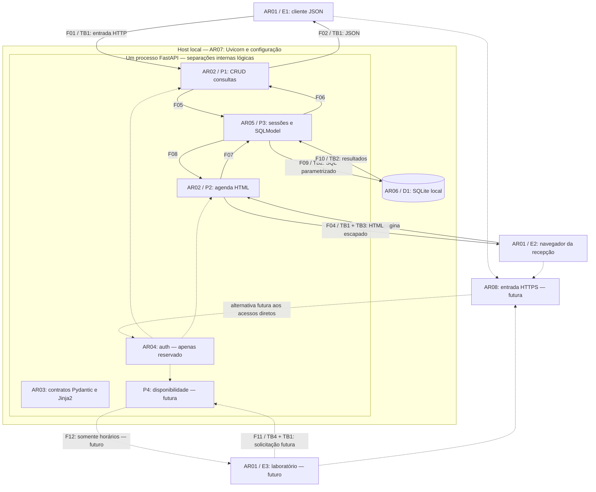

# Exercício 5 — Arquitetura de segurança e vetores de ataque

**Autor:** Hebert Almeida · **Data:** 22/09/2026 · **Versão:** ARQ-CLINICA 1.0  
**Base:** DFD do Exercício 3 e threat model TM-CLINICA 1.0 do Exercício 4.

## 1. Escopo e conclusão

A aplicação atual é um monólito modular em um processo FastAPI, com SQLite local. Separar routes, models, database e auth organiza responsabilidades, mas não cria isolamento de memória, rede ou privilégios. A principal lacuna continua sendo o acesso sem autenticação e autorização ao CRUD e à agenda. Os contratos de saída e o escape HTML reduzem exposição de campos e XSS, mas não decidem quem pode consultar um paciente.

Este exercício documenta partições, fluxos, fronteiras e 12 vetores nos três eixos solicitados: design, implementação e infraestrutura. Esses eixos são uma classificação de trabalho do Assessment; um risco pode atravessar mais de um eixo. O código não é modificado. Controles propostos não são apresentados como implementados nem como testes aprovados.

## 2. Partições e responsabilidades

| Partição | Componentes e localização | Dados e responsabilidade | Separação efetiva hoje |
|---|---|---|---|
| AR01 — consumidores | E1 cliente JSON; E2 navegador da recepção; E3 laboratório futuro | Enviam entradas não confiáveis; deverão receber somente dados autorizados, mas hoje as respostas não verificam autorização. E1 é exercitado por Swagger/TestClient; frontend dedicado ainda futuro. | Cliente e servidor são contextos distintos; localização interna não concede confiança. E3 pertence a outra organização. |
| AR02 — interfaces | P1 `app/routes/consultas.py`; P2 `app/routes/agenda.py`; `app/main.py` | CRUD JSON e agenda HTML por dia UTC, com paginação. | APIRouter no mesmo processo; rotas atuais abertas. |
| AR03 — contratos e apresentação | `app/models/consulta.py`, `app/core/templates.py`, templates com herança | Validar entradas; selecionar os seis campos públicos; escapar observacao em texto HTML. | Separação lógica. O ORM não é entregue ao template, mas permanece na memória do servidor. |
| AR04 — identidade e políticas | `app/auth/__init__.py` | Futuramente autenticar humanos/máquinas e decidir ação e acesso ao recurso. | Apenas módulo reservado: ainda não verifica identidade, papel ou ownership. |
| AR05 — persistência | P3 `app/database/session.py` e statements SQLModel nas rotas | Sessão por requisição; execução parametrizada; transações. | Biblioteca dentro do mesmo processo, sem serviço de banco remoto nem credencial de rede SQLite. |
| AR06 — armazenamento | D1 SQLite: caminho padrão `data/clinica.db`, configurável por DATABASE_URL, e eventuais cópias | Consultas, identificadores, observacao e campos internos criado_em/referencia_interna. | Fronteira com o sistema de arquivos. ACL, criptografia em repouso e restauração não foram auditadas. |
| AR07 — operação e configuração | Uvicorn, `app/core/config.py`, `.env.example`, dependências; `/health`, `/docs`, `/openapi.json`, `/static` | Configuração, execução, documentação e arquivos estáticos. Logs operacionais podem conter caminhos/parâmetros. | Processo do sistema operacional e arquivos locais. `.venv` isola dependências, não privilégios do processo. |
| AR08 — entrada de rede futura | Proxy HTTPS e limites de tráfego propostos | Terminação TLS, limites de corpo/conexões, encaminhamento controlado ao serviço. | Não implementada. Execução documentada em 127.0.0.1; não há implantação pública validada. |

Pacientes e profissionais ainda são IDs em consultas, sem tabelas ou vínculos de identidade. IDs numéricos não tornam os dados anônimos. Observacao é texto livre e pode receber informação sensível; o campo deve ser tratado como tal mesmo que o exemplo seja fictício. A02 representa campos internos, não uma trilha de eventos de auditoria.

## 3. Diagrama e fronteiras

O diagrama mantém P1/P2/P3/D1, E1/E2/E3 e F01–F12 do DFD. Setas sólidas mostram fluxos existentes; tracejadas mostram propostas. F01–F04 atuais são diretos; a entrada HTTPS futura é uma alternativa de implantação, não um salto já existente.

AR03 é uma responsabilidade transversal usada por P1/P2; não é serviço HTTP independente. P4 não tem integração de persistência definida ainda. AR07 inclui superfícies auxiliares omitidas das setas do fluxo clínico. O código Mermaid também está em `arquitetura_exercicio_05.mmd`.

| Fronteira | Cruzamento e risco | Controle atual e decisão necessária |
|---|---|---|
| TB1 — cliente/aplicação | HTTP de E1/E2, futuramente E3; conteúdo, IDs e identidade declarada são não confiáveis. | Validação de formato existe. Autenticar e autorizar cada operação, inclusive listagens e agenda, ainda é necessário. Loopback limita exposição de rede, mas não autoriza o cliente. |
| TB2 — processo/arquivo | F09/F10; quem acessa o arquivo pode contornar a API. | ORM parametrizado existe. Proteção do arquivo exige permissões do SO, cópias protegidas e recuperação testada. Não é uma fronteira de banco em rede. |
| TB3 — dados/interpretação HTML | F04: observacao armazenada chega ao navegador. Sobrepõe TB1; não é outro servidor. | Autoescape, contrato de leitura e uso em contexto textual. Não usar safe/Markup nem transferir conteúdo para contexto executável sem proteção específica. |
| TB4 — clínica/parceiro | F11/F12 previstos, entre organizações. | Identidade de máquina, escopo e audiência próprios; retornar disponibilidade mínima, sem dados de paciente. Ainda sem endpoint ou proteção implementada. |

A futura AR08 adicionará um salto proxy/aplicação dentro do trajeto TB1. A implantação deverá documentar se esse salto usa rede privada/TLS, restringir acesso direto ao backend e aceitar cabeçalhos encaminhados apenas de proxies confiáveis. O presente desenho não atesta essas condições. HTTPS e controle por endpoint são recomendações de referência da [OWASP REST Security](https://cheatsheetseries.owasp.org/cheatsheets/REST_Security_Cheat_Sheet.html).

## 4. Fluxos e exposição de dados

| Fluxos | Origem → destino | Conteúdo e transformação | Fronteira |
|---|---|---|---|
| F01 / F02 | E1 ↔ P1 | Entrada: IDs, data_hora, status, observacao, filtros/ID de rota. Saída: id, paciente_id, profissional_id, data_hora, status, observacao; erros ou DELETE 204 sem corpo. Campos internos excluídos. | TB1 |
| F03 / F04 | E2 ↔ P2 | Dia e página → agenda em HTML; seleção por intervalo UTC, contrato público e escape. `Cache-Control: no-store` no HTML. Identificadores e observacao continuam visíveis ao consumidor atual. | TB1; TB3 na saída |
| F05 / F06 | P1 ↔ P3 | Operações/valores validados → entidades que podem conter auditoria interna. Projeção para ConsultaRead antes da resposta externa. | Interna lógica |
| F07 / F08 | P2 ↔ P3 | Intervalo do dia e paginação → entidades com observacao bruta e auditoria; conversão para ConsultaRead antes do template. | Interna lógica |
| F09 / F10 | P3 ↔ D1 | SQL parametrizado, dados de consulta e auditoria gerada pelo servidor → resultados. Arquivo contém mais campos do que a resposta pública. | TB2 |
| F11 / F12 | E3 ↔ P4, futuro | Consulta de horários → disponibilidade mínima. Contrato, autenticação e integração interna ainda por implementar; não reutilizar a listagem completa de consultas. | TB4 e TB1 |

Fluxos auxiliares: `/docs` e `/openapi.json` revelam o contrato; Swagger pode carregar recursos de CDN, sem que isso comprove envio de dados clínicos à CDN. `/static` monta somente a pasta estática; não monta `data`. `/health` verifica resposta do processo, não saúde do banco. Configuração e logs não são trilha de auditoria clínica. Rever esses canais antes de exposição externa, inclusive evitar dados sensíveis em URLs e logs.

## 5. Vetores nos três eixos

Design define quem pode fazer o quê e quais dados atravessam as interfaces. Implementação define como as regras e os contratos são executados. Infraestrutura define onde e com quais proteções o serviço e seus dados operam. Os IDs TH, MT e VT abaixo pertencem ao Exercício 4 e mantêm seus significados; VT indica critério de verificação, não teste já executado.

### Design

| Vetor | Caminho, pré-condição e ativo | Situação e decisão | Rastreabilidade |
|---|---|---|---|
| VD01 — acesso a consulta de outro usuário | AR01→AR02, F01–F04/TB1; basta acessar as rotas atuais. A01. | Aberto: não há identidade/ownership. Centralizar política e filtrar também listas e HTML; proteger somente GET por ID deixaria outros canais expostos. | TH-01, TH-02; MT-01, MT-02; VT-01, VT-02 |
| VD02 — ação incompatível com papel | AR01→P1, F01/TB1; clientes atuais podem alterar/excluir sem papel. A01/A04. | Aberto: definir matriz recepcionista/profissional/administrador com negação por padrão e verificá-la junto ao vínculo com recurso. Não é bypass de um RBAC já existente. | TH-13; MT-03; VT-13 |
| VD03 — laboratório recebe dados clínicos | E3→P4, F11/F12/TB4; depende de futura integração e contrato excessivo. A01. | Futuro: separar audiência/escopos de máquina; retornar horários, sem observacao ou paciente_id. Usar o CRUD como API de disponibilidade violaria essa separação. | TH-14; MT-12; VT-14 |
| VD04 — agendamento inconsistente e ação sem autoria | P1→P3→D1, F05/F09; entradas sintaticamente válidas, referências inexistentes ou concorrência. A01/A02. | Aberto: IDs positivos não comprovam existência; definir vínculos e regra de conflito atômica. criado_em/UUID não registram quem alterou. Planejar auditoria protegida sem conteúdo clínico ou segredos. | TH-04, TH-05; MT-05, MT-06; VT-04, VT-05 |

A decisão de negar por padrão e verificar permissão em cada requisição segue a [OWASP Authorization Cheat Sheet](https://cheatsheetseries.owasp.org/cheatsheets/Authorization_Cheat_Sheet.html). A matriz concreta e o vínculo entre usuário e profissional precisam ser definidos no projeto; não podem ser inferidos de IDs enviados pelo cliente.

### Implementação

| Vetor | Caminho, pré-condição e ativo | Situação e decisão | Rastreabilidade |
|---|---|---|---|
| VI01 — XSS persistido por regressão | F01→F09→F08→F04/TB3; atacante grava marcação em observacao e uma alteração remove o escape. A01/A05. | Controlado no contexto textual atual: Jinja autoescape e herança, sem safe. Preservar testes de payload persistido; escape HTML não garante proteção em JavaScript/URL. Não há sessão atual para alegar roubo demonstrado. | TH-07; MT-07; VT-07 |
| VI02 — injeção SQL por concatenação futura | P1/P2→P3→D1, F05/F07/F09; exige regressão para SQL construído com entrada. A01/A03. | Controlado no caminho atual: select/Session.get e parâmetros SQLModel. Manter parametrização e validar IDs; texto livre não deve virar sintaxe SQL. | TH-08; MT-08; VT-08 |
| VI03 — mass assignment e vazamento de auditoria | AR01↔AR02/AR03, F01/F02/F04/TB1; tentar enviar campos internos ou regressão que serialize ORM completo. A01/A02. | Controlado no contrato atual: extra=forbid, campos de auditoria gerados no servidor, ConsultaRead no JSON/contexto HTML. Isso não impede exposição dos campos públicos a pessoas não autorizadas (VD01). | TH-03, TH-06; MT-04; VT-03, VT-06 |
| VI04 — proteção aplicada só a algumas rotas | AR02/AR04, F01–F04/TB1; futura autenticação ligada ao CRUD mas esquecida em listas/agenda ou PUT/DELETE. A01. | Hoje todas essas rotas estão abertas. Ao implementar auth, usar dependências/políticas compartilhadas e testar todos os métodos e representações. CORS não substitui autorização para clientes diretos. | TH-01, TH-02, TH-13; MT-01, MT-02, MT-03; VT-01, VT-02, VT-13 |

### Infraestrutura

| Vetor | Caminho, pré-condição e ativo | Situação e decisão | Rastreabilidade |
|---|---|---|---|
| VF01 — interceptação de tráfego | AR01→AR08→AR02/TB1; futura exposição em rede sem TLS adequado. A01 e futuras credenciais. | Condicional: execução atual local, sem implantação HTTPS validada. Exigir HTTPS, certificado válido e proteção do salto proxy/backend; não expor porta alternativa que contorne a entrada. | TH-12; MT-11; VT-12 |
| VF02 — leitura direta do banco/cópia | AR06/TB2; acesso local indevido ou cópia em local acessível. A01/A02/A03. | Não auditado: limitar identidade do processo e ACL, proteger cópias e planejar criptografia em repouso. Response models não protegem o arquivo. Não há evidência de banco servido publicamente. | TH-10; MT-10; VT-10 |
| VF03 — indisponibilidade por volume/contenção | AR01→AR02→AR05→AR06, TB1/TB2; muitas requisições, corpos grandes ou escritas concorrentes. A04. | Parcial: lista JSON limitada a 100, HTML a 50 e observacao a 500 caracteres. Faltam limites de corpo, taxa, conexões e timeout definidos. Limite de campo não evita custo de receber/parsear corpo enorme. | TH-09; MT-09; VT-09 |
| VF04 — corrupção/perda sem recuperação | AR06/AR07/TB2; escrita indevida, falha de disco ou perda do host. A01/A03/A04. | Condicional: backup/restore não validados. Definir RPO/RTO, cópias consistentes e teste de restauração em banco descartável. create_all não substitui migração nem recupera dados perdidos. | TH-11; MT-10; VT-11 |

As medidas acima têm responsáveis por camada: projeto de políticas e contratos (design), desenvolvimento e testes (implementação), administração do ambiente e implantação (infraestrutura). São responsabilidades propostas, não equipes já provisionadas. Limites de tráfego devem combinar aplicação e infraestrutura; autorizações de recurso continuam na aplicação mesmo com proxy.

## 6. Decisões para o Exercício 6 e exposição externa

1. Manter o monólito modular; não criar microserviços só para separar pastas. Implementar autenticação e políticas compartilhadas em app/auth, com dependências nas rotas e sem copiar lógica de segurança entre módulos.
2. Separar identidade validada, papel, vínculo com recurso e tipo de cliente. paciente_id/profissional_id recebidos no corpo nunca comprovam identidade. Definir associação persistida de usuário/profissional e alcance da recepção; eventual segregação por clínica exigirá modelagem própria, ainda ausente.
3. Aplicar autorização antes de leitura ou alteração e incluir filtros nas listagens e agenda. Adotar os critérios VT-01/VT-02/VT-13, com cenários positivos e negativos. Definir respostas sem permitir distinguir recursos de terceiros indevidamente.
4. A rubrica prevê OAuth2PasswordBearer, bcrypt, JWT, ownership e posterior diferenciação humano/M2M. O enunciado do próximo exercício determinará o recorte de implementação. Não há token, hashing ou sessão implementado neste exercício. JWT futuro deverá validar assinatura e claims; seu conteúdo não deve transportar informação clínica. OAuth2PasswordBearer isolado não implementa toda a autenticação.
5. Definir como o navegador obterá/apresentará credenciais sem colocá-las em query string. Se futuramente adotar cookies, avaliar CSRF, atributos do cookie e operações que mudam estado; não alegar esse risco como falha de sessão atual inexistente.
6. Expor ao parceiro apenas o recurso de disponibilidade P4 e seu contrato mínimo, com identidade de serviço própria. Aprovar separadamente a implantação HTTPS, acesso ao host e capacidade. Atualizar o threat model quando novos componentes ou ameaças forem introduzidos.

Pontos de atenção complementares para fases futuras: gestão/rotação de segredos de autenticação, revisão de dependências e pipeline, política de CORS/cabeçalhos e proteção de logs. Dependências fixadas não comprovam ausência de vulnerabilidades. Esses tópicos não receberam novos IDs TH nesta etapa; qualquer nova ameaça formal deverá entrar em uma versão rastreável do modelo.

## 7. Evidências, rubrica e limites

| Exigência | Evidência entregue |
|---|---|
| Particionar componentes | AR01–AR08, tabela de responsabilidades e diagrama |
| Mapear fluxos entre componentes | F01–F12 com dados, transformações e direções |
| Identificar fronteiras de segurança | TB1–TB4 e distinção entre separação lógica, arquivo, contexto HTML e organização |
| Identificar vetores nos três eixos | VD01–VD04, VI01–VI04, VF01–VF04, com pré-condições, situação e mitigação |
| Orientar próximas etapas | Decisões para auth/exposição e referências TH/MT/VT do Exercício 4 |

Fontes locais: app/main.py, routes/consultas.py, routes/agenda.py, models/consulta.py, database/session.py, core/config.py, core/templates.py, auth/__init__.py, templates e testes existentes. O validador em `evidencias/exercicio_05/validar_arquitetura.py` verifica IDs e a preservação da baseline de 24 arquivos do Exercício 3; o resultado fica em `validacao_arquitetura.json`. Isso é verificação documental, não pentest ou teste de controles futuros. Os 39 testes aprovados são o resultado histórico do Exercício 2; não são apresentados como nova execução. Revisão independente registrada em `docs/revisao_astra_exercicio_05.md`.

Não foram gerados scans ZAP, pipeline ou prints de funcionalidades novas, pois não houve implementação nesta etapa. O ZIP permanece reservado para o final do Assessment.

## 8. Trecho opcional para o vídeo — cerca de 25 segundos

Mostrar o diagrama e apontar TB1, TB2 e TB4: “A API está dividida em rotas, contratos e persistência, mas esses módulos rodam no mesmo processo. O contrato reduz os campos expostos e o Jinja protege o texto HTML; ainda precisamos decidir quem pode acessar cada consulta. Para o laboratório, o desenho prevê uma identidade de máquina e somente horários disponíveis. Já o arquivo do banco exige proteção no sistema operacional.”

Este trecho é opcional; preservar a maior parte dos cinco minutos para demonstrações, o security gate do Exercício 12 e as decisões do capstone do Exercício 13. A gravação deve ser feita pelo aluno, com suas próprias palavras.
