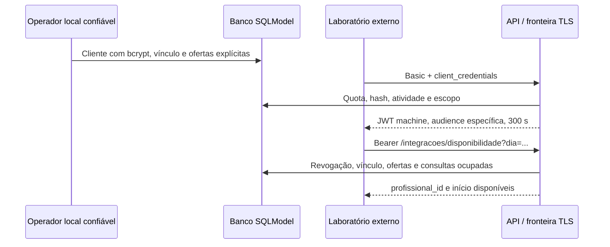

> Registro técnico da etapa indicada. Para resultados atuais e alterações posteriores, consulte o [índice de documentação](README.md).

# Exercício 7 — Escopos e integração externa

Revisão de conformidade: 02/10/2026. Implementação vinculada à ameaça TH-14 do Exercício 4. O laboratório consulta ofertas de horários; não recebe dados de pacientes ou permissões clínicas.

## Escolha do fluxo

Foi adotado OAuth 2.0 **Client Credentials**, adequado a um cliente confidencial que atua em nome próprio, sem usuário presente. O laboratório envia HTTP Basic ao `POST /integracoes/token`, com formulário `grant_type=client_credentials&scope=disponibilidade:read`. Credenciais em query string ou no corpo não são aceitas. Omitir scope usa o único escopo contratado; scope vazio, desconhecido ou ampliado é rejeitado. Não há refresh token: o cliente deve autenticar-se novamente após 300 segundos.

Referência: [RFC 6749, seção 4.4](https://www.rfc-editor.org/rfc/rfc6749#section-4.4). TLS é obrigatório no ambiente externo; o ensaio local usa exclusivamente loopback HTTP.

| Controle | Humano | Laboratório |
|---|---|---|
| Emissão | `/auth/token`, senha do usuário | `/integracoes/token`, segredo do cliente |
| Identidade | Usuário e papel no banco | ClienteIntegracao separado de Usuario |
| Claim `token_use` | `human` | `machine` |
| Audience | Audience humana configurada | `clinica-laboratorio` |
| Autorização | RBAC + ownership + vínculo paciente | Scope `disponibilidade:read` + profissionais vinculados |
| Dados retornados | Contratos específicos e dados permitidos ao papel | Somente `profissional_id` e `inicio` |

Ambos usam assinatura HS256, issuer e expiração verificados. A revogação humana usa sessão persistida/JTI e flag de revogação; a integração M2M usa `token_version` no cliente. O JWT M2M exige `sub`, `client_id` coerente, `aud`, `iss`, `iat`, `nbf`, `exp`, `jti`, `scope`, `token_use` e `version`. A aplicação consulta novamente atividade, versão e escopos do cliente no banco: um token assinado não basta. Claims não concedem papéis humanos. Tokens antigos humanos sem `token_use=human` precisam de novo login após esta atualização.

## Fluxos e fronteiras



A fronteira parceiro/clínica é **TB4**, preservando o identificador do threat model; TB1 descreve o acesso cliente/aplicação e TB2 o processo/arquivo de persistência. F11/F12, antes futuros, passam a representar a requisição do parceiro e a resposta mínima de disponibilidade. O operador CLI pertence à zona confiável, sem endpoint público de cadastro de clientes. Segredos ficam com o cliente, o banco mantém apenas bcrypt e o processo acessa configuração por BaseSettings. Não são incluídos segredos reais na entrega.

Complemento STRIDE de P4/AS07: **S/E/I** são tratados pela identidade machine, audience, scope e ausência de PII; **T** pela assinatura/validação estrita e queries parametrizadas; **R** por EventoIntegracao vinculado ao request_id, sem segredos; **D** por quotas, paginação e limites de corpo. TLS e contenção volumétrica continuam riscos operacionais, sem prova de implantação externa.

`GET /integracoes/disponibilidade` usa seleção SQLModel parametrizada, ofertas explícitas futuras em UTC e somente profissionais ativos vinculados ao cliente. Uma consulta não cancelada no mesmo instante elimina a oferta; uma cancelada libera o instante. Isso implementa a regra de conflito aprovada no Exercício 9, sem inventar duração de consulta ou agenda de trabalho. Limite padrão 20, máximo 100 e offset máximo 10.000. Data inválida, argumentos extras e duplicados são rejeitados. Nenhum ID de paciente, observação clínica ou auditoria interna integra a resposta.

## Provisionamento e operação local

No mesmo terminal/configuração de banco do servidor, após provisionar um profissional ativo:

```powershell
.\.venv\Scripts\python.exe -m app.auth.provision_m2m client laboratorio_demo --profissional-id 901
.\.venv\Scripts\python.exe -m app.auth.provision_m2m slot --profissional-id 901 --inicio '2030-10-15T14:00:00+00:00'
```

O segredo exclusivo é solicitado duas vezes sem eco, com 32 a 72 bytes ASCII. O exemplo de horário é fictício e deve continuar no futuro na data de uso. A revogação é feita por `python -m app.auth.provision_m2m revoke laboratorio_demo`: desativa o cliente e incrementa sua versão. Para rotação nesta implementação, provisionar um novo client_id/segredo e revogar o anterior. Não há console administrativo público nem automação de distribuição de segredos.

O middleware aplica limites por origem e uma quota de cinco tentativas por minuto por client_id apresentado, antes do lookup. IDs existentes e inexistentes atingem a mesma sequência de limite; erros não revelam qual credencial falhou. A rota de disponibilidade possui quota própria. Bcrypt, quota e SQLite executam em threadpool. Respostas sensíveis usam `no-store`, e eventos de máquina são registrados em tabela própria sem atribuir um usuário humano fictício.

## Evidência e limites

`tests/test_exercicio07.py` cobre emissão, claims, mínimo de dados, escopos, credenciais inválidas, duplicatas, expiração, audience, papéis, revogação, vínculo, cliente/profissional inativo e limites. `evidencias/conformidade_2026-10-02/m2m-evidence.json` registra respostas sanitizadas; o corpus ZAP inclui sucesso M2M e as duas negações cruzadas humano/máquina. A OpenAPI declara o fluxo clientCredentials e o scope da operação.

As correções de quota e threadpool estão implementadas e cobertas por testes. Permanecem responsabilidades de produção: TLS/proxy confiável, custódia/rotação de segredos, monitoramento e disponibilidade do banco. O compartilhamento da chave simétrica dentro deste único emissor exige proteção operacional; um comprometimento do emissor extrapola a restrição de um token isolado. Não se declara prontidão para produção.
