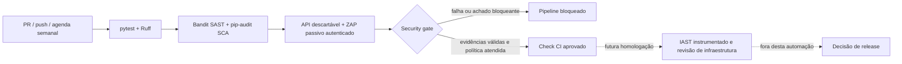

> Registro técnico da etapa indicada. Para resultados atuais e alterações posteriores, consulte o [índice de documentação](README.md).

# Exercício 12 — Pipeline DevSecOps e auditoria automatizada

**Hebert Almeida — Desenvolvimento Seguro de Aplicações Web**  
Data: 25/09/2026. Base: aplicação após Exercício 11 e threat model TM-CLINICA 1.0 do Exercício 4.

## Decisão de arquitetura do pipeline

O workflow `.github/workflows/security.yml` executa testes, revisão estática, auditoria de dependências e análise dinâmica de uma instância descartável. `scripts/security_gate.py` toma a decisão final a partir dos relatórios e dos códigos de saída. A regra é falhar quando não há evidência suficiente, em vez de interpretar ausência de relatório como ausência de vulnerabilidades.



O check de CI não equivale a autorização de produção. Nenhum deploy é executado. O repositório remoto não foi informado: entregamos o YAML e evidências de execução local dos seus componentes, sem afirmar uma execução hospedada no GitHub. Para impedir merge, o administrador do repositório deve exigir `security-gate` no ruleset/branch protection. Alterações em workflow, scripts, testes obrigatórios e política devem exigir revisão protegida; um PR não pode aprovar sua própria exceção sem revisão. O YAML não configura essas proteções remotas automaticamente.

## Ferramentas por fase do SDLC

| Tipo | Fase escolhida | Uso e justificativa neste domínio |
|---|---|---|
| SAST — Bandit 1.9.4 | Desenvolvimento e cada PR, antes de executar a aplicação | Procura padrões inseguros no código Python de `app`. Executa com `--ignore-nosec` para que comentários não suprimam silenciosamente findings. Não demonstra ausência de BOLA contextual. Ruff complementa qualidade, sem ser tratado como scanner de vulnerabilidades. |
| SCA — pip-audit 2.10.1 | Build/PR e reexecução semanal | Audita todas as versões pinadas do inventário completo em requirements.txt. A consulta atualizada encontra avisos publicados depois da escolha original das bibliotecas. Envia ao serviço nomes/versões de pacotes, não dados clínicos. |
| DAST — ZAP 2.17.0 | Integração, depois de iniciar o serviço e antes do gate | Scan passivo real sobre um corpus autenticado em loopback. Inspeciona respostas HTTP, inclusive HTML, sem atingir clínica ou ambiente externo. Dados, contas e chaves são efêmeros e fictícios. |
| IAST — agente instrumentado, candidato Contrast Assess | Homologação, durante os testes de integração/negócio e antes de uma futura liberação | Correlacionar entrada, percurso e operações sensíveis em execução pode complementar SAST/DAST. Instrumentação tem custo e depende de caminhos exercitados; não substitui testes de autorização. A etapa foi posicionada e justificada, mas não executada nem apresentada como implementada nesta automação. |

A documentação consultada do agente Python Contrast descreve IAST e suporte ASGI, mas sua matriz publicada cobre versões de FastAPI/Starlette inferiores às versões pinadas desta aplicação. Além de credenciais/licença de homologação, é necessário validar compatibilidade antes de adotá-lo. Não instalamos agente externo não validado, não enviamos telemetria clínica e não chamamos pytest, captura SQL ou ZAP de IAST. Essa limitação fica registrada para a decisão de release. [Agente Python](https://docs.contrastsecurity.com/en/python.html), [matriz de tecnologias](https://docs.contrastsecurity.com/en/python-supported-technologies.html).

## Critério de severidade e impacto de negócio

Escolhi CVSS **3.1** para permitir comparação explícita dos vetores e dos avisos encontrados. Não trato a versão como a mais recente do padrão. Os vetores completos, premissas, scores, prioridades e fontes estão em `security/risk-register.json`; um teste recalcula cada score com a biblioteca `cvss`. CVSS descreve severidade técnica sob determinadas premissas, não substitui a análise de negócio. [Especificação FIRST](https://www.first.org/cvss/v3.1/specification-document).

Impacto de negócio **alto**: acesso a informação de saúde de terceiros, alteração indevida de registros, interrupção do agendamento/login ou perda da trilha mínima necessária à investigação. **Moderado**: defesa em profundidade ausente ou impacto limitado/condicional sem violação demonstrada dos controles clínicos atuais. **Baixo**: caminho afetado não usado na arquitetura atual, sem ignorar o dever de acompanhar a dependência. P0 exige correção imediata antes de promoção; P1 exige resolução antes do uso operacional; P2 entra em backlog com revisão datada. Essas prioridades não são o score CVSS.

### Histórico do Assessment

| Identificador | CVSS 3.1 | Negócio / prioridade | Premissa e situação atual |
|---|---:|---|---|
| V08-01 — BOLA GET-only | 6,5 | Alto / P0 | Exemplo didático de leitura por ID sem ownership, por usuário autenticado. C:H, I:N, A:N. Proteção já existente desde Ex6; não é uma BOLA aberta encontrada no scan atual. |
| V08-02 — login sem limite | 7,4 | Alto / P0 | Cenário condicionado à adivinhação bem-sucedida de senha fraca/reutilizada de profissional: AC:H, C:H, I:H, A:N. Não houve tomada de conta demonstrada. Limites por conta/IP foram implementados nos Ex9/10. |
| V08-03 — ausência de auditoria | 0,0 técnico | Alto / P1 | Sem impacto CIA direto causado apenas pela ausência de registro. CVSS não expressa bem repudiação/investigação; zero não significa risco zero. Auditoria implementada no Ex9, com retenção/exportação operacional ainda pendentes. |
| V08-04 — conflitos de agenda | 5,4 | Alto / P1 | Profissional autorizado produz inconsistência e indisponibilidade parcial de agenda confiável: I:L/A:L. Não se presume queda completa do servidor. Regra aprovada e protegida por índice/transações no Ex9. |

Os scores são dos cenários anteriores à mitigação, e não notas artificiais de risco residual. O gate não volta a bloquear uma vulnerabilidade histórica corrigida apenas porque ela continua registrada. Uma regressão, entretanto, reprova os testes obrigatórios independentemente de CVSS — inclusive a auditoria com score técnico zero.

### Achados reais de dependência nesta etapa

O primeiro pip-audit retornou **10 entradas, correspondentes a cinco avisos únicos**, todas associadas a `python-multipart==0.0.22`. As duplicatas são preservadas no relatório original; não são dez CVEs distintas. Atualizamos a versão pinada para **0.0.32**, obtida do PyPI com SHA256 verificado, e repetimos testes e auditoria.

| CVE | CVSS publicado | Negócio / prioridade | Avaliação de alcance |
|---|---:|---|---|
| CVE-2026-53539 | 7,5 | Alto / P0 | Custo quadrático no parser urlencoded usado por request.form do login. Rate limit não limita o custo de cada corpo. |
| CVE-2026-53538 | 3,7 | Moderado / P2 | Interpretação divergente de separadores; validação e rejeição de campos extras reduzem possibilidades, sem bypass demonstrado. |
| CVE-2026-40347 | 5,3 | Moderado / P2 | Parser multipart afetado; o login atual rejeita multipart antes de chamar request.form. |
| CVE-2026-42561 | 7,5 | Moderado / P1 | Limites de headers multipart ausentes na biblioteca afetada; caminho multipart não é aceito pela rota atual. |
| CVE-2026-53540 | 3,7 | Baixo / P2 | parse_form direto não usado pelo fluxo FastAPI atual; não confundir pacote instalado com exploração confirmada. |

Fontes, vetores e datas estão em `evidencias/exercicio_12/advisories.json` e no registro de riscos. O caso alcançável do parser urlencoded motivou a correção imediata, sem executar carga DoS. [Aviso do parser](https://github.com/advisories/GHSA-5rvq-cxj2-64vf), [aviso de separadores](https://github.com/advisories/GHSA-6jv3-5f52-599m).

## Security gate implementado

O job falha nos seguintes casos:

1. Falha de pytest, Ruff, formatação, teste ignorado, relatório JUnit vazio ou ausência de qualquer teste obrigatório listado em `security/threat-tests.json`.
2. Erro de execução de scanner, relatório inexistente, vazio, inválido ou incompleto. Exit code de achados é distinguido de erro operacional.
3. Qualquer finding **High** do Bandit/ZAP. **Medium** do Bandit também bloqueia por padrão, dada a sensibilidade de `app`; Medium do ZAP bloqueia se não houver triagem válida e restrita.
4. Qualquer vulnerabilidade reportada pelo pip-audit. Seu JSON não fornece CVSS de forma suficiente para nosso gate: a regra conservadora exige correção, em vez de converter ausência de score em aprovação. Portanto também bloqueia CVSS ≥7 quando houver esse aviso e é mais restritiva para scores menores. Não há allowlist SCA nesta implementação.
5. DAST sem cobertura esperada de consultas/agenda autenticadas, status divergentes ou fila passiva ainda pendente.

Bandit usa severidade própria e ZAP usa risco próprio; **nenhuma dessas classificações é convertida em um CVSS inventado**. Achados sem classificação reconhecida falham na validação. Findings Low/Informational válidos permanecem visíveis e não bloqueiam automaticamente; a suíte obrigatória continua cobrindo o impacto de negócio que scanners não reconhecem.

O ZAP registrou sete alertas: CSP ausente em `/docs` e `/agenda` (dois Medium), SRI ausente em recursos da documentação (dois Medium), inclusão de JavaScript de outra origem (Low) e dois informativos. Não é demonstração de XSS explorável. As duas regras Medium receberam triagem explícita em `security/policy.json`, limitada a essas rotas, impacto moderado e validade até **25/10/2026**. A ausência de CSP é defesa em profundidade pendente; SRI envolve risco de cadeia de suprimento da interface Swagger. Autoescape/ownership e seus testes continuam obrigatórios. Sugerimos self-host/SRI e CSP compatível no capstone. Se a rota mudar, o prazo expirar, o impacto for alto ou a severidade subir para High, o gate bloqueia. A triagem não remove alertas nem reduz sua severidade no relatório.

Os testes do gate usam fixtures **sintéticas claramente identificadas**, cobrindo aprovação, rejeição de relatórios, erros, ausência de controles, severidade alta/média, CVE fictícia, cobertura incompleta e revisão expirada/fora da rota. Essas fixtures não são apresentadas como resultados de scanners reais. Uma avaliação adicional usa o relatório SCA real anterior para demonstrar o bloqueio e o relatório posterior para mostrar o resultado corrigido.

## Testes derivados do threat model

O catálogo original do Exercício 4 permanece histórico e intacto. O mapeamento atual em `security/threat-tests.json` seleciona testes obrigatórios e explicita ameaças ainda incompletas.

| Ameaça | Expansão e controle verificado |
|---|---|
| TH-02 | Três casos novos removem o vínculo paciente-profissional enquanto o JWT permanece válido: GET/PUT/DELETE passam a negar o recurso, e a listagem fica vazia. |
| TH-13 | Quatro casos novos usam profissional/recepção, painel/auditoria, header e claims de papel forjados com assinatura válida de teste. A autorização continua consultando o papel do banco e retorna 403. |
| TH-02 + TH-05 | Exclusão alheia retorna 404, preserva o registro e produz auditoria com ator correto e ID de correlação gerado pelo servidor. |
| TH-03 + TH-06 | PUT com ID/metadados internos retorna 422, não modifica o registro e não expõe esses campos. |
| TH-01/04/05/07/08/09/12 | Mantidos como obrigatórios: JWT inválido, conflito concorrente, rollback em falha de auditoria, XSS como texto, parâmetros SQL, limites e HSTS condicionado a HTTPS. |

São nove casos novos de segurança da aplicação, além dos testes do gate e recálculo de CVSS. O teste de não administrador do Ex6 permanece obrigatório. TH-10/11 (proteção e recuperação de armazenamento), parte de TH-09/12 (infraestrutura/TLS real) e TH-14 (M2M do Ex7 pendente) não são declaradas integralmente resolvidas.

## Segurança e reprodução do workflow

**Resultado final local:** 175 testes aprovados (127 anteriores, nove novos de segurança da aplicação e 39 de gate/CVSS/inventário), com dois avisos de depreciação preexistentes. Ruff e formatação de 45 arquivos Python aprovados; Bandit sem findings; pip-audit sem vulnerabilidades conhecidas no inventário atualizado; ZAP com nove respostas e sete alertas preservados; gate aprovado com as revisões Medium descritas. `actionlint` 1.7.12 validou o YAML sem erros e `pip check` não encontrou dependências quebradas. O replay do SCA histórico foi bloqueado.

Actions são fixadas por SHA completo, com `contents: read` e `persist-credentials: false`; não há `pull_request_target`, credenciais de produção ou execução de código PR com token privilegiado. ZAP é fixado em 2.17.0 e validado por SHA256 do asset oficial. Java 21 executa o scanner. O job tem timeout de 20 minutos e upload de evidências mesmo em falha, com retenção de sete dias. Agendamento semanal busca alterações no banco de avisos, sem prometer detecção de todo zero-day. Pins precisam de manutenção e revisão; o conjunto de wheels ainda não constitui um lock com hashes de todas as dependências.

```powershell
.\.venv\Scripts\python.exe -m pip install -r requirements.txt -r requirements-security.txt
.\.venv\Scripts\python.exe -m scripts.run_checks
.\.venv\Scripts\python.exe -m scripts.fetch_zap
.\.venv\Scripts\python.exe -m scripts.run_dast --zap-home .cache/security-tools/ZAP_2.17.0
.\.venv\Scripts\python.exe -m scripts.security_gate --reports reports
```

O comando DAST requer Java 21 disponível; `--java` aceita caminho explícito. Ele inicia API e ZAP somente em loopback, cria banco exclusivo, gera credenciais temporárias e encerra os processos criados. O relatório exporta uma whitelist de campos dos alertas; não inclui JWT, cookies, senhas, mensagens HTTP completas ou conteúdo clínico. O login ocorre diretamente na instância fictícia; as nove requisições do corpus passam efetivamente pelo proxy ZAP. Não houve spider, active scan, análise TLS real ou IAST. Falhas de cobertura não são tratadas como scan limpo.

No Windows automatizado houve restrição de ACL em diretórios temporários criados com modo 0700. A validação local usou um adaptador de criação de diretórios restrito ao workspace e bibliotecas de ferramentas isoladas; ele não integra a aplicação nem o workflow Linux. O código dos verificadores e a política entregues são os mesmos usados para validar os relatórios. Não houve downgrade de checagem de vulnerabilidades.

Logs de pytest/Ruff/formatação/Bandit/pip-audit, saída sanitizada ZAP, avaliação do gate, scores e hashes estão preservados em `evidencias/exercicio_12`. O resumo final está em `checks.json`. `gate-comparison.json` é um replay do SCA histórico real sobre os demais checks atuais, não uma execução integral da aplicação antiga. Evidências de execução local não substituem screenshot de um run remoto; publicação do workflow e configuração do ruleset permanecem necessárias no repositório escolhido. `.cache`, bancos, sessões brutas do ZAP, binários de ferramentas e ambientes virtuais não integram as evidências entregues. Nenhum ZIP foi criado.

## Roteiro prioritário para o vídeo — 60 a 75 segundos

1. **0–15 s:** mostrar `security.yml`: “Coloquei SAST e dependências no PR; depois subo uma instância descartável para o ZAP. IAST fica previsto para homologação instrumentada, ainda sem execução nesta versão.”
2. **15–35 s:** abrir a política e o registro de riscos: “Bloqueio severidade alta e regressões dos controles obrigatórios. BOLA tem CVSS 6,5 mas alto impacto de negócio; ausência de auditoria tem score técnico zero e ainda assim sua regressão bloqueia.”
3. **35–55 s:** mostrar o relatório SCA anterior e a avaliação bloqueada: “O scan encontrou cinco avisos únicos em python-multipart. Atualizei a versão e repeti a validação. Ausência de score não significa aprovação.”
4. **55–75 s:** mostrar a cobertura ZAP e um teste TH-02: “O scan alcança rotas autenticadas, mas autorização de paciente exige teste de negócio. As pendências CSP/SRI estão registradas, limitadas por rota e prazo.”

Usar suas próprias palavras; ocultar credenciais. Este trecho deve ter prioridade no vídeo único de até cinco minutos, junto das decisões do capstone Ex13, sem somar todos os roteiros opcionais das etapas anteriores.

## Referências complementares

- [Bandit — CLI](https://bandit.readthedocs.io/en/latest/man/bandit.html).
- [pip-audit — documentação oficial](https://github.com/pypa/pip-audit).
- [ZAP — API](https://www.zaproxy.org/docs/api/) e [alertas](https://www.zaproxy.org/docs/desktop/start/features/alerts/).
- [GitHub — uso seguro de Actions](https://docs.github.com/en/actions/reference/security/secure-use).
